Exploratory\_Data\_Analysis
================
Stuart Miller
July 23, 2019

# Setup

``` r
# libraries
library(knitr)
library(tidyverse)
library(naniar)
library(Hmisc)

# helper files
source('../helper/data_munging.R')
```

# Exploratory Analysis

### Load the data into R

``` r
train <- read_csv('../data/train.csv')
test <- read_csv('../data/test.csv')
```

## Structure of the data

There are 79 features to the data in total. 43 of these features are
categorical and 36 of these features are numeric. The training set
consists of 1460 observations and the test set consists of 1459
observations. The training and test sets include an `Id` column, which
is not a feature of the dataset.

``` r
# split the training set into numeric and non-numeric sets 
train.numeric <- train %>% select_if(is.numeric)
train.nonnumeric <- train %>% select_if(is.character)

# get the dimensions
print('dimensions of the numeric features (training)')
```

    ## [1] "dimensions of the numeric features (training)"

``` r
dim(train.numeric)
```

    ## [1] 1460   38

``` r
print('dimensions of the non-numeric features (training)')
```

    ## [1] "dimensions of the non-numeric features (training)"

``` r
dim(train.nonnumeric)
```

    ## [1] 1460   43

``` r
test.numeric <- test %>% select_if(is.numeric)
test.nonnumeric <- test %>% select_if(is.character)

# get the dimensions
print('dimensions of the numeric features (testing)')
```

    ## [1] "dimensions of the numeric features (testing)"

``` r
dim(test.numeric)
```

    ## [1] 1459   37

``` r
print('dimensions of the non-numeric features (testing)')
```

    ## [1] "dimensions of the non-numeric features (testing)"

``` r
dim(test.nonnumeric)
```

    ## [1] 1459   43

``` r
# Print out the data structure
#str(train)
```

## Missing Data

5 of the features, `PoolQC`, `MiscFeature`, `Alley`, `Fence`, and
`FireplaceQu`, have very high missing rates in both sets of data. It
seems unlikely that these features would provide value as imbuing values
for the missing values would likely bias the training set towards the
imbued value. The feature `LotFrontage` is missing at a rate of ~17% and
~ 15% in the training and testing set respectively. This is also a
fairly high missing rate, but the usefulness of the feature should be
investigated. Fortunately, the rate of missingness for each feature is
approximately the same between the training and testing datasets.

``` r
train.nabular <- train %>% bind_shadow()
train.missing.summary <- train.nabular %>% miss_var_summary()
#train.missing.summary

train.missing.summary %>%
  filter(n_miss > 0) %>%
  ggplot(aes(x = reorder(variable, -n_miss), y = pct_miss)) + geom_bar(stat = 'identity') +
  theme(axis.text.x = element_text(angle = 70, hjust = 1)) +
  labs(title = 'Percent Missing Values of Features (Training Set)',
       y = '% Observations Missing', x = 'Feature Name')
```

<!-- -->

`PoolQC`, `MiscFeature`, `Alley`, `Fence`, `FireplaceQu`, and
`LotFrontage` are the primary missing values in the training dataset.

``` r
test.nabular <- test %>% bind_shadow()
test.missing.summary <- test.nabular %>% miss_var_summary()
#test.missing.summary

test.missing.summary %>%
  filter(n_miss > 0) %>%
  ggplot(aes(x = reorder(variable, -n_miss), y = pct_miss)) + geom_bar(stat = 'identity') +
  theme(axis.text.x = element_text(angle = 70, hjust = 1)) +
  labs(title = 'Percent Missing Values of Features (Test Set)',
       y = '% Observations Missing', x = 'Feature Name')
```

<!-- -->

`PoolQC`, `MiscFeature`, `Alley`, `Fence`,`FireplaceQu`, and
`LotFrontage` are the primary missing values in the testing dataset.

**Summary of the Data Missing per Feature from the
Datasets**

| Variable     | Number Missing (Train) | Percent Missing (Train) | Number Missing (Test) | Percent Missing (Test) |
| ------------ | ---------------------- | ----------------------- | --------------------- | ---------------------- |
| PoolQC       | 1453                   | 99.5%                   | 1456                  | 99.7%                  |
| MiscFeature  | 1406                   | 96.3%                   | 1408                  | 96.5%                  |
| Alley        | 1369                   | 93.7%                   | 1352                  | 92.6%                  |
| Fence        | 1179                   | 80.7%                   | 1169                  | 80.1%                  |
| FireplaceQu  | 690                    | 47.2%                   | 730                   | 50.0%                  |
| LotFrontage  | 259                    | 17.8%                   | 227                   | 15.5%                  |
| GarageType   | 81                     | 5.55%                   | 76                    | 5.21%                  |
| GarageYrBlt  | 81                     | 5.55%                   | 78                    | 5.34%                  |
| GarageFinish | 81                     | 5.55%                   | 78                    | 5.34%                  |
| GarageQual   | 81                     | 5.55%                   | 78                    | 5.34%                  |
| GarageCond   | 81                     | 5.55%                   | 78                    | 5.34%                  |
| BsmtExposure | 38                     | 2.60%                   | 44                    | 3.01%                  |
| BsmtFinType2 | 38                     | 2.60%                   | 42                    | 2.87%                  |
| BsmtQual     | 37                     | 2.53%                   | 44                    | 3.01%                  |
| BsmtCond     | 37                     | 2.53%                   | 45                    | 3.08%                  |
| BsmtFinType1 | 37                     | 2.53%                   | 42                    | 2.87%                  |
| MasVnrType   | 8                      | 0.55%                   | 16                    | 0.27%                  |
| MasVnrArea   | 8                      | 0.55%                   | 15                    | 0.13%                  |
| Electrical   | 1                      | 0.07%                   | N/A                   | N/A                    |
| MSZoning     | N/A                    | N/A                     | 4                     | 0.27%                  |
| Utilities    | N/A                    | N/A                     | 2                     | 0.14%                  |
| BsmtFullBath | N/A                    | N/A                     | 2                     | 0.14%                  |
| BsmtHalfBath | N/A                    | N/A                     | 2                     | 0.14%                  |
| Functional   | N/A                    | N/A                     | 2                     | 0.14%                  |
| Exterior1st  | N/A                    | N/A                     | 1                     | 0.07%                  |
| Exterior2nd  | N/A                    | N/A                     | 1                     | 0.07%                  |
| BsmtFinSF1   | N/A                    | N/A                     | 1                     | 0.07%                  |
| BsmtFinSF2   | N/A                    | N/A                     | 1                     | 0.07%                  |
| BsmtUnfSF    | N/A                    | N/A                     | 1                     | 0.07%                  |
| TotalBsmtSF  | N/A                    | N/A                     | 1                     | 0.07%                  |
| KitchenQual  | N/A                    | N/A                     | 1                     | 0.07%                  |
| GarageCars   | N/A                    | N/A                     | 1                     | 0.07%                  |
| GarageArea   | N/A                    | N/A                     | 1                     | 0.07%                  |
| SaleType     | N/A                    | N/A                     | 1                     | 0.07%                  |

## Correlation of Numeric Features (Training Set)

**Table of Correlated Features from Training Set (r \>
0.5)**

``` r
train.dropna <- train.numeric %>% drop_na() %>% select(-one_of(c('SalePrice')))
res2<-rcorr(as.matrix(train.dropna))
flattenedCor <- flattenCorrMatrix(res2$r, res2$P) %>% arrange(desc(cor))
flattenedCor <- flattenedCor %>% filter(cor > 0.5) %>% select(-one_of(c('p')))
names(flattenedCor) <- c('Feature1','Feature2','Correlation Coefficient')
kable(flattenedCor)
```

| Feature1     | Feature2     | Correlation Coefficient |
| :----------- | :----------- | ----------------------: |
| GarageCars   | GarageArea   |               0.8394149 |
| TotalBsmtSF  | 1stFlrSF     |               0.8359994 |
| GrLivArea    | TotRmsAbvGrd |               0.8243121 |
| YearBuilt    | GarageYrBlt  |               0.8235195 |
| 2ndFlrSF     | GrLivArea    |               0.6882916 |
| BsmtFinSF1   | BsmtFullBath |               0.6517267 |
| BedroomAbvGr | TotRmsAbvGrd |               0.6502846 |
| YearRemodAdd | GarageYrBlt  |               0.6458085 |
| YearBuilt    | YearRemodAdd |               0.6231713 |
| 2ndFlrSF     | TotRmsAbvGrd |               0.6177759 |
| GrLivArea    | FullBath     |               0.6148873 |
| OverallQual  | GrLivArea    |               0.6074661 |
| 2ndFlrSF     | HalfBath     |               0.6063367 |
| GarageYrBlt  | GarageCars   |               0.6009034 |
| OverallQual  | GarageCars   |               0.5938029 |
| GarageYrBlt  | GarageArea   |               0.5926352 |
| OverallQual  | YearBuilt    |               0.5893845 |
| OverallQual  | FullBath     |               0.5768747 |
| OverallQual  | YearRemodAdd |               0.5707571 |
| OverallQual  | TotalBsmtSF  |               0.5639597 |
| 1stFlrSF     | GrLivArea    |               0.5613723 |
| OverallQual  | GarageYrBlt  |               0.5604251 |
| OverallQual  | GarageArea   |               0.5506589 |
| FullBath     | TotRmsAbvGrd |               0.5404489 |
| YearBuilt    | GarageCars   |               0.5325628 |
| BsmtFinSF1   | TotalBsmtSF  |               0.5309165 |
| TotalBsmtSF  | GarageArea   |               0.5220512 |
| 1stFlrSF     | GarageArea   |               0.5211830 |
| FullBath     | GarageCars   |               0.5208570 |
| OverallQual  | 1stFlrSF     |               0.5144529 |
| GrLivArea    | BedroomAbvGr |               0.5119397 |
| 2ndFlrSF     | BedroomAbvGr |               0.5107030 |
| YearBuilt    | FullBath     |               0.5004947 |

## Univariate Exploration

### Continuous Variables

#### Distribution of Response Variable

`SalePrice` is the response variable. This is only contained in the
training set.

``` r
ggplot(aes_string(x = 'SalePrice'), data = train) + 
  geom_histogram()
```

    ## `stat_bin()` using `bins = 30`. Pick better value with `binwidth`.

<!-- -->

#### Distribution of Explanatory Variable

``` r
# get the names of the continuous variables
cont.names <- names(train.numeric)
print(cont.names)
```

    ##  [1] "Id"            "MSSubClass"    "LotFrontage"   "LotArea"      
    ##  [5] "OverallQual"   "OverallCond"   "YearBuilt"     "YearRemodAdd" 
    ##  [9] "MasVnrArea"    "BsmtFinSF1"    "BsmtFinSF2"    "BsmtUnfSF"    
    ## [13] "TotalBsmtSF"   "1stFlrSF"      "2ndFlrSF"      "LowQualFinSF" 
    ## [17] "GrLivArea"     "BsmtFullBath"  "BsmtHalfBath"  "FullBath"     
    ## [21] "HalfBath"      "BedroomAbvGr"  "KitchenAbvGr"  "TotRmsAbvGrd" 
    ## [25] "Fireplaces"    "GarageYrBlt"   "GarageCars"    "GarageArea"   
    ## [29] "WoodDeckSF"    "OpenPorchSF"   "EnclosedPorch" "3SsnPorch"    
    ## [33] "ScreenPorch"   "PoolArea"      "MiscVal"       "MoSold"       
    ## [37] "YrSold"        "SalePrice"

``` r
# add factors for test and train
train.numeric$Set <- rep('train', (dim(train.numeric)[1]))
test.numeric$Set <- rep('test', (dim(test.numeric)[1]))

# combine the training and testing set for histogram plotting
numeric.both <- rbind(train.numeric %>% select(-one_of(c('SalePrice','Id'))),
                      test.numeric %>% select(-one_of(c('Id'))))
numeric.both$Set <- as.factor(numeric.both$Set)
```

``` r
ggplot(aes_string(x = 'MasVnrArea'), data = numeric.both) + 
  geom_histogram() + facet_wrap(~ Set)
```

    ## `stat_bin()` using `bins = 30`. Pick better value with `binwidth`.

    ## Warning: Removed 23 rows containing non-finite values (stat_bin).

<!-- -->

``` r
ggplot(aes_string(x = 'LotArea'), data = numeric.both) + 
  geom_histogram() + facet_wrap(~ Set)
```

    ## `stat_bin()` using `bins = 30`. Pick better value with `binwidth`.

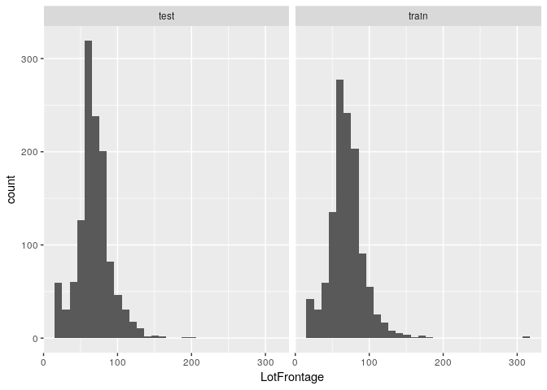<!-- -->

``` r
ggplot(aes_string(x = 'LotFrontage'), data = numeric.both) + 
  geom_histogram() + facet_wrap(~ Set)
```

    ## `stat_bin()` using `bins = 30`. Pick better value with `binwidth`.

    ## Warning: Removed 486 rows containing non-finite values (stat_bin).

<!-- -->

``` r
ggplot(aes_string(x = 'OverallQual'), data = numeric.both) + 
  geom_histogram() + facet_wrap(~ Set)
```

    ## `stat_bin()` using `bins = 30`. Pick better value with `binwidth`.

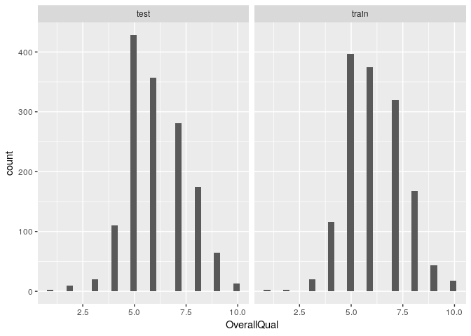<!-- -->

``` r
ggplot(aes_string(x = 'YearBuilt'), data = numeric.both) + 
  geom_histogram() + facet_wrap(~ Set)
```

    ## `stat_bin()` using `bins = 30`. Pick better value with `binwidth`.

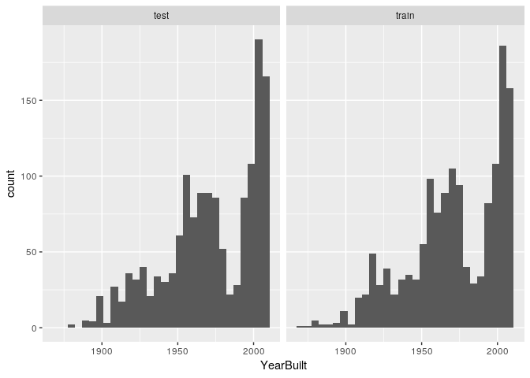<!-- -->

``` r
ggplot(aes_string(x = 'YearRemodAdd'), data = numeric.both) + 
  geom_histogram() + facet_wrap(~ Set)
```

    ## `stat_bin()` using `bins = 30`. Pick better value with `binwidth`.

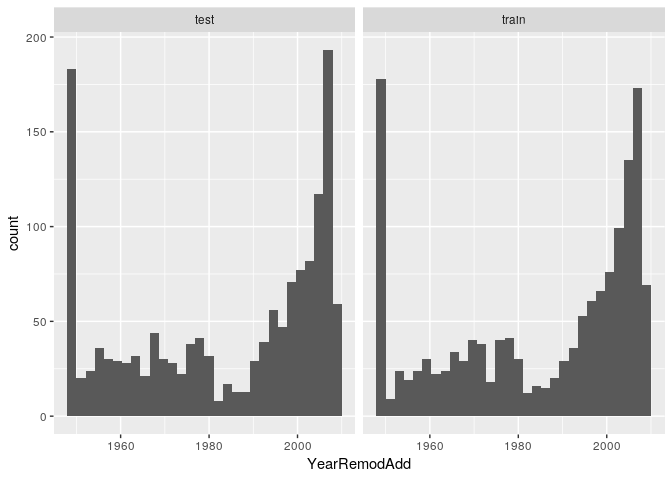<!-- -->

``` r
ggplot(aes_string(x = 'BsmtFinSF1'), data = numeric.both) + 
  geom_histogram() + facet_wrap(~ Set)
```

    ## `stat_bin()` using `bins = 30`. Pick better value with `binwidth`.

    ## Warning: Removed 1 rows containing non-finite values (stat_bin).

<!-- -->

``` r
ggplot(aes_string(x = 'MasVnrArea'), data = numeric.both) + 
  geom_histogram() + facet_wrap(~ Set)
```

    ## `stat_bin()` using `bins = 30`. Pick better value with `binwidth`.

    ## Warning: Removed 23 rows containing non-finite values (stat_bin).

<!-- -->

``` r
ggplot(aes_string(x = 'BsmtFinSF2'), data = numeric.both) + 
  geom_histogram() + facet_wrap(~ Set)
```

    ## `stat_bin()` using `bins = 30`. Pick better value with `binwidth`.

    ## Warning: Removed 1 rows containing non-finite values (stat_bin).

<!-- -->

``` r
ggplot(aes_string(x = 'BsmtUnfSF'), data = numeric.both) + 
  geom_histogram() + facet_wrap(~ Set)
```

    ## `stat_bin()` using `bins = 30`. Pick better value with `binwidth`.

    ## Warning: Removed 1 rows containing non-finite values (stat_bin).

<!-- -->

``` r
ggplot(aes_string(x = 'TotalBsmtSF'), data = numeric.both) + 
  geom_histogram() + facet_wrap(~ Set)
```

    ## `stat_bin()` using `bins = 30`. Pick better value with `binwidth`.

    ## Warning: Removed 1 rows containing non-finite values (stat_bin).

<!-- -->

``` r
ggplot(aes_string(x = '`1stFlrSF`'), data = numeric.both) + 
  geom_histogram() + facet_wrap(~ Set)
```

    ## `stat_bin()` using `bins = 30`. Pick better value with `binwidth`.

<!-- -->

``` r
ggplot(aes_string(x = '`2ndFlrSF`'), data = numeric.both) + 
  geom_histogram() + facet_wrap(~ Set)
```

    ## `stat_bin()` using `bins = 30`. Pick better value with `binwidth`.

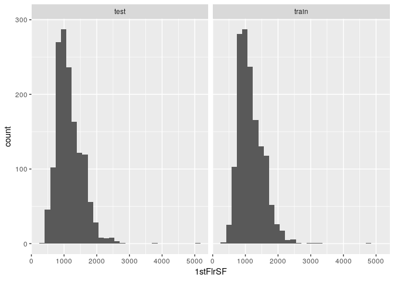<!-- -->

``` r
ggplot(aes_string(x = 'LowQualFinSF'), data = numeric.both) + 
  geom_histogram() + facet_wrap(~ Set)
```

    ## `stat_bin()` using `bins = 30`. Pick better value with `binwidth`.

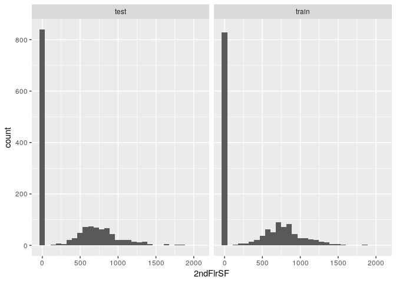<!-- -->

``` r
ggplot(aes_string(x = 'GrLivArea'), data = numeric.both) + 
  geom_histogram() + facet_wrap(~ Set)
```

    ## `stat_bin()` using `bins = 30`. Pick better value with `binwidth`.

<!-- -->

``` r
ggplot(aes_string(x = 'BsmtFullBath'), data = numeric.both) + 
  geom_histogram() + facet_wrap(~ Set)
```

    ## `stat_bin()` using `bins = 30`. Pick better value with `binwidth`.

    ## Warning: Removed 2 rows containing non-finite values (stat_bin).

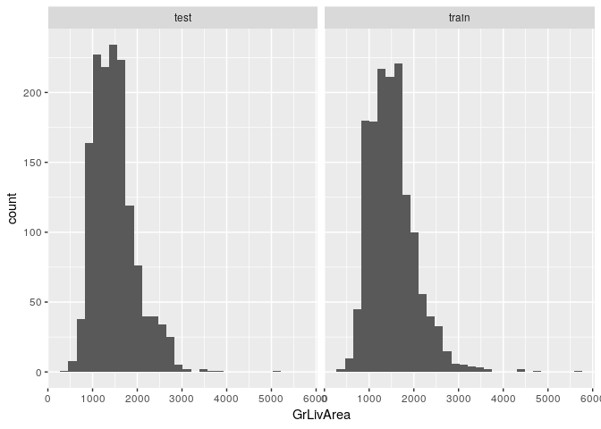<!-- -->

``` r
ggplot(aes_string(x = 'BsmtHalfBath'), data = numeric.both) + 
  geom_histogram() + facet_wrap(~ Set)
```

    ## `stat_bin()` using `bins = 30`. Pick better value with `binwidth`.

    ## Warning: Removed 2 rows containing non-finite values (stat_bin).

<!-- -->

``` r
ggplot(aes_string(x = 'BedroomAbvGr'), data = numeric.both) + 
  geom_histogram() + facet_wrap(~ Set)
```

    ## `stat_bin()` using `bins = 30`. Pick better value with `binwidth`.

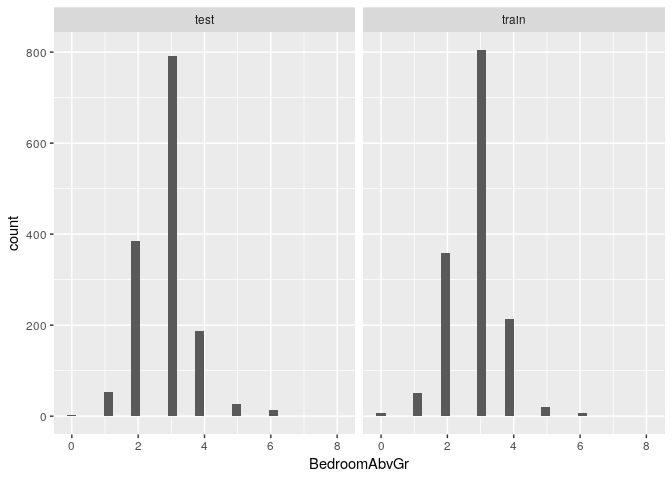<!-- -->

``` r
ggplot(aes_string(x = 'FullBath'), data = numeric.both) + 
  geom_histogram() + facet_wrap(~ Set)
```

    ## `stat_bin()` using `bins = 30`. Pick better value with `binwidth`.

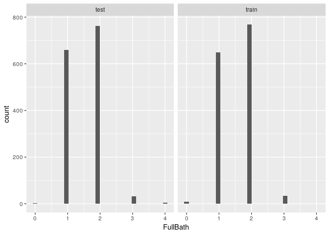<!-- -->

``` r
ggplot(aes_string(x = 'KitchenAbvGr'), data = numeric.both) + 
  geom_histogram() + facet_wrap(~ Set)
```

    ## `stat_bin()` using `bins = 30`. Pick better value with `binwidth`.

<!-- -->

``` r
ggplot(aes_string(x = 'TotRmsAbvGrd'), data = numeric.both) + 
  geom_histogram() + facet_wrap(~ Set)
```

    ## `stat_bin()` using `bins = 30`. Pick better value with `binwidth`.

<!-- -->

``` r
ggplot(aes_string(x = 'HalfBath'), data = numeric.both) + 
  geom_histogram() + facet_wrap(~ Set)
```

    ## `stat_bin()` using `bins = 30`. Pick better value with `binwidth`.

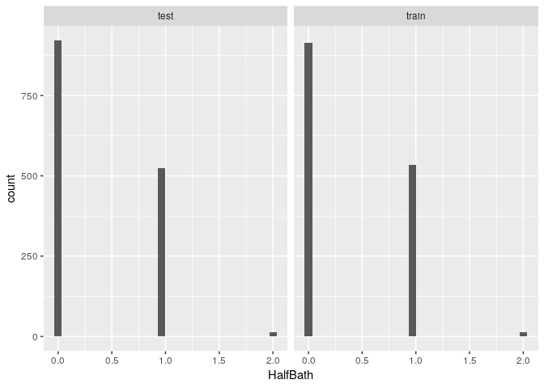<!-- -->

``` r
ggplot(aes_string(x = 'Fireplaces'), data = numeric.both) + 
  geom_histogram() + facet_wrap(~ Set)
```

    ## `stat_bin()` using `bins = 30`. Pick better value with `binwidth`.

<!-- -->

``` r
ggplot(aes_string(x = 'HalfBath'), data = numeric.both) + 
  geom_histogram() + facet_wrap(~ Set)
```

    ## `stat_bin()` using `bins = 30`. Pick better value with `binwidth`.

<!-- -->

``` r
ggplot(aes_string(x = 'GarageYrBlt'), data = numeric.both) + 
  geom_histogram() + facet_wrap(~ Set)
```

    ## `stat_bin()` using `bins = 30`. Pick better value with `binwidth`.

    ## Warning: Removed 159 rows containing non-finite values (stat_bin).

<!-- -->

``` r
ggplot(aes_string(x = 'GarageCars'), data = numeric.both) + 
  geom_histogram() + facet_wrap(~ Set)
```

    ## `stat_bin()` using `bins = 30`. Pick better value with `binwidth`.

    ## Warning: Removed 1 rows containing non-finite values (stat_bin).

<!-- -->

``` r
ggplot(aes_string(x = 'GarageArea'), data = numeric.both) + 
  geom_histogram() + facet_wrap(~ Set)
```

    ## `stat_bin()` using `bins = 30`. Pick better value with `binwidth`.

    ## Warning: Removed 1 rows containing non-finite values (stat_bin).

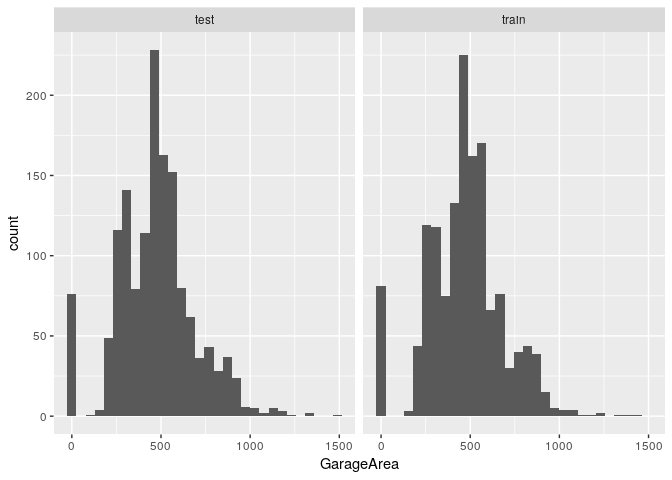<!-- -->

``` r
ggplot(aes_string(x = 'WoodDeckSF'), data = numeric.both) + 
  geom_histogram() + facet_wrap(~ Set)
```

    ## `stat_bin()` using `bins = 30`. Pick better value with `binwidth`.

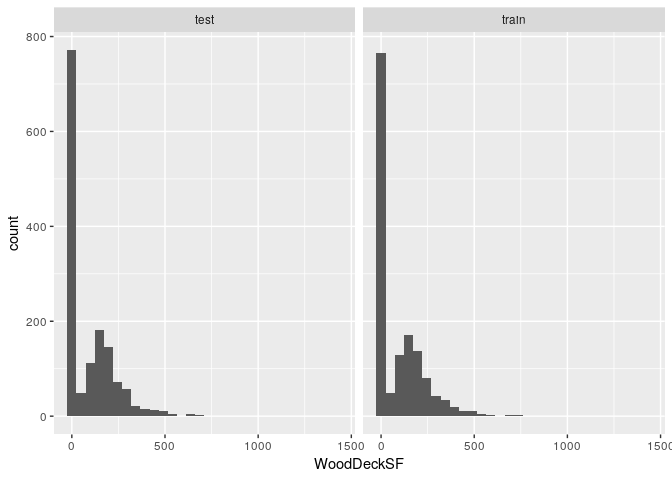<!-- -->

``` r
ggplot(aes_string(x = 'OpenPorchSF'), data = numeric.both) + 
  geom_histogram() + facet_wrap(~ Set)
```

    ## `stat_bin()` using `bins = 30`. Pick better value with `binwidth`.

<!-- -->

``` r
ggplot(aes_string(x = 'EnclosedPorch'), data = numeric.both) + 
  geom_histogram() + facet_wrap(~ Set)
```

    ## `stat_bin()` using `bins = 30`. Pick better value with `binwidth`.

<!-- -->

``` r
ggplot(aes_string(x = '`3SsnPorch`'), data = numeric.both) + 
  geom_histogram() + facet_wrap(~ Set)
```

    ## `stat_bin()` using `bins = 30`. Pick better value with `binwidth`.

<!-- -->

``` r
ggplot(aes_string(x = 'ScreenPorch'), data = numeric.both) + 
  geom_histogram() + facet_wrap(~ Set)
```

    ## `stat_bin()` using `bins = 30`. Pick better value with `binwidth`.

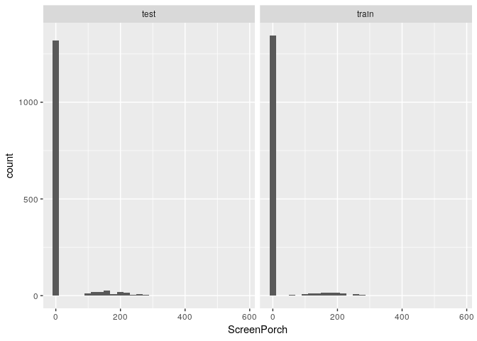<!-- -->

``` r
ggplot(aes_string(x = 'PoolArea'), data = numeric.both) + 
  geom_histogram() + facet_wrap(~ Set)
```

    ## `stat_bin()` using `bins = 30`. Pick better value with `binwidth`.

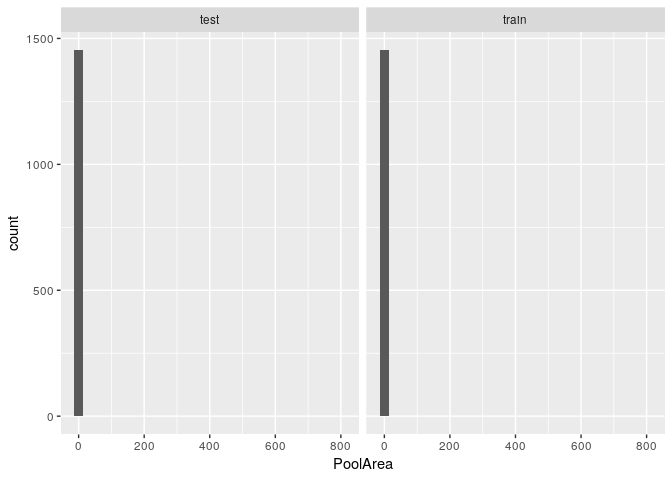<!-- -->

``` r
ggplot(aes_string(x = 'MiscVal'), data = numeric.both) + 
  geom_histogram() + facet_wrap(~ Set)
```

    ## `stat_bin()` using `bins = 30`. Pick better value with `binwidth`.

<!-- -->

``` r
ggplot(aes_string(x = 'MoSold'), data = numeric.both) + 
  geom_histogram() + facet_wrap(~ Set)
```

    ## `stat_bin()` using `bins = 30`. Pick better value with `binwidth`.

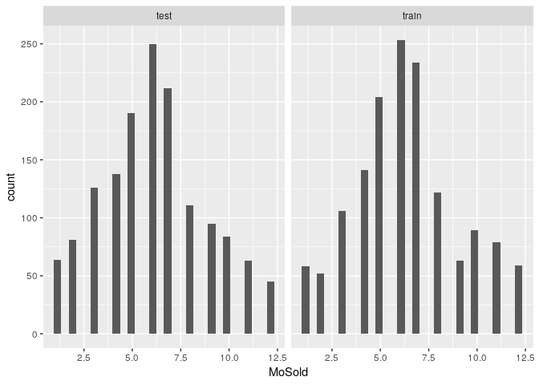<!-- -->

``` r
ggplot(aes_string(x = 'YrSold'), data = numeric.both) + 
  geom_histogram() + facet_wrap(~ Set)
```

    ## `stat_bin()` using `bins = 30`. Pick better value with `binwidth`.

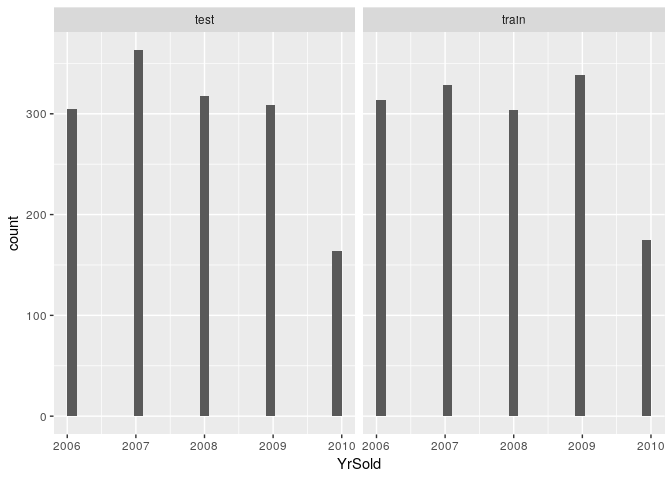<!-- -->

#### Varaince of Explanatory Variables

``` r
temp.table <- train.numeric %>%
  select(-one_of(c('Id', 'Set'))) %>%
  summarise_all(funs(sd(., na.rm=TRUE))) %>%
  rownames_to_column %>%
  gather(var, value, -rowname) %>%
  arrange(-value) %>%
  select(-one_of(c('rowname')))
names(temp.table) <- c('Feature','Correlation Coefficient')
kable(temp.table)
```

| Feature       | Correlation Coefficient |
| :------------ | ----------------------: |
| SalePrice     |            7.944250e+04 |
| LotArea       |            9.981265e+03 |
| GrLivArea     |            5.254804e+02 |
| MiscVal       |            4.961230e+02 |
| BsmtFinSF1    |            4.560981e+02 |
| BsmtUnfSF     |            4.418670e+02 |
| TotalBsmtSF   |            4.387053e+02 |
| 2ndFlrSF      |            4.365284e+02 |
| 1stFlrSF      |            3.865877e+02 |
| GarageArea    |            2.138048e+02 |
| MasVnrArea    |            1.810662e+02 |
| BsmtFinSF2    |            1.613193e+02 |
| WoodDeckSF    |            1.253388e+02 |
| OpenPorchSF   |            6.625603e+01 |
| EnclosedPorch |            6.111915e+01 |
| ScreenPorch   |            5.575742e+01 |
| LowQualFinSF  |            4.862308e+01 |
| MSSubClass    |            4.230057e+01 |
| PoolArea      |            4.017731e+01 |
| YearBuilt     |            3.020290e+01 |
| 3SsnPorch     |            2.931733e+01 |
| GarageYrBlt   |            2.468972e+01 |
| LotFrontage   |            2.428475e+01 |
| YearRemodAdd  |            2.064541e+01 |
| MoSold        |            2.703626e+00 |
| TotRmsAbvGrd  |            1.625393e+00 |
| OverallQual   |            1.382996e+00 |
| YrSold        |            1.328095e+00 |
| OverallCond   |            1.112799e+00 |
| BedroomAbvGr  |            8.157780e-01 |
| GarageCars    |            7.473150e-01 |
| Fireplaces    |            6.446664e-01 |
| FullBath      |            5.509158e-01 |
| BsmtFullBath  |            5.189106e-01 |
| HalfBath      |            5.028854e-01 |
| BsmtHalfBath  |            2.387526e-01 |
| KitchenAbvGr  |            2.203382e-01 |
