Exploratory Data Analysis
================
Stuart Miller
August 2, 2019

# Setup

``` r
# libraries
library(knitr)
library(tidyverse)
library(naniar)
library(Hmisc)
library(GGally)

# helper files
source('../helper/data_munging.R')
```

# Exploratory Analysis

### Load the data into R

``` r
train <- read_csv('../data/train.csv')
test <- read_csv('../data/test.csv')

train <- train %>% mutate(logSalePrice = log(SalePrice))

train$MSSubClass <- factor(train$MSSubClass)
test$MSSubClass <- factor(test$MSSubClass)
```

## Structure of the data

There are 79 features to the data in total. 43 of these features are
categorical and 36 of these features are numeric. The training set
consists of 1460 observations and the test set consists of 1459
observations. The training and test sets include an `Id` column, which
is not a feature of the dataset.

``` r
# split the training set into numeric and non-numeric sets 
train.numeric <- train %>% select_if(is.numeric)
train.nonnumeric <- train %>% select_if(is.character)

# get the dimensions
print('dimensions of the numeric features (training)')
```

    ## [1] "dimensions of the numeric features (training)"

``` r
dim(train.numeric)
```

    ## [1] 1460   38

``` r
print('dimensions of the non-numeric features (training)')
```

    ## [1] "dimensions of the non-numeric features (training)"

``` r
dim(train.nonnumeric)
```

    ## [1] 1460   43

``` r
test.numeric <- test %>% select_if(is.numeric)
test.nonnumeric <- test %>% select_if(is.character)

# get the dimensions
print('dimensions of the numeric features (testing)')
```

    ## [1] "dimensions of the numeric features (testing)"

``` r
dim(test.numeric)
```

    ## [1] 1459   36

``` r
print('dimensions of the non-numeric features (testing)')
```

    ## [1] "dimensions of the non-numeric features (testing)"

``` r
dim(test.nonnumeric)
```

    ## [1] 1459   43

``` r
# Print out the data structure
#str(train)
```

## Missing Data

5 of the features, `PoolQC`, `MiscFeature`, `Alley`, `Fence`, and
`FireplaceQu`, have very high missing rates in both sets of data. It
seems unlikely that these features would provide value as imbuing values
for the missing values would likely bias the training set towards the
imbued value. The feature `LotFrontage` is missing at a rate of ~17% and
~ 15% in the training and testing set respectively. This is also a
fairly high missing rate, but the usefulness of the feature should be
investigated. Fortunately, the rate of missingness for each feature is
approximately the same between the training and testing datasets.

``` r
train.nabular <- train %>% bind_shadow()
train.missing.summary <- train.nabular %>% miss_var_summary()
#train.missing.summary

train.missing.summary %>%
  filter(n_miss > 0) %>%
  ggplot(aes(x = reorder(variable, -n_miss), y = pct_miss)) + geom_bar(stat = 'identity') +
  theme(axis.text.x = element_text(angle = 70, hjust = 1)) +
  labs(title = 'Percent Missing Values of Features (Training Set)',
       y = '% Observations Missing', x = 'Feature Name')
```

<!-- -->

`PoolQC`, `MiscFeature`, `Alley`, `Fence`, `FireplaceQu`, and
`LotFrontage` are the primary missing values in the training dataset.

``` r
test.nabular <- test %>% bind_shadow()
test.missing.summary <- test.nabular %>% miss_var_summary()
#test.missing.summary

test.missing.summary %>%
  filter(n_miss > 0) %>%
  ggplot(aes(x = reorder(variable, -n_miss), y = pct_miss)) + geom_bar(stat = 'identity') +
  theme(axis.text.x = element_text(angle = 70, hjust = 1)) +
  labs(title = 'Percent Missing Values of Features (Test Set)',
       y = '% Observations Missing', x = 'Feature Name')
```

<!-- -->

`PoolQC`, `MiscFeature`, `Alley`, `Fence`,`FireplaceQu`, and
`LotFrontage` are the primary missing values in the testing dataset.

**Summary of the Data Missing per Feature from the
Datasets**

| Variable     | Number Missing (Train) | Percent Missing (Train) | Number Missing (Test) | Percent Missing (Test) |
| ------------ | ---------------------- | ----------------------- | --------------------- | ---------------------- |
| PoolQC       | 1453                   | 99.5%                   | 1456                  | 99.7%                  |
| MiscFeature  | 1406                   | 96.3%                   | 1408                  | 96.5%                  |
| Alley        | 1369                   | 93.7%                   | 1352                  | 92.6%                  |
| Fence        | 1179                   | 80.7%                   | 1169                  | 80.1%                  |
| FireplaceQu  | 690                    | 47.2%                   | 730                   | 50.0%                  |
| LotFrontage  | 259                    | 17.8%                   | 227                   | 15.5%                  |
| GarageType   | 81                     | 5.55%                   | 76                    | 5.21%                  |
| GarageYrBlt  | 81                     | 5.55%                   | 78                    | 5.34%                  |
| GarageFinish | 81                     | 5.55%                   | 78                    | 5.34%                  |
| GarageQual   | 81                     | 5.55%                   | 78                    | 5.34%                  |
| GarageCond   | 81                     | 5.55%                   | 78                    | 5.34%                  |
| BsmtExposure | 38                     | 2.60%                   | 44                    | 3.01%                  |
| BsmtFinType2 | 38                     | 2.60%                   | 42                    | 2.87%                  |
| BsmtQual     | 37                     | 2.53%                   | 44                    | 3.01%                  |
| BsmtCond     | 37                     | 2.53%                   | 45                    | 3.08%                  |
| BsmtFinType1 | 37                     | 2.53%                   | 42                    | 2.87%                  |
| MasVnrType   | 8                      | 0.55%                   | 16                    | 0.27%                  |
| MasVnrArea   | 8                      | 0.55%                   | 15                    | 0.13%                  |
| Electrical   | 1                      | 0.07%                   | N/A                   | N/A                    |
| MSZoning     | N/A                    | N/A                     | 4                     | 0.27%                  |
| Utilities    | N/A                    | N/A                     | 2                     | 0.14%                  |
| BsmtFullBath | N/A                    | N/A                     | 2                     | 0.14%                  |
| BsmtHalfBath | N/A                    | N/A                     | 2                     | 0.14%                  |
| Functional   | N/A                    | N/A                     | 2                     | 0.14%                  |
| Exterior1st  | N/A                    | N/A                     | 1                     | 0.07%                  |
| Exterior2nd  | N/A                    | N/A                     | 1                     | 0.07%                  |
| BsmtFinSF1   | N/A                    | N/A                     | 1                     | 0.07%                  |
| BsmtFinSF2   | N/A                    | N/A                     | 1                     | 0.07%                  |
| BsmtUnfSF    | N/A                    | N/A                     | 1                     | 0.07%                  |
| TotalBsmtSF  | N/A                    | N/A                     | 1                     | 0.07%                  |
| KitchenQual  | N/A                    | N/A                     | 1                     | 0.07%                  |
| GarageCars   | N/A                    | N/A                     | 1                     | 0.07%                  |
| GarageArea   | N/A                    | N/A                     | 1                     | 0.07%                  |
| SaleType     | N/A                    | N/A                     | 1                     | 0.07%                  |

## Univariate and Relation to Response Exploration

### Continuous Variables

#### Distribution of Response Variable

`SalePrice` is the response variable. This is only contained in the
training set.

``` r
ggplot(aes_string(x = 'SalePrice'), data = train) + 
  geom_histogram()
```

    ## `stat_bin()` using `bins = 30`. Pick better value with `binwidth`.

<!-- -->

#### Correlation of Numeric Features (Training Set)

**Table of Correlated Features from Training Set (r \>
0.5)**

``` r
train.dropna <- train.numeric %>% drop_na() %>% select(-one_of(c('SalePrice')))
res2<-rcorr(as.matrix(train.dropna))
flattenedCor <- flattenCorrMatrix(res2$r, res2$P) %>% arrange(desc(cor))
flattenedCor <- flattenedCor %>% filter(cor > 0.5) %>% select(-one_of(c('p')))
names(flattenedCor) <- c('Feature1','Feature2','Correlation Coefficient')
kable(flattenedCor)
```

| Feature1     | Feature2     | Correlation Coefficient |
| :----------- | :----------- | ----------------------: |
| GarageCars   | GarageArea   |               0.8394149 |
| TotalBsmtSF  | 1stFlrSF     |               0.8359994 |
| OverallQual  | logSalePrice |               0.8276821 |
| GrLivArea    | TotRmsAbvGrd |               0.8243121 |
| YearBuilt    | GarageYrBlt  |               0.8235195 |
| GrLivArea    | logSalePrice |               0.6958444 |
| 2ndFlrSF     | GrLivArea    |               0.6882916 |
| GarageCars   | logSalePrice |               0.6643378 |
| BsmtFinSF1   | BsmtFullBath |               0.6517267 |
| BedroomAbvGr | TotRmsAbvGrd |               0.6502846 |
| YearRemodAdd | GarageYrBlt  |               0.6458085 |
| GarageArea   | logSalePrice |               0.6263662 |
| YearBuilt    | YearRemodAdd |               0.6231713 |
| 2ndFlrSF     | TotRmsAbvGrd |               0.6177759 |
| TotalBsmtSF  | logSalePrice |               0.6162565 |
| GrLivArea    | FullBath     |               0.6148873 |
| FullBath     | logSalePrice |               0.6099352 |
| OverallQual  | GrLivArea    |               0.6074661 |
| 2ndFlrSF     | HalfBath     |               0.6063367 |
| 1stFlrSF     | logSalePrice |               0.6035725 |
| GarageYrBlt  | GarageCars   |               0.6009034 |
| YearBuilt    | logSalePrice |               0.5938805 |
| OverallQual  | GarageCars   |               0.5938029 |
| GarageYrBlt  | GarageArea   |               0.5926352 |
| YearRemodAdd | logSalePrice |               0.5925974 |
| OverallQual  | YearBuilt    |               0.5893845 |
| OverallQual  | FullBath     |               0.5768747 |
| OverallQual  | YearRemodAdd |               0.5707571 |
| OverallQual  | TotalBsmtSF  |               0.5639597 |
| GarageYrBlt  | logSalePrice |               0.5629896 |
| 1stFlrSF     | GrLivArea    |               0.5613723 |
| OverallQual  | GarageYrBlt  |               0.5604251 |
| OverallQual  | GarageArea   |               0.5506589 |
| TotRmsAbvGrd | logSalePrice |               0.5452451 |
| FullBath     | TotRmsAbvGrd |               0.5404489 |
| YearBuilt    | GarageCars   |               0.5325628 |
| BsmtFinSF1   | TotalBsmtSF  |               0.5309165 |
| TotalBsmtSF  | GarageArea   |               0.5220512 |
| 1stFlrSF     | GarageArea   |               0.5211830 |
| FullBath     | GarageCars   |               0.5208570 |
| OverallQual  | 1stFlrSF     |               0.5144529 |
| GrLivArea    | BedroomAbvGr |               0.5119397 |
| 2ndFlrSF     | BedroomAbvGr |               0.5107030 |
| YearBuilt    | FullBath     |               0.5004947 |

#### Varaince of Explanatory Variables

``` r
temp.table <- train.numeric %>%
  select(-one_of(c('Id', 'Set'))) %>%
  summarise_all(funs(sd(., na.rm=TRUE))) %>%
  rownames_to_column %>%
  gather(var, value, -rowname) %>%
  arrange(-value) %>%
  select(-one_of(c('rowname')))
```

    ## Warning: Unknown columns: `Set`

``` r
names(temp.table) <- c('Feature','Standard Deviation')
kable(temp.table)
```

| Feature       | Standard Deviation |
| :------------ | -----------------: |
| SalePrice     |       7.944250e+04 |
| LotArea       |       9.981265e+03 |
| GrLivArea     |       5.254804e+02 |
| MiscVal       |       4.961230e+02 |
| BsmtFinSF1    |       4.560981e+02 |
| BsmtUnfSF     |       4.418670e+02 |
| TotalBsmtSF   |       4.387053e+02 |
| 2ndFlrSF      |       4.365284e+02 |
| 1stFlrSF      |       3.865877e+02 |
| GarageArea    |       2.138048e+02 |
| MasVnrArea    |       1.810662e+02 |
| BsmtFinSF2    |       1.613193e+02 |
| WoodDeckSF    |       1.253388e+02 |
| OpenPorchSF   |       6.625603e+01 |
| EnclosedPorch |       6.111915e+01 |
| ScreenPorch   |       5.575742e+01 |
| LowQualFinSF  |       4.862308e+01 |
| PoolArea      |       4.017731e+01 |
| YearBuilt     |       3.020290e+01 |
| 3SsnPorch     |       2.931733e+01 |
| GarageYrBlt   |       2.468972e+01 |
| LotFrontage   |       2.428475e+01 |
| YearRemodAdd  |       2.064541e+01 |
| MoSold        |       2.703626e+00 |
| TotRmsAbvGrd  |       1.625393e+00 |
| OverallQual   |       1.382996e+00 |
| YrSold        |       1.328095e+00 |
| OverallCond   |       1.112799e+00 |
| BedroomAbvGr  |       8.157780e-01 |
| GarageCars    |       7.473150e-01 |
| Fireplaces    |       6.446664e-01 |
| FullBath      |       5.509158e-01 |
| BsmtFullBath  |       5.189106e-01 |
| HalfBath      |       5.028854e-01 |
| logSalePrice  |       3.994519e-01 |
| BsmtHalfBath  |       2.387526e-01 |
| KitchenAbvGr  |       2.203382e-01 |

#### Explanatory Variables

``` r
# get the names of the continuous variables
cont.names <- names(train.numeric)
print(cont.names)
```

    ##  [1] "Id"            "LotFrontage"   "LotArea"       "OverallQual"  
    ##  [5] "OverallCond"   "YearBuilt"     "YearRemodAdd"  "MasVnrArea"   
    ##  [9] "BsmtFinSF1"    "BsmtFinSF2"    "BsmtUnfSF"     "TotalBsmtSF"  
    ## [13] "1stFlrSF"      "2ndFlrSF"      "LowQualFinSF"  "GrLivArea"    
    ## [17] "BsmtFullBath"  "BsmtHalfBath"  "FullBath"      "HalfBath"     
    ## [21] "BedroomAbvGr"  "KitchenAbvGr"  "TotRmsAbvGrd"  "Fireplaces"   
    ## [25] "GarageYrBlt"   "GarageCars"    "GarageArea"    "WoodDeckSF"   
    ## [29] "OpenPorchSF"   "EnclosedPorch" "3SsnPorch"     "ScreenPorch"  
    ## [33] "PoolArea"      "MiscVal"       "MoSold"        "YrSold"       
    ## [37] "SalePrice"     "logSalePrice"

``` r
# add factors for test and train
train.numeric$Set <- rep('train', (dim(train.numeric)[1]))
test.numeric$Set <- rep('test', (dim(test.numeric)[1]))

# combine the training and testing set for histogram plotting
numeric.both <- rbind(train.numeric %>% select(-one_of(c('SalePrice','Id','logSalePrice'))),
                      test.numeric %>% select(-one_of(c('Id'))))
numeric.both$Set <- as.factor(numeric.both$Set)

# remove points based on initial analysis
train.numeric <- train.numeric %>% filter(GrLivArea < 4000)

# add log of sale price
train.numeric <- train.numeric %>% mutate(logSalePrice = log(SalePrice))
```

Based on the plots below, the following features appear to be linearly
related to log of sale price:

  - `OverallQual`
  - `YearBuilt`
  - `YearRemodAdd`
  - `BsmtFinSF1` - with dummy variable to remove 0s
  - `BsmtFinSF2` - with dummy variable to remove 0s
  - `BsmtUnfSF` - maybe with a dummy variable
  - `TotalBsmtSF` - with dummy variable to remove 0s
  - `1stFlrSF`
  - `2ndFlrSF` - with dummy variable to remove 0s
  - `GrLivArea`
  - `FullBath`
  - `TotRmsAbvGrd` - somewhat of a curve in the response
  - `GarageYrBlt`
  - `GarageCars`
  - `GarageArea`

The following features may be useful:

`MasVnrArea` - maybe with a dummy variable `EnclosedPorch` - maybe with
a dummy variable

The following features do not seem to have a relationship with log of
sale price:

  - `LotFrontage`
  - `LotArea`
  - `OverallCond`
  - `LowQualFinSF`
  - `BsmtFullBath`
  - `BsmtHalfBath`
  - `HalfBath`
  - `BedroomAbvGr`
  - `KitchenAbvGr`
  - `Fireplaces`
  - `WoodDeckSF`
  - `OpenPorchSF`
  - `3SsnPorch`
  - `PoolArea`
  - `ScreenPorch`
  - `MiscVal`
  - `MoSold`
  - `YrSold`

<!-- end list -->

``` r
ggplot(aes_string(x = 'LotFrontage'), data = numeric.both) + 
  geom_histogram() + facet_wrap(~ Set)
```

    ## `stat_bin()` using `bins = 30`. Pick better value with `binwidth`.

    ## Warning: Removed 486 rows containing non-finite values (stat_bin).

<!-- -->

``` r
train.numeric %>% ggplot(aes(x = LotFrontage, y = logSalePrice)) +
  geom_point(alpha = 0.3) + geom_smooth(method = 'lm')
```

    ## Warning: Removed 259 rows containing non-finite values (stat_smooth).

    ## Warning: Removed 259 rows containing missing values (geom_point).

<!-- -->

``` r
ggplot(aes_string(x = 'LotArea'), data = numeric.both) + 
  geom_histogram() + facet_wrap(~ Set)
```

    ## `stat_bin()` using `bins = 30`. Pick better value with `binwidth`.

<!-- -->

``` r
train.numeric %>% ggplot(aes(x = LotArea, y = logSalePrice)) +
  geom_point() + geom_smooth(method = 'lm')
```

<!-- -->

``` r
ggplot(aes_string(x = 'OverallQual'), data = numeric.both) + 
  geom_histogram() + facet_wrap(~ Set)
```

    ## `stat_bin()` using `bins = 30`. Pick better value with `binwidth`.

<!-- -->

``` r
train.numeric %>% ggplot(aes(x = OverallQual, y = logSalePrice)) +
  geom_point() + geom_smooth(method = 'lm')
```

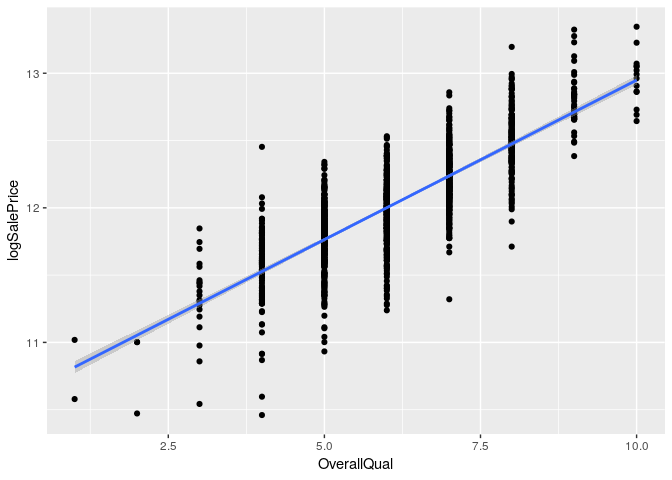<!-- -->

``` r
ggplot(aes_string(x = 'OverallCond'), data = numeric.both) + 
  geom_histogram() + facet_wrap(~ Set)
```

    ## `stat_bin()` using `bins = 30`. Pick better value with `binwidth`.

<!-- -->

``` r
train.numeric %>% ggplot(aes(x = OverallCond, y = logSalePrice)) +
  geom_point() + geom_smooth(method = 'lm')
```

<!-- -->

``` r
ggplot(aes_string(x = 'YearBuilt'), data = numeric.both) + 
  geom_histogram() + facet_wrap(~ Set)
```

    ## `stat_bin()` using `bins = 30`. Pick better value with `binwidth`.

<!-- -->

``` r
train.numeric %>% ggplot(aes(x = YearBuilt, y = logSalePrice)) +
  geom_point() + geom_smooth(method = 'lm')
```

<!-- -->

``` r
ggplot(aes_string(x = 'YearRemodAdd'), data = numeric.both) + 
  geom_histogram() + facet_wrap(~ Set)
```

    ## `stat_bin()` using `bins = 30`. Pick better value with `binwidth`.

<!-- -->

``` r
train.numeric %>% ggplot(aes(x = YearRemodAdd, y = logSalePrice)) +
  geom_point() + geom_smooth(method = 'lm')
```

<!-- -->

``` r
ggplot(aes_string(x = 'MasVnrArea'), data = numeric.both) + 
  geom_histogram() + facet_wrap(~ Set)
```

    ## `stat_bin()` using `bins = 30`. Pick better value with `binwidth`.

    ## Warning: Removed 23 rows containing non-finite values (stat_bin).

<!-- -->

``` r
train.numeric %>% filter(MasVnrArea != 0) %>% ggplot(aes(x = MasVnrArea, y = logSalePrice)) +
  geom_point() + geom_smooth(method = 'lm')
```

<!-- -->

``` r
ggplot(aes_string(x = 'BsmtFinSF1'), data = numeric.both) + 
  geom_histogram() + facet_wrap(~ Set)
```

    ## `stat_bin()` using `bins = 30`. Pick better value with `binwidth`.

    ## Warning: Removed 1 rows containing non-finite values (stat_bin).

<!-- -->

``` r
train.numeric %>% filter(BsmtFinSF1 != 0) %>% ggplot(aes(x = BsmtFinSF1, y = logSalePrice)) +
  geom_point() + geom_smooth(method = 'lm')
```

<!-- -->

``` r
ggplot(aes_string(x = 'BsmtFinSF2'), data = numeric.both) + 
  geom_histogram() + facet_wrap(~ Set)
```

    ## `stat_bin()` using `bins = 30`. Pick better value with `binwidth`.

    ## Warning: Removed 1 rows containing non-finite values (stat_bin).

<!-- -->

``` r
train.numeric %>% filter(BsmtFinSF2 != 0) %>% ggplot(aes(x = BsmtFinSF2, y = logSalePrice)) +
  geom_point() + geom_smooth(method = 'lm')
```

<!-- -->

``` r
ggplot(aes_string(x = 'BsmtUnfSF'), data = numeric.both) + 
  geom_histogram() + facet_wrap(~ Set)
```

    ## `stat_bin()` using `bins = 30`. Pick better value with `binwidth`.

    ## Warning: Removed 1 rows containing non-finite values (stat_bin).

<!-- -->

``` r
train.numeric %>% filter(BsmtUnfSF != 0) %>% ggplot(aes(x = BsmtUnfSF, y = logSalePrice)) +
  geom_point() + geom_smooth(method = 'lm')
```

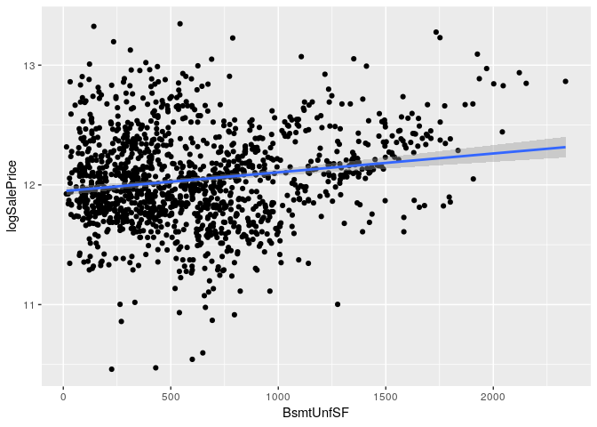<!-- -->

``` r
ggplot(aes_string(x = 'TotalBsmtSF'), data = numeric.both) + 
  geom_histogram() + facet_wrap(~ Set)
```

    ## `stat_bin()` using `bins = 30`. Pick better value with `binwidth`.

    ## Warning: Removed 1 rows containing non-finite values (stat_bin).

<!-- -->

``` r
train.numeric %>% filter(TotalBsmtSF != 0) %>% ggplot(aes(x = TotalBsmtSF, y = logSalePrice)) +
  geom_point() + geom_smooth(method = 'lm')
```

<!-- -->

``` r
ggplot(aes_string(x = '`1stFlrSF`'), data = numeric.both) + 
  geom_histogram() + facet_wrap(~ Set)
```

    ## `stat_bin()` using `bins = 30`. Pick better value with `binwidth`.

<!-- -->

``` r
train.numeric %>% filter(`1stFlrSF` != 0) %>% ggplot(aes(x = `1stFlrSF`, y = logSalePrice)) +
  geom_point() + geom_smooth(method = 'lm')
```

<!-- -->

``` r
ggplot(aes_string(x = '`2ndFlrSF`'), data = numeric.both) + 
  geom_histogram() + facet_wrap(~ Set)
```

    ## `stat_bin()` using `bins = 30`. Pick better value with `binwidth`.

<!-- -->

``` r
train.numeric %>% filter(`2ndFlrSF` != 0) %>% ggplot(aes(x = `2ndFlrSF`, y = logSalePrice)) +
  geom_point() + geom_smooth(method = 'lm')
```

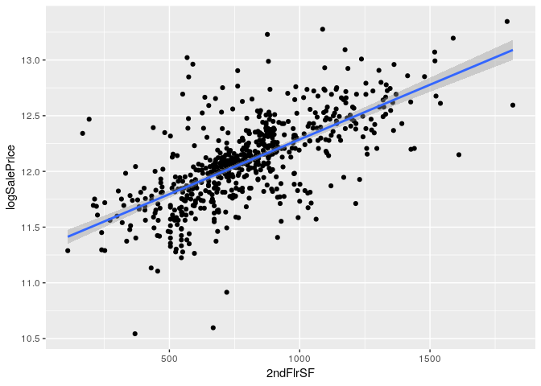<!-- -->

``` r
ggplot(aes_string(x = 'LowQualFinSF'), data = numeric.both) + 
  geom_histogram() + facet_wrap(~ Set)
```

    ## `stat_bin()` using `bins = 30`. Pick better value with `binwidth`.

<!-- -->

``` r
train.numeric %>% filter(LowQualFinSF != 0) %>% ggplot(aes(x = LowQualFinSF, y = logSalePrice)) +
  geom_point() + geom_smooth(method = 'lm')
```

<!-- -->

``` r
ggplot(aes_string(x = 'GrLivArea'), data = numeric.both) + 
  geom_histogram() + facet_wrap(~ Set)
```

    ## `stat_bin()` using `bins = 30`. Pick better value with `binwidth`.

<!-- -->

``` r
train.numeric %>% filter(GrLivArea != 0) %>% ggplot(aes(x = GrLivArea, y = logSalePrice)) +
  geom_point() + geom_smooth(method = 'lm')
```

<!-- -->

``` r
ggplot(aes_string(x = 'BsmtFullBath'), data = numeric.both) + 
  geom_histogram() + facet_wrap(~ Set)
```

    ## `stat_bin()` using `bins = 30`. Pick better value with `binwidth`.

    ## Warning: Removed 2 rows containing non-finite values (stat_bin).

<!-- -->

``` r
train.numeric %>% filter(BsmtFullBath != 0) %>% ggplot(aes(x = BsmtFullBath, y = logSalePrice)) +
  geom_point() + geom_smooth(method = 'lm')
```

<!-- -->

``` r
ggplot(aes_string(x = 'BsmtHalfBath'), data = numeric.both) + 
  geom_histogram() + facet_wrap(~ Set)
```

    ## `stat_bin()` using `bins = 30`. Pick better value with `binwidth`.

    ## Warning: Removed 2 rows containing non-finite values (stat_bin).

<!-- -->

``` r
train.numeric %>% filter(BsmtHalfBath != 0) %>% ggplot(aes(x = BsmtHalfBath, y = logSalePrice)) +
  geom_point() + geom_smooth(method = 'lm')
```

<!-- -->

``` r
ggplot(aes_string(x = 'FullBath'), data = numeric.both) + 
  geom_histogram() + facet_wrap(~ Set)
```

    ## `stat_bin()` using `bins = 30`. Pick better value with `binwidth`.

<!-- -->

``` r
train.numeric %>% filter(FullBath != 0) %>% ggplot(aes(x = FullBath, y = logSalePrice)) +
  geom_point() + geom_smooth(method = 'lm')
```

<!-- -->

``` r
ggplot(aes_string(x = 'HalfBath'), data = numeric.both) + 
  geom_histogram() + facet_wrap(~ Set)
```

    ## `stat_bin()` using `bins = 30`. Pick better value with `binwidth`.

<!-- -->

``` r
train.numeric %>% filter(HalfBath != 0) %>% ggplot(aes(x = HalfBath, y = logSalePrice)) +
  geom_point() + geom_smooth(method = 'lm')
```

<!-- -->

``` r
ggplot(aes_string(x = 'BedroomAbvGr'), data = numeric.both) + 
  geom_histogram() + facet_wrap(~ Set)
```

    ## `stat_bin()` using `bins = 30`. Pick better value with `binwidth`.

<!-- -->

``` r
train.numeric %>% filter(BedroomAbvGr != 0) %>% ggplot(aes(x = BedroomAbvGr, y = logSalePrice)) +
  geom_point() + geom_smooth(method = 'lm')
```

<!-- -->

``` r
ggplot(aes_string(x = 'KitchenAbvGr'), data = numeric.both) + 
  geom_histogram() + facet_wrap(~ Set)
```

    ## `stat_bin()` using `bins = 30`. Pick better value with `binwidth`.

<!-- -->

``` r
train.numeric %>% filter(KitchenAbvGr != 0) %>% ggplot(aes(x = KitchenAbvGr, y = logSalePrice)) +
  geom_point() + geom_smooth(method = 'lm')
```

<!-- -->

``` r
ggplot(aes_string(x = 'TotRmsAbvGrd'), data = numeric.both) + 
  geom_histogram() + facet_wrap(~ Set)
```

    ## `stat_bin()` using `bins = 30`. Pick better value with `binwidth`.

<!-- -->

``` r
train.numeric %>% filter(TotRmsAbvGrd != 0) %>% ggplot(aes(x = TotRmsAbvGrd, y = logSalePrice)) +
  geom_point() + geom_smooth(method = 'lm')
```

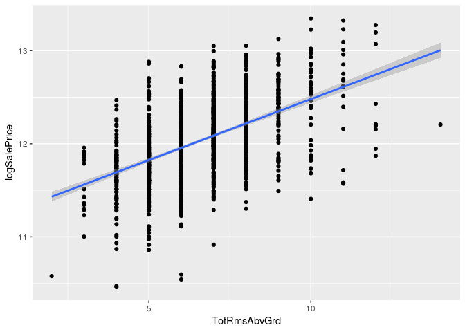<!-- -->

``` r
ggplot(aes_string(x = 'Fireplaces'), data = numeric.both) + 
  geom_histogram() + facet_wrap(~ Set)
```

    ## `stat_bin()` using `bins = 30`. Pick better value with `binwidth`.

<!-- -->

``` r
train.numeric %>% filter(Fireplaces != 0) %>% ggplot(aes(x = Fireplaces, y = logSalePrice)) +
  geom_point() + geom_smooth(method = 'lm')
```

<!-- -->

``` r
ggplot(aes_string(x = 'GarageYrBlt'), data = numeric.both) + 
  geom_histogram() + facet_wrap(~ Set)
```

    ## `stat_bin()` using `bins = 30`. Pick better value with `binwidth`.

    ## Warning: Removed 159 rows containing non-finite values (stat_bin).

<!-- -->

``` r
train.numeric %>% filter(GarageYrBlt != 0) %>% ggplot(aes(x = GarageYrBlt, y = logSalePrice)) +
  geom_point() + geom_smooth(method = 'lm')
```

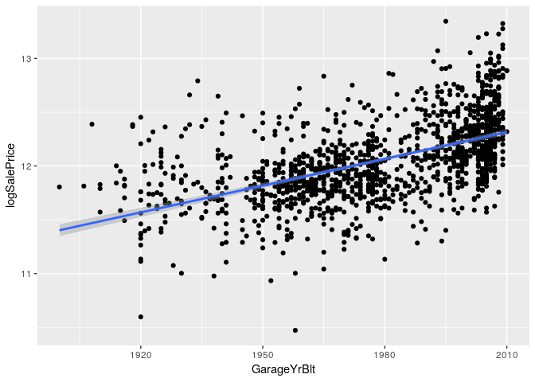<!-- -->

``` r
ggplot(aes_string(x = 'GarageCars'), data = numeric.both) + 
  geom_histogram() + facet_wrap(~ Set)
```

    ## `stat_bin()` using `bins = 30`. Pick better value with `binwidth`.

    ## Warning: Removed 1 rows containing non-finite values (stat_bin).

<!-- -->

``` r
train.numeric %>% filter(GarageCars != 0) %>% ggplot(aes(x = GarageCars, y = logSalePrice)) +
  geom_point() + geom_smooth(method = 'lm')
```

<!-- -->

``` r
ggplot(aes_string(x = 'GarageArea'), data = numeric.both) + 
  geom_histogram() + facet_wrap(~ Set)
```

    ## `stat_bin()` using `bins = 30`. Pick better value with `binwidth`.

    ## Warning: Removed 1 rows containing non-finite values (stat_bin).

<!-- -->

``` r
train.numeric %>% filter(GarageArea != 0) %>% ggplot(aes(x = GarageArea, y = logSalePrice)) +
  geom_point() + geom_smooth(method = 'lm')
```

<!-- -->

``` r
ggplot(aes_string(x = 'WoodDeckSF'), data = numeric.both) + 
  geom_histogram() + facet_wrap(~ Set)
```

    ## `stat_bin()` using `bins = 30`. Pick better value with `binwidth`.

<!-- -->

``` r
train.numeric %>% filter(WoodDeckSF != 0) %>% ggplot(aes(x = WoodDeckSF, y = logSalePrice)) +
  geom_point() + geom_smooth(method = 'lm')
```

<!-- -->

``` r
ggplot(aes_string(x = 'OpenPorchSF'), data = numeric.both) + 
  geom_histogram() + facet_wrap(~ Set)
```

    ## `stat_bin()` using `bins = 30`. Pick better value with `binwidth`.

<!-- -->

``` r
train.numeric %>% filter(OpenPorchSF != 0) %>% ggplot(aes(x = OpenPorchSF, y = logSalePrice)) +
  geom_point() + geom_smooth(method = 'lm')
```

<!-- -->

``` r
ggplot(aes_string(x = 'EnclosedPorch'), data = numeric.both) + 
  geom_histogram() + facet_wrap(~ Set)
```

    ## `stat_bin()` using `bins = 30`. Pick better value with `binwidth`.

<!-- -->

``` r
train.numeric %>% filter(EnclosedPorch != 0) %>% ggplot(aes(x = EnclosedPorch, y = logSalePrice)) +
  geom_point() + geom_smooth(method = 'lm')
```

<!-- -->

``` r
ggplot(aes_string(x = '`3SsnPorch`'), data = numeric.both) + 
  geom_histogram() + facet_wrap(~ Set)
```

    ## `stat_bin()` using `bins = 30`. Pick better value with `binwidth`.

<!-- -->

``` r
train.numeric %>% filter(`3SsnPorch` != 0) %>% ggplot(aes(x = `3SsnPorch`, y = logSalePrice)) +
  geom_point() + geom_smooth(method = 'lm')
```

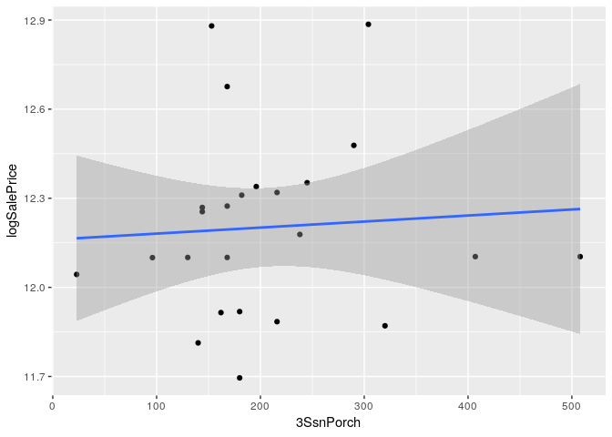<!-- -->

``` r
ggplot(aes_string(x = 'ScreenPorch'), data = numeric.both) + 
  geom_histogram() + facet_wrap(~ Set)
```

    ## `stat_bin()` using `bins = 30`. Pick better value with `binwidth`.

<!-- -->

``` r
train.numeric %>% filter(ScreenPorch != 0) %>% ggplot(aes(x = ScreenPorch, y = logSalePrice)) +
  geom_point() + geom_smooth(method = 'lm')
```

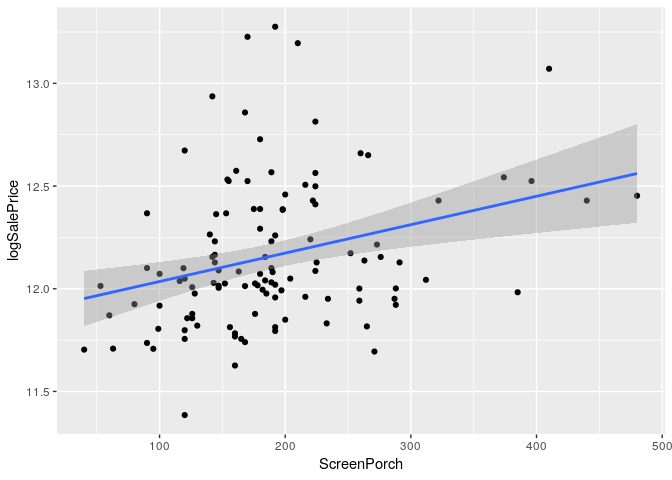<!-- -->

``` r
ggplot(aes_string(x = 'PoolArea'), data = numeric.both) + 
  geom_histogram() + facet_wrap(~ Set)
```

    ## `stat_bin()` using `bins = 30`. Pick better value with `binwidth`.

<!-- -->

``` r
train.numeric %>% filter(PoolArea != 0) %>% ggplot(aes(x = PoolArea, y = logSalePrice)) +
  geom_point() + geom_smooth(method = 'lm')
```

<!-- -->

``` r
ggplot(aes_string(x = 'MiscVal'), data = numeric.both) + 
  geom_histogram() + facet_wrap(~ Set)
```

    ## `stat_bin()` using `bins = 30`. Pick better value with `binwidth`.

<!-- -->

``` r
train.numeric %>% filter(MiscVal != 0) %>% ggplot(aes(x = MiscVal, y = logSalePrice)) +
  geom_point() + geom_smooth(method = 'lm')
```

<!-- -->

``` r
ggplot(aes_string(x = 'MoSold'), data = numeric.both) + 
  geom_histogram() + facet_wrap(~ Set)
```

    ## `stat_bin()` using `bins = 30`. Pick better value with `binwidth`.

<!-- -->

``` r
train.numeric %>% filter(MoSold != 0) %>% ggplot(aes(x = MoSold, y = logSalePrice)) +
  geom_point() + geom_smooth(method = 'lm')
```

<!-- -->

``` r
ggplot(aes_string(x = 'YrSold'), data = numeric.both) + 
  geom_histogram() + facet_wrap(~ Set)
```

    ## `stat_bin()` using `bins = 30`. Pick better value with `binwidth`.

<!-- -->

``` r
train.numeric %>% filter(YrSold != 0) %>% ggplot(aes(x = YrSold, y = logSalePrice)) +
  geom_point() + geom_smooth(method = 'lm')
```

<!-- -->

### Categorical Variables

``` r
# get the names of the continuous variables
cont.names <- names(train.nonnumeric)
print(cont.names)
```

    ##  [1] "MSZoning"      "Street"        "Alley"         "LotShape"     
    ##  [5] "LandContour"   "Utilities"     "LotConfig"     "LandSlope"    
    ##  [9] "Neighborhood"  "Condition1"    "Condition2"    "BldgType"     
    ## [13] "HouseStyle"    "RoofStyle"     "RoofMatl"      "Exterior1st"  
    ## [17] "Exterior2nd"   "MasVnrType"    "ExterQual"     "ExterCond"    
    ## [21] "Foundation"    "BsmtQual"      "BsmtCond"      "BsmtExposure" 
    ## [25] "BsmtFinType1"  "BsmtFinType2"  "Heating"       "HeatingQC"    
    ## [29] "CentralAir"    "Electrical"    "KitchenQual"   "Functional"   
    ## [33] "FireplaceQu"   "GarageType"    "GarageFinish"  "GarageQual"   
    ## [37] "GarageCond"    "PavedDrive"    "PoolQC"        "Fence"        
    ## [41] "MiscFeature"   "SaleType"      "SaleCondition"

``` r
# add factors for test and train
train.nonnumeric$Set <- rep('train', (dim(train.nonnumeric)[1]))
test.nonnumeric$Set <- rep('test', (dim(test.nonnumeric)[1]))

# combine the training and testing set for histogram plotting
nonnumeric.both <- rbind(train.nonnumeric, test.nonnumeric)
nonnumeric.both$Set <- as.factor(nonnumeric.both$Set)
```

Based on the bar charts below, the following categorical variables
should be checked for use in the model:

  - MSZoning
  - LotShape
  - LotConfig
  - Neighborhood
  - BldgType
  - HouseStyle
  - RoofStyle
  - Exterior1st
  - Exterior2nd
  - MasVnrType
  - ExterQual
  - ExterCond
  - Foundation
  - BsmtQual
  - BsmtExposure
  - BsmtFinType1
  - BsmtFinType2
  - CentralAir
  - Electrical
  - KitchenQual
  - FireplaceQu
  - GarageType
  - GarageFinish
  - LandContour - lower interest
  - LandSlope - lower interest
  - Condition1 - lower interest
  - GarageQual - lower interest
  - PavedDrive - lower interest
  - Fence - with dummy
  - SaleType

<!-- end list -->

``` r
ggplot(aes_string(x = 'MSZoning'), data = nonnumeric.both) + 
  geom_bar() + facet_wrap(~ Set)
```

<!-- -->

``` r
ggplot(aes_string(x = 'Street'), data = nonnumeric.both) + 
  geom_bar() + facet_wrap(~ Set)
```

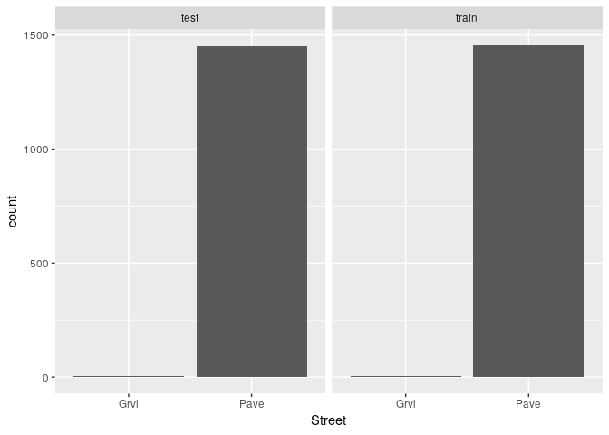<!-- -->

``` r
ggplot(aes_string(x = 'Alley'), data = nonnumeric.both) + 
  geom_bar() + facet_wrap(~ Set)
```

<!-- -->

``` r
ggplot(aes_string(x = 'LotShape'), data = nonnumeric.both) + 
  geom_bar() + facet_wrap(~ Set)
```

<!-- -->

``` r
ggplot(aes_string(x = 'LandContour'), data = nonnumeric.both) + 
  geom_bar() + facet_wrap(~ Set)
```

<!-- -->

``` r
ggplot(aes_string(x = 'Utilities'), data = nonnumeric.both) + 
  geom_bar() + facet_wrap(~ Set)
```

<!-- -->

``` r
ggplot(aes_string(x = 'LotConfig'), data = nonnumeric.both) + 
  geom_bar() + facet_wrap(~ Set)
```

<!-- -->

``` r
ggplot(aes_string(x = 'LandSlope'), data = nonnumeric.both) + 
  geom_bar() + facet_wrap(~ Set)
```

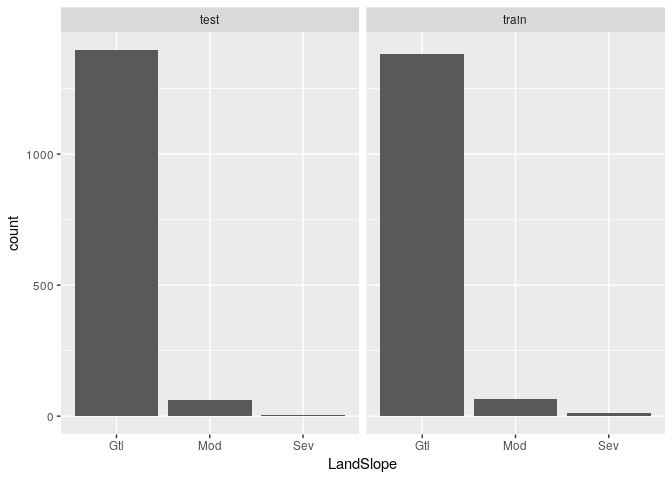<!-- -->

``` r
ggplot(aes_string(x = 'Neighborhood'), data = nonnumeric.both) + 
  geom_bar() + facet_wrap(~ Set)
```

<!-- -->

``` r
ggplot(aes_string(x = 'Condition1'), data = nonnumeric.both) + 
  geom_bar() + facet_wrap(~ Set)
```

<!-- -->

``` r
ggplot(aes_string(x = 'Condition2'), data = nonnumeric.both) + 
  geom_bar() + facet_wrap(~ Set)
```

<!-- -->

``` r
ggplot(aes_string(x = "HouseStyle"), data = nonnumeric.both) + 
  geom_bar() + facet_wrap(~ Set)
```

<!-- -->

``` r
ggplot(aes_string(x = "RoofStyle"), data = nonnumeric.both) + 
  geom_bar() + facet_wrap(~ Set)
```

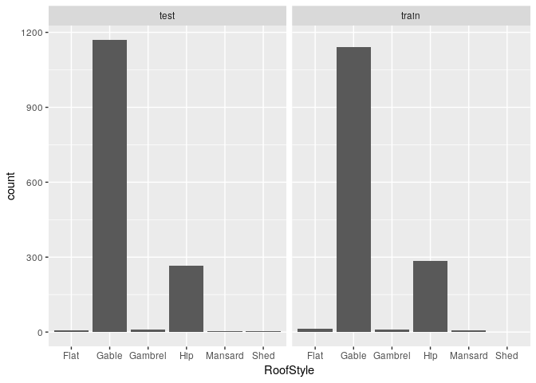<!-- -->

``` r
ggplot(aes_string(x = "RoofMatl"), data = nonnumeric.both) + 
  geom_bar() + facet_wrap(~ Set)
```

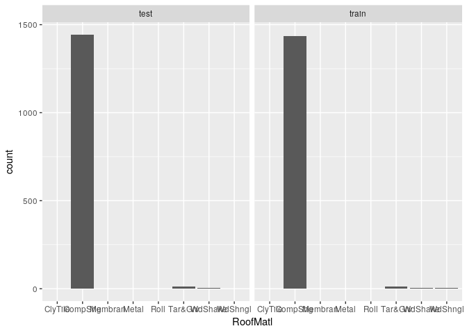<!-- -->

``` r
ggplot(aes_string(x = "Exterior1st"), data = nonnumeric.both) + 
  geom_bar() + facet_wrap(~ Set)
```

<!-- -->

``` r
ggplot(aes_string(x = "Exterior2nd"), data = nonnumeric.both) + 
  geom_bar() + facet_wrap(~ Set)
```

<!-- -->

``` r
ggplot(aes_string(x = "MasVnrType"), data = nonnumeric.both) + 
  geom_bar() + facet_wrap(~ Set)
```

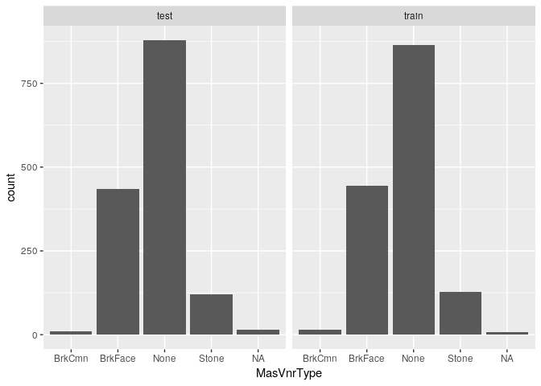<!-- -->

``` r
ggplot(aes_string(x = "ExterQual"), data = nonnumeric.both) + 
  geom_bar() + facet_wrap(~ Set)
```

<!-- -->

``` r
ggplot(aes_string(x = "ExterCond"), data = nonnumeric.both) + 
  geom_bar() + facet_wrap(~ Set)
```

<!-- -->

``` r
ggplot(aes_string(x = "Foundation"), data = nonnumeric.both) + 
  geom_bar() + facet_wrap(~ Set)
```

<!-- -->

``` r
ggplot(aes_string(x = "BsmtQual"), data = nonnumeric.both) + 
  geom_bar() + facet_wrap(~ Set)
```

<!-- -->

``` r
ggplot(aes_string(x = "BsmtExposure"), data = nonnumeric.both) + 
  geom_bar() + facet_wrap(~ Set)
```

<!-- -->

``` r
ggplot(aes_string(x = "BsmtFinType1"), data = nonnumeric.both) + 
  geom_bar() + facet_wrap(~ Set)
```

<!-- -->

``` r
ggplot(aes_string(x = "BsmtFinType2"), data = nonnumeric.both) + 
  geom_bar() + facet_wrap(~ Set)
```

<!-- -->

``` r
ggplot(aes_string(x = "Heating"), data = nonnumeric.both) + 
  geom_bar() + facet_wrap(~ Set)
```

<!-- -->

``` r
ggplot(aes_string(x = "HeatingQC"), data = nonnumeric.both) + 
  geom_bar() + facet_wrap(~ Set)
```

<!-- -->

``` r
ggplot(aes_string(x = "CentralAir"), data = nonnumeric.both) + 
  geom_bar() + facet_wrap(~ Set)
```

<!-- -->

``` r
ggplot(aes_string(x = "Electrical"), data = nonnumeric.both) + 
  geom_bar() + facet_wrap(~ Set)
```

<!-- -->

``` r
ggplot(aes_string(x = "KitchenQual"), data = nonnumeric.both) + 
  geom_bar() + facet_wrap(~ Set)
```

<!-- -->

``` r
ggplot(aes_string(x = "Functional"), data = nonnumeric.both) + 
  geom_bar() + facet_wrap(~ Set)
```

<!-- -->

``` r
ggplot(aes_string(x = "FireplaceQu"), data = nonnumeric.both) + 
  geom_bar() + facet_wrap(~ Set)
```

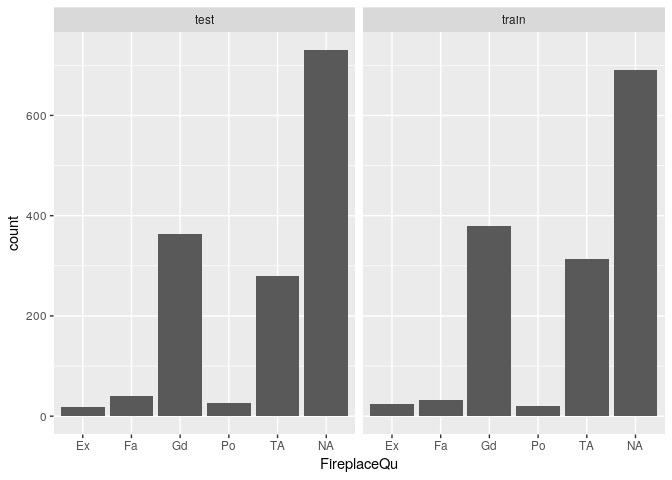<!-- -->

``` r
ggplot(aes_string(x = "GarageType"), data = nonnumeric.both) + 
  geom_bar() + facet_wrap(~ Set)
```

<!-- -->

``` r
ggplot(aes_string(x = "GarageFinish"), data = nonnumeric.both) + 
  geom_bar() + facet_wrap(~ Set)
```

<!-- -->

``` r
ggplot(aes_string(x = "GarageQual"), data = nonnumeric.both) + 
  geom_bar() + facet_wrap(~ Set)
```

<!-- -->

``` r
ggplot(aes_string(x = "GarageCond"), data = nonnumeric.both) + 
  geom_bar() + facet_wrap(~ Set)
```

<!-- -->

``` r
ggplot(aes_string(x = "PavedDrive"), data = nonnumeric.both) + 
  geom_bar() + facet_wrap(~ Set)
```

<!-- -->

``` r
ggplot(aes_string(x = "PoolQC"), data = nonnumeric.both) + 
  geom_bar() + facet_wrap(~ Set)
```

<!-- -->

``` r
ggplot(aes_string(x = "Fence"), data = nonnumeric.both) + 
  geom_bar() + facet_wrap(~ Set)
```

<!-- -->

``` r
ggplot(aes_string(x = "MiscFeature"), data = nonnumeric.both) + 
  geom_bar() + facet_wrap(~ Set)
```

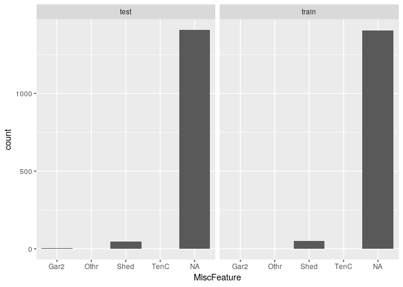<!-- -->

``` r
ggplot(aes_string(x = "SaleType"), data = nonnumeric.both) + 
  geom_bar() + facet_wrap(~ Set)
```

<!-- -->

``` r
ggplot(aes_string(x = "SaleCondition"), data = nonnumeric.both) + 
  geom_bar() + facet_wrap(~ Set)
```

<!-- -->

### Continuous and Categorical Variable Interactions

#### Interactions for Garage Variables

A number of varaibles are likely related and could provide useful
interactions. The following variables are assocaited with garages.

  - Categorical
      - `GarageType`
      - `GarageFinish`
  - Continuous
      - `GarageYrBlt`
      - `GarageCars`
      - `GarageArea`

**Correlation between Continupus Garage Features**

As expected, there is a strong correlation betwen area and number of
cars (cor ~ 0.83). There is a moderate correlation between size (area
and number of cars) and year built (cor ~ 0.57).

``` r
train %>%
  select(c('GarageArea','GarageCars','GarageYrBlt')) %>%
  drop_na() %>%
  ggpairs()
```

<!-- -->

**Interaction Plots for Garage Area**

Plots of log of sale price vs garage area. The slope of log sale price
vs garage area does appear to vary by garage finish and garage type
(`GarageFinish` and `GarageType`, respectively). This indicates an
interaction could be useful.

``` r
train %>%
  ggplot(aes(x = GarageArea, y = logSalePrice)) +
  geom_point() + facet_wrap(GarageType ~ .) +
  geom_smooth(method = 'lm')
```

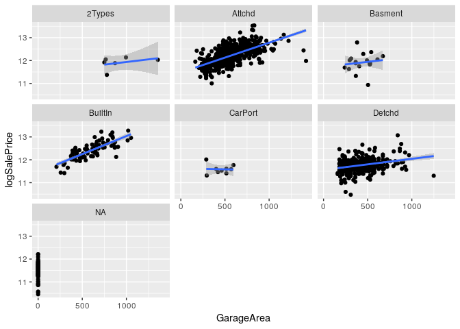<!-- -->

``` r
train %>%
  ggplot(aes(x = GarageArea, y = logSalePrice)) +
  geom_point() + facet_wrap(GarageFinish ~ .) +
  geom_smooth(method = 'lm')
```

<!-- -->

**Interaction Plots for Garage Cars**

Plots of log of sale price vs number of cars per garage (sizing). The
slope of log sale price vs number of cars per garage does appear to vary
by garage finish and garage type (`GarageFinish` and `GarageType`,
respectively). This indicates an interaction could be useful.

``` r
train %>%
  ggplot(aes(x = GarageCars, y = logSalePrice)) +
  geom_point() + facet_wrap(GarageType ~ .) +
  geom_smooth(method = 'lm')
```

<!-- -->

``` r
train %>%
  ggplot(aes(x = GarageCars, y = logSalePrice)) +
  geom_point() + facet_wrap(GarageFinish ~ .) +
  geom_smooth(method = 'lm')
```

<!-- -->

**Interaction Plots for Garage Year Built**

Plots of log of sale price vs garage year built. The slope of log sale
price vs garage year built does appear to vary by garage finish and
garage type (`GarageFinish` and `GarageType`, respectively). This
indicates an interaction could be useful.

``` r
train %>%
  ggplot(aes(x = GarageYrBlt, y = logSalePrice)) +
  geom_point() + facet_wrap(GarageType ~ .) +
  geom_smooth(method = 'lm')
```

    ## Warning: Removed 81 rows containing non-finite values (stat_smooth).

    ## Warning: Removed 81 rows containing missing values (geom_point).

<!-- -->

``` r
train %>%
  ggplot(aes(x = GarageYrBlt, y = logSalePrice)) +
  geom_point() + facet_wrap(GarageFinish ~ .) +
  geom_smooth(method = 'lm')
```

    ## Warning: Removed 81 rows containing non-finite values (stat_smooth).
    
    ## Warning: Removed 81 rows containing missing values (geom_point).

<!-- -->

#### Interactions for Garage Variables

A number of varaibles are likely related and could provide useful
interactions. The following variables are assocaited with garages.

  - Categorical
      - `BsmtQual`
      - `BsmtExposure`
      - `BsmtFinType1`
      - `BsmtFinType2`
  - Continuous
      - `BsmtFinSF1` - with dummy variable to remove 0s
      - `BsmtFinSF2` - with dummy variable to remove 0s
      - `BsmtUnfSF` - maybe with a dummy variable
      - `TotalBsmtSF` - with dummy variable to remove 0s

**Correlation between Continupus Basement Features**

The continuous basement features do not appear to be closely related.

``` r
train %>%
  select(c('BsmtFinSF1','BsmtFinSF2','BsmtUnfSF', 'TotalBsmtSF')) %>%
  drop_na() %>%
  ggpairs()
```

<!-- -->

**Interaction Plots for BsmtFinSF1**

Plots of BsmtFinSF1 vs log of sale price split on the following factor
variables:

  - `BsmtQual`
  - `BsmtExposure`
  - `BsmtFinType1`
  - `BsmtFinType2`

Since this is finished basement variable, the unfinised type (`Unf`) is
factored out. There does appear to be a relationship between
`BsmtFinSF1` (basement finished square feet - first type) and log of
sale price.

``` r
train %>%
  ggplot(aes(x = BsmtFinSF1, y = logSalePrice)) +
  geom_point() + facet_wrap(BsmtQual ~ .) +
  geom_smooth(method = 'lm')
```

<!-- -->

``` r
train %>%
  ggplot(aes(x = BsmtFinSF1, y = logSalePrice)) +
  geom_point() + facet_wrap(BsmtExposure ~ .) +
  geom_smooth(method = 'lm')
```

<!-- -->

``` r
train %>%
  filter(!BsmtFinType1 %in% c('Unf')) %>%
  ggplot(aes(x = BsmtFinSF1, y = logSalePrice)) +
  geom_point() + facet_wrap(BsmtFinType1 ~ .) +
  geom_smooth(method = 'lm')
```

<!-- -->

``` r
train %>% 
  filter(!BsmtFinType2 %in% c('Unf')) %>%
  ggplot(aes(x = BsmtFinSF1, y = logSalePrice)) +
  geom_point() + facet_wrap(BsmtFinType2 ~ .) +
  geom_smooth(method = 'lm')
```

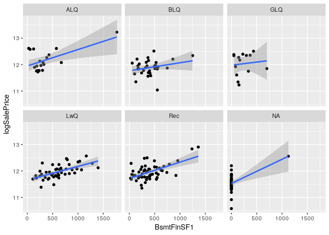<!-- -->

**Interaction Plots for BsmtFinSF2**

Plots of BsmtFinSF2 vs log of sale price split on the following factor
variables:

  - `BsmtQual`
  - `BsmtExposure`
  - `BsmtFinType1`
  - `BsmtFinType2`

Since this is finished basement variable, the unfinised type (`Unf`) is
factored out. There does not appear to be a relationship between
`BsmtFinSF2` (basement finished square feet - second type) and log of
sale price.

``` r
train %>%
  ggplot(aes(x = BsmtFinSF2, y = logSalePrice)) +
  geom_point() + facet_wrap(BsmtQual ~ .) +
  geom_smooth(method = 'lm')
```

<!-- -->

``` r
train %>%
  ggplot(aes(x = BsmtFinSF2, y = logSalePrice)) +
  geom_point() + facet_wrap(BsmtExposure ~ .) +
  geom_smooth(method = 'lm')
```

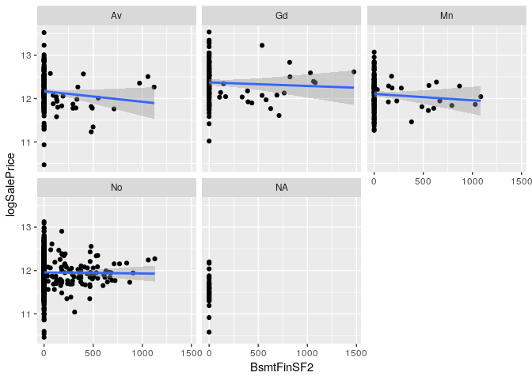<!-- -->

``` r
train %>%
  filter(!BsmtFinType1 %in% c('Unf')) %>%
  ggplot(aes(x = BsmtFinSF2, y = logSalePrice)) +
  geom_point() + facet_wrap(BsmtFinType1 ~ .) +
  geom_smooth(method = 'lm')
```

<!-- -->

**Interaction Plots for BsmtUnfSF**

Plots of BsmtUnfSF vs log of sale price split on the following factor
variables:

  - `BsmtQual`
  - `BsmtExposure`
  - `BsmtFinType1`
  - `BsmtFinType2`

Since this is an unfinshed basement variable, only the unfinished factor
of `BsmtFinType1` and `BsmtFinType2` is considered. There does not
appear to be a relationship between `BsmtUnfSF` and log of sale price
for `BsmtExposure` and `BsmtFinType1`.

``` r
train %>%
  ggplot(aes(x = BsmtUnfSF, y = logSalePrice)) +
  geom_point() + facet_wrap(BsmtQual ~ .) +
  geom_smooth(method = 'lm')
```

<!-- -->

``` r
train %>%
  ggplot(aes(x = BsmtUnfSF, y = logSalePrice)) +
  geom_point() + facet_wrap(BsmtExposure ~ .) +
  geom_smooth(method = 'lm')
```

<!-- -->

``` r
train %>%
  filter(BsmtFinType1 %in% c('Unf')) %>%
  ggplot(aes(x = BsmtUnfSF, y = logSalePrice)) +
  geom_point() + facet_wrap(BsmtFinType1 ~ .) +
  geom_smooth(method = 'lm')
```

<!-- -->

``` r
train %>%
  filter(BsmtFinType2 %in% c('Unf')) %>%
  ggplot(aes(x = BsmtUnfSF, y = logSalePrice)) +
  geom_point() + facet_wrap(BsmtFinType2 ~ .) +
  geom_smooth(method = 'lm')
```

<!-- -->

**Interaction Plots for TotalBsmtSF**

Plots of TotalBsmtSF vs log of sale price split on the following factor
variables:

  - `BsmtQual`
  - `BsmtExposure`
  - `BsmtFinType1`
  - `BsmtFinType2`

There does appear to be a relationship between `TotalBsmtSF` (basement
square feet) and log of sale price.

``` r
train %>%
  ggplot(aes(x = TotalBsmtSF, y = logSalePrice)) +
  geom_point() + facet_wrap(BsmtQual ~ .) +
  geom_smooth(method = 'lm')
```

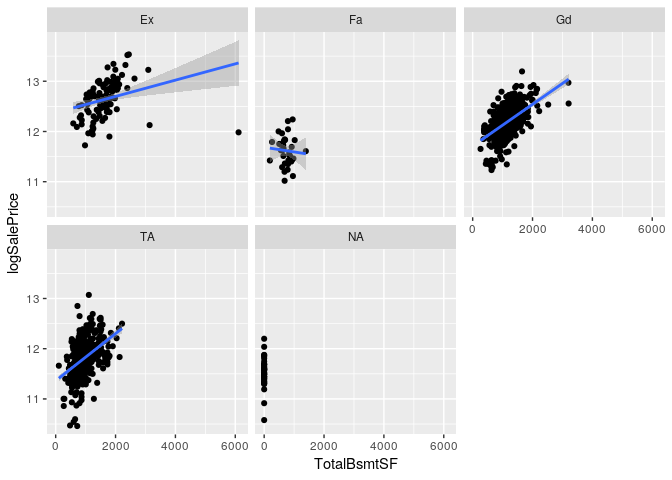<!-- -->

``` r
train %>%
  ggplot(aes(x = TotalBsmtSF, y = logSalePrice)) +
  geom_point() + facet_wrap(BsmtExposure ~ .) +
  geom_smooth(method = 'lm')
```

<!-- -->

``` r
train %>%
  ggplot(aes(x = TotalBsmtSF, y = logSalePrice)) +
  geom_point() + facet_wrap(BsmtFinType1 ~ .) +
  geom_smooth(method = 'lm')
```

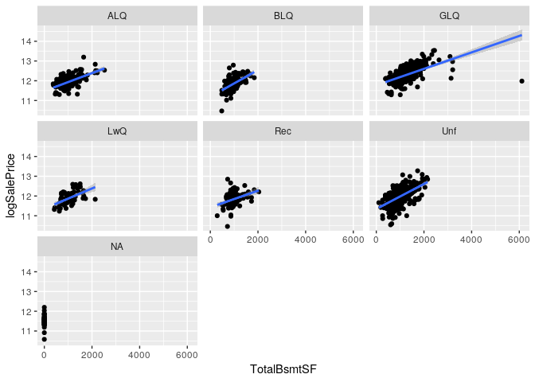<!-- -->

``` r
train %>% 
  ggplot(aes(x = TotalBsmtSF, y = logSalePrice)) +
  geom_point() + facet_wrap(BsmtFinType2 ~ .) +
  geom_smooth(method = 'lm')
```

<!-- -->
