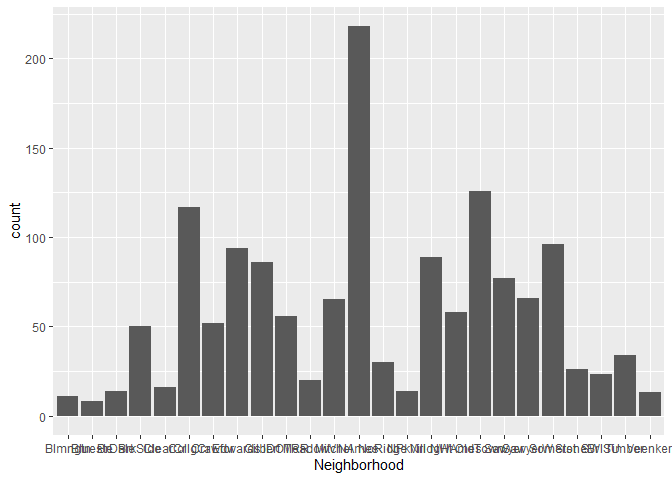
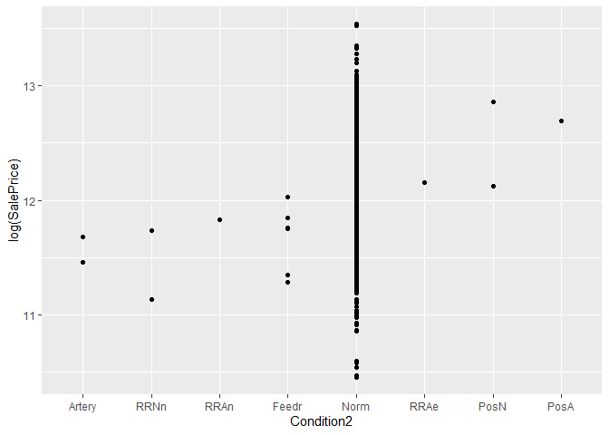

Exploratory Data Analysis
================
Chance Robinson
August 4, 2019

  - [Setup](#setup)
  - [Exploratory Analysis](#exploratory-analysis)
      - [Load the data into R](#load-the-data-into-r)
      - [Data Cleaning](#data-cleaning)
          - [Handle null values for continuous
            variables](#handle-null-values-for-continuous-variables)
          - [Handle null values for categorical
            variables](#handle-null-values-for-categorical-variables)
          - [Set ordered factor values](#set-ordered-factor-values)

# Setup

``` r
# libraries
library(knitr)
library(tidyverse)
library(naniar)
library(Hmisc)
library(GGally)
# Correlation
library(corrr)
# Forward, Backward and Stepwise Regression
library(MASS)

library(caret)

# helper files
source('../../helper/data_munging.R')
```

# Exploratory Analysis

### Load the data into R

``` r
train <- read_csv('../../data/train.csv')
test <- read_csv('../../data/test.csv')
```

## Data Cleaning

### Handle null values for continuous variables

  - The `GarageYrBlt (Garage Year Built)` was found to be null when tied
    rows with an empty Garage Type for all cases of the training data.
    It is likely that a Garage Type of NA would represent a property
    with no garage, and therefore we are setting the `GarageYrBlt` to 0.
  - The `LotFrontage` used an impute strategry with the mean value from
    each data set, as we assumed all houses should have some value for
    this data point.
  - For `MasVnrArea`, we assumed that these properties had no masonry
    veneer and replaced the NAs with 0.

<!-- end list -->

``` r
# Garage Year Built {"train": 81, "test": 78}

train$GarageYrBlt[is.na(train$GarageYrBlt)] <- 0
test$GarageYrBlt[is.na(test$GarageYrBlt)] <- 0

# Lot Frontage {"train": 259, "test": 227}

train$LotFrontage[is.na(train$LotFrontage)] <- mean(train$LotFrontage, na.rm=TRUE)
test$LotFrontage[is.na(test$LotFrontage)] <- mean(test$LotFrontage, na.rm=TRUE)


# MasVnrArea {"train": 8, "test": 15}
train$MasVnrArea[is.na(train$MasVnrArea)] <- 0
test$MasVnrArea[is.na(test$MasVnrArea)] <- 0
```

``` r
# Reduce Neighborhood into 3 categories
# train %>% 
#   group_by(Neighborhood) %>%
#   summarise(mean = mean(log(SalePrice)), n = n()) %>%
#   arrange(desc(mean))
# 
# neighborhood_high <- c('NoRidge', 'NridgHt', 'StoneBr', 'Timber', 'Veenker', 'Somerst', 'ClearCr', 'Crawfor', 'Blmngtn', 'CollgCr')
# 
# neighborhood_medium <- c('Gilbert', 'NWAmes', 'SawyerW', 'Mitchel', 'NAmes', 'NPkVill', 'SWISU', 'Blueste', 'Sawyer', 'Edwards')
# 
# neighborhood_low <- c('OldTown', 'BrkSide', 'BrDale', 'MeadowV', 'IDOTRR')
# 
# train$Neighborhood <- case_when(train$Neighborhood %in% c('NoRidge', 'NridgHt', 'StoneBr', 'Timber', 'Veenker', 'Somerst', 'ClearCr', 'Crawfor', 'Blmngtn', 'CollgCr') ~ 'High',
#                train$Neighborhood %in% c('Gilbert', 'NWAmes', 'SawyerW', 'Mitchel', 'NAmes', 'NPkVill', 'SWISU', 'Blueste', 'Sawyer', 'Edwards') ~ 'Medium',
#                train$Neighborhood %in% c('OldTown', 'BrkSide', 'BrDale', 'MeadowV', 'IDOTRR') ~ 'Low')
# 
# 
# test$Neighborhood <- case_when(test$Neighborhood %in% c('NoRidge', 'NridgHt', 'StoneBr', 'Timber', 'Veenker', 'Somerst', 'ClearCr', 'Crawfor', 'Blmngtn', 'CollgCr') ~ 'High',
#                test$Neighborhood %in% c('Gilbert', 'NWAmes', 'SawyerW', 'Mitchel', 'NAmes', 'NPkVill', 'SWISU', 'Blueste', 'Sawyer', 'Edwards') ~ 'Medium',
#                test$Neighborhood %in% c('OldTown', 'BrkSide', 'BrDale', 'MeadowV', 'IDOTRR') ~ 'Low')


table(train$Neighborhood)
```

    ## 
    ## Blmngtn Blueste  BrDale BrkSide ClearCr CollgCr Crawfor Edwards Gilbert 
    ##      17       2      16      58      28     150      51     100      79 
    ##  IDOTRR MeadowV Mitchel   NAmes NoRidge NPkVill NridgHt  NWAmes OldTown 
    ##      37      17      49     225      41       9      77      73     113 
    ##  Sawyer SawyerW Somerst StoneBr   SWISU  Timber Veenker 
    ##      74      59      86      25      25      38      11

``` r
# Reduce Neighborhood into 3 categories
train %>% 
  group_by(MSSubClass) %>%
  summarise(mean = mean(log(SalePrice)), n = n()) %>%
  arrange(desc(mean))
```

    ## # A tibble: 15 x 3
    ##    MSSubClass  mean     n
    ##         <dbl> <dbl> <int>
    ##  1         60  12.3   299
    ##  2        120  12.2    87
    ##  3         75  12.1    16
    ##  4         20  12.1   536
    ##  5         80  12.0    58
    ##  6         70  12.0    60
    ##  7         85  11.9    20
    ##  8         40  11.9     4
    ##  9         50  11.8   144
    ## 10        160  11.8    63
    ## 11         90  11.8    52
    ## 12        190  11.7    30
    ## 13         45  11.6    12
    ## 14        180  11.5    10
    ## 15         30  11.4    69

``` r
table(train$mean)
```

    ## Warning: Unknown or uninitialised column: 'mean'.

    ## < table of extent 0 >

### Handle null values for categorical variables

  - Alley
  - MasVnrType
  - BsmtQual
  - BsmtCond
  - BsmtExposure
  - BsmtFinType1
  - BsmtFinType2
  - FireplaceQu
  - GarageType
  - GarageFinish
  - GarageQual
  - GarageCond
  - PoolQC
  - Fence
  - MiscFeature
  - Electrical (SBrkr Standard Circuit Breakers &
Romex)

### Set ordered factor values

``` r
# train$Neighborhood <- ordered(train$Neighborhood, levels = c("Low", "Medium", "High"))
# test$Neighborhood <- ordered(test$Neighborhood, levels = c("Low", "Medium", "High"))

train$MSZoning <- ordered(train$MSZoning, levels = c("C (all)", "RM", "RH", "RL", "FV"))
test$MSZoning <- ordered(test$MSZoning, levels = c("C (all)", "RM", "RH", "RL", "FV"))

train$Street <- ordered(train$Street, levels = c("Grvl", "Pave"))
test$Street <- ordered(test$Street, levels = c("Grvl", "Pave"))

train$LotShape <- ordered(train$LotShape, levels = c("Reg", "IR1", "IR2", "IR3"))
test$LotShape <- ordered(test$LotShape, levels = c("Reg", "IR1", "IR2", "IR3"))


train$LandContour <- ordered(train$LandContour, levels = c("Bnk", "Lvl", "Low", "HLS"))
test$LandContour <- ordered(test$LandContour, levels = c("Bnk", "Lvl", "Low", "HLS"))

train$LotConfig <- ordered(train$LotConfig, levels = c("Inside", "Corner", "CulDSac", "FR2", "FR3"))
test$LotConfig <- ordered(test$LotConfig, levels = c("Inside", "Corner", "CulDSac", "FR2", "FR3"))

train$LandSlope <- ordered(train$LandSlope, levels = c("Gtl", "Mod", "Sev"))
test$LandSlope <- ordered(test$LandSlope, levels = c("Gtl", "Mod", "Sev"))


train$Condition1 <- ordered(train$Condition1, levels = c("Artery", "Feedr", "RRAe", "Norm", "RRAn", "RRNe", "RRNn", "PosA", "PosN"))
test$Condition1 <- ordered(test$Condition1, levels = c("Artery", "Feedr", "RRAe", "Norm", "RRAn", "RRNe", "RRNn", "PosA", "PosN"))

train$Condition2 <- ordered(train$Condition2, levels = c("Artery", "RRNn","RRAn","Feedr", "Norm", "RRAe", "PosN", "PosA"))
test$Condition2 <- ordered(test$Condition2, levels = c("Artery", "RRNn","RRAn","Feedr", "Norm", "RRAe", "PosN", "PosA"))

train$Alley <- ordered(train$Alley, levels = c("None", "Grvl", "Pave"))
test$Alley <- ordered(test$Alley, levels = c("None", "Grvl", "Pave"))

train$MasVnrType <- ordered(train$MasVnrType, levels = c("None", "CBlock", "BrkFace", "BrkCmn", "Stone"))
test$MasVnrType <- ordered(test$MasVnrType, levels = c("None", "CBlock", "BrkFace", "BrkCmn", "Stone"))

train$BsmtQual <- ordered(train$BsmtQual, levels = c("None", "Po", "Fa", "TA", "Gd", "Ex"))
test$BsmtQual <- ordered(test$BsmtQual, levels = c("None", "Po", "Fa", "TA", "Gd", "Ex"))

train$BsmtCond <- ordered(train$BsmtCond, levels = c("None", "Po", "Fa", "TA", "Gd", "Ex"))
test$BsmtCond <- ordered(test$BsmtCond, levels = c("None", "Po", "Fa", "TA", "Gd", "Ex"))

# train$BsmtExposure <- ordered(train$BsmtExposure, levels = c("None", "Po", "Fa", "TA", "Gd", "Ex"))
# test$BsmtExposure <- ordered(test$BsmtExposure, levels = c("None", "Po", "Fa", "TA", "Gd", "Ex"))

train$BsmtFinType1 <- ordered(train$BsmtFinType1, levels = c("None", "Unf", "LwQ", "Rec", "BLQ", "ALQ", "GLQ"))
test$BsmtFinType1 <- ordered(test$BsmtFinType1, levels = c("None", "Unf", "LwQ", "Rec", "BLQ", "ALQ", "GLQ"))

train$BsmtFinType2 <- ordered(train$BsmtFinType2, levels = c("None", "Unf", "LwQ", "Rec", "BLQ", "ALQ", "GLQ"))
test$BsmtFinType2 <- ordered(test$BsmtFinType2, levels = c("None", "Unf", "LwQ", "Rec", "BLQ", "ALQ", "GLQ"))

train$FireplaceQu <- ordered(train$FireplaceQu, levels = c("None", "Po", "Fa", "TA", "Gd", "Ex"))
test$FireplaceQu <- ordered(test$FireplaceQu, levels = c("None", "Po", "Fa", "TA", "Gd", "Ex"))

train$GarageType <- ordered(train$GarageType, levels = c("None", "CarPort", "2Types", "Basment", "Detchd", "Attchd", "BuiltIn"))
test$GarageType <- ordered(test$GarageType, levels = c("None", "CarPort", "2Types", "Basment", "Detchd", "Attchd", "BuiltIn"))

train$GarageFinish <- ordered(train$GarageFinish, levels = c("None", "Unf", "RFn", "Fin"))
test$GarageFinish <- ordered(test$GarageFinish, levels = c("None", "Unf", "RFn", "Fin"))

train$GarageQual <- ordered(train$GarageQual, levels = c("None", "Po", "Fa", "TA", "Gd", "Ex"))
test$GarageQual <- ordered(test$GarageQual, levels = c("None", "Po", "Fa", "TA", "Gd", "Ex"))

train$GarageCond <- ordered(train$GarageCond, levels = c("None", "Po", "Fa", "TA", "Gd", "Ex"))
test$GarageCond <- ordered(test$GarageCond, levels = c("None", "Po", "Fa", "TA", "Gd", "Ex"))

train$PoolQC <- ordered(train$PoolQC, levels = c("None", "Po", "Fa", "TA", "Gd", "Ex"))
test$PoolQC <- ordered(test$PoolQC, levels = c("None", "Po", "Fa", "TA", "Gd", "Ex"))

train$Fence <- ordered(train$Fence, levels = c("None", "MnWw", "GdWo", "MnPrv", "GdPrv"))
test$Fence <- ordered(test$Fence, levels = c("None", "MnWw", "GdWo", "MnPrv", "GdPrv"))

train$Electrical <- ordered(train$Electrical, levels = c("Mix", "FuseP", "FuseF", "FuseA", "SBrkr"))
test$Electrical <- ordered(test$Electrical, levels = c("Mix", "FuseP", "FuseF", "FuseA", "SBrkr"))

train$MiscFeature <- ordered(train$MiscFeature, levels = c("None", "Othr", "Shed", "Gar2", "TenC"))
test$MiscFeature <- ordered(test$MiscFeature, levels = c("None", "Othr", "Shed", "Gar2", "TenC"))


train$SaleCondition <- factor(train$SaleCondition, levels = c("Abnorml", "AdjLand", "Alloca", "Partial", "Family", "Normal"))
test$SaleCondition <- factor(test$SaleCondition, levels = c("Abnorml", "AdjLand", "Alloca", "Partial", "Family", "Normal"))

train$BldgType[is.na(train$BldgType)] <- '1Fam'
test$BldgType[is.na(test$BldgType)] <- '1Fam'


# str(train)
```

``` r
# describe(train)
```

#### Describe all categorical variables after handling nulls

``` r
# # Scatterplot of Numeric Variable
# train.numeric %>% filter(WoodDeckSF != 0) %>% ggplot(aes(x = WoodDeckSF, y = log(SalePrice))) +
#   geom_point() + geom_smooth(method = 'lm')


# Bar Chart of Categorical Variable
ggplot(test) + geom_bar(aes(x = Neighborhood))
```

<!-- -->

``` r
# Scatterplot of Categroical Variable
train %>% ggplot(aes(x = Condition2, y = log(SalePrice))) +
  geom_point() + geom_smooth(method = 'lm')
```

<!-- -->

``` r
# Scatterplot of Categroical Variable
train %>% ggplot(aes(x = Condition2, y = log(SalePrice))) +
  geom_boxplot()
```

<!-- -->

``` r
# 
# ggplot(train,aes(y=log(SalePrice),x=GrLivArea,color=factor(Neighborhood)))+geom_point()+stat_smooth(method="lm",se=FALSE)


# # Scatterplot of Categroical Variable
# train %>% ggplot(aes(x = factor(Neighborhood), y = log(SalePrice))) +
#   geom_boxplot()


# head(train$SalePrice)
# 
# 
# describe(test$Condition2)
```

#### Correlation Table

``` r
sales.price.cor <- train %>%
  select_if(is.numeric) %>%
  correlate() %>%
  focus(SalePrice)
```

    ## 
    ## Correlation method: 'pearson'
    ## Missing treated using: 'pairwise.complete.obs'

``` r
sales.price.cor %>%
  arrange(desc(SalePrice))
```

    ## # A tibble: 37 x 2
    ##    rowname      SalePrice
    ##    <chr>            <dbl>
    ##  1 OverallQual      0.791
    ##  2 GrLivArea        0.709
    ##  3 GarageCars       0.640
    ##  4 GarageArea       0.623
    ##  5 TotalBsmtSF      0.614
    ##  6 1stFlrSF         0.606
    ##  7 FullBath         0.561
    ##  8 TotRmsAbvGrd     0.534
    ##  9 YearBuilt        0.523
    ## 10 YearRemodAdd     0.507
    ## # ... with 27 more rows

#### base model

``` r
# model.formula <- log(SalePrice) ~ OverallQual + GrLivArea + GarageCars + TotalBsmtSF + YearBuilt +YearRemodAdd + Fireplaces + GrLivArea:Neighborhood + as.factor(BldgType)

# model.formula <- log(SalePrice) ~ MSZoning + LotFrontage + LotArea +
#     Street + LotConfig + LandSlope + 
#     Condition2 + BldgType + OverallQual + OverallCond + YearBuilt +
#     YearRemodAdd + RoofMatl + Foundation +
#     BsmtFinSF1 + BsmtFinSF2 + BsmtUnfSF +
#     HeatingQC + CentralAir + `1stFlrSF` + `2ndFlrSF` +
#     LowQualFinSF + BsmtFullBath + FullBath + HalfBath + KitchenAbvGr +
#     KitchenQual + TotRmsAbvGrd + Functional + Fireplaces + GarageYrBlt +
#     GarageCars + GarageArea + WoodDeckSF +
#     EnclosedPorch + `3SsnPorch` + ScreenPorch + PoolArea + PoolQC +
#     SaleType + OverallQual:Neighborhood

## forward model ##
# model.formula <- log(SalePrice) ~ OverallQual + Neighborhood + GrLivArea + 
#     BsmtFinType1 + GarageCars + OverallCond + RoofMatl + TotalBsmtSF + 
#     YearBuilt + Condition2 + MSZoning + BsmtUnfSF + SaleCondition + 
#     Functional + BldgType + CentralAir + LotArea + KitchenQual + 
#     ScreenPorch + Condition1 + Fireplaces + Heating + BsmtExposure + 
#     Exterior1st + YearRemodAdd + LandSlope + GarageArea + WoodDeckSF + 
#     LotConfig + Foundation + LotFrontage + HeatingQC + PoolQC + 
#     BsmtFullBath + EnclosedPorch + PoolArea + SaleType + HalfBath + 
#     GarageCond + BsmtQual + FullBath + Street + KitchenAbvGr + 
#     `3SsnPorch` + GarageQual + ExterCond + GarageYrBlt + TotRmsAbvGrd

## backward model ##

# model.formula <- log(SalePrice) ~ MSZoning + LotFrontage + LotArea +
#     Street + LotConfig + LandSlope + Neighborhood + Condition1 +
#     Condition2 + BldgType + OverallQual + OverallCond + YearBuilt +
#     YearRemodAdd + RoofMatl + Exterior1st + ExterCond + Foundation +
#     BsmtQual + BsmtExposure + BsmtFinSF1 + BsmtFinSF2 + BsmtUnfSF +
#     Heating + HeatingQC + CentralAir + `1stFlrSF` + `2ndFlrSF` +
#     LowQualFinSF + BsmtFullBath + FullBath + HalfBath + KitchenAbvGr +
#     KitchenQual + TotRmsAbvGrd + Functional + Fireplaces + GarageYrBlt +
#     GarageCars + GarageArea + GarageQual + GarageCond + WoodDeckSF +
#     EnclosedPorch + `3SsnPorch` + ScreenPorch + PoolArea + PoolQC +
#     SaleType + SaleCondition


model.formula <- log(SalePrice) ~ MSZoning + LotFrontage + LotArea + 
    Street + LotConfig + LandSlope + Neighborhood + Condition1 + 
    Condition2 + BldgType + OverallQual + OverallCond + YearBuilt + 
    YearRemodAdd + RoofMatl + Exterior1st + Foundation + BsmtQual + 
    BsmtExposure + BsmtFinSF1 + BsmtFinSF2 + BsmtUnfSF + Heating + 
    HeatingQC + CentralAir + `1stFlrSF` + `2ndFlrSF` + LowQualFinSF + 
    BsmtFullBath + FullBath + HalfBath + KitchenAbvGr + KitchenQual + 
    Functional + Fireplaces + GarageCars + GarageArea + GarageCond + 
    WoodDeckSF + EnclosedPorch + `3SsnPorch` + ScreenPorch + 
    PoolArea + PoolQC + SaleType + SaleCondition

## stepwise model ##

# model.formula <- log(SalePrice) ~ OverallQual + Neighborhood + GrLivArea + 
#     GarageCars + OverallCond + RoofMatl + TotalBsmtSF + YearBuilt + 
#     Condition2 + MSZoning + BsmtUnfSF + SaleCondition + Functional + 
#     BldgType + CentralAir + LotArea + KitchenQual + ScreenPorch + 
#     Condition1 + Fireplaces + Heating + BsmtExposure + Exterior1st + 
#     YearRemodAdd + LandSlope + GarageArea + WoodDeckSF + LotConfig + 
#     Foundation + LotFrontage + HeatingQC + PoolQC + BsmtFullBath + 
#     EnclosedPorch + PoolArea + SaleType + BsmtFinSF1 + GarageCond + 
#     HalfBath + Street + KitchenAbvGr + FullBath + `3SsnPorch` + 
#     ExterCond + GarageQual


# Remove utilities from dataframe as it doesn't have enough observations in the 2 levels
dat <- subset(train, select = -c(Utilities, Id) )

# dat <- na.omit(dat)

base.model <- lm(model.formula,
               data = train)

fit1 <- lm(log(SalePrice) ~ ., data=dat)

fit2 <- lm(log(SalePrice) ~ 1, data=dat)

# summary(fit1)
```

    ## Warning in predict.lm(modelFit, newdata): prediction from a rank-deficient
    ## fit may be misleading
    
    ## Warning in predict.lm(modelFit, newdata): prediction from a rank-deficient
    ## fit may be misleading
    
    ## Warning in predict.lm(modelFit, newdata): prediction from a rank-deficient
    ## fit may be misleading
    
    ## Warning in predict.lm(modelFit, newdata): prediction from a rank-deficient
    ## fit may be misleading
    
    ## Warning in predict.lm(modelFit, newdata): prediction from a rank-deficient
    ## fit may be misleading
    
    ## Warning in predict.lm(modelFit, newdata): prediction from a rank-deficient
    ## fit may be misleading
    
    ## Warning in predict.lm(modelFit, newdata): prediction from a rank-deficient
    ## fit may be misleading
    
    ## Warning in predict.lm(modelFit, newdata): prediction from a rank-deficient
    ## fit may be misleading
    
    ## Warning in predict.lm(modelFit, newdata): prediction from a rank-deficient
    ## fit may be misleading
    
    ## Warning in predict.lm(modelFit, newdata): prediction from a rank-deficient
    ## fit may be misleading

    ## Linear Regression 
    ## 
    ## 1460 samples
    ##   46 predictor
    ## 
    ## No pre-processing
    ## Resampling: Cross-Validated (10 fold) 
    ## Summary of sample sizes: 1315, 1314, 1315, 1314, 1314, 1314, ... 
    ## Resampling results:
    ## 
    ##   RMSE       Rsquared   MAE       
    ##   0.1783295  0.8177431  0.09065102
    ## 
    ## Tuning parameter 'intercept' was held constant at a value of TRUE
