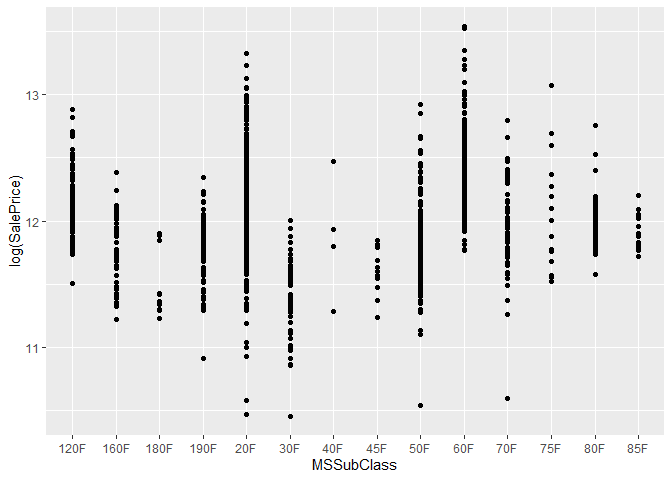

Exploratory Data Analysis
================
Chance Robinson
August 4, 2019

  - [Setup](#setup)
  - [Exploratory Analysis](#exploratory-analysis)
      - [Load the data into R](#load-the-data-into-r)
      - [Data Cleaning](#data-cleaning)
          - [Handle null values for continuous
            variables](#handle-null-values-for-continuous-variables)
          - [Handle null values for categorical
            variables](#handle-null-values-for-categorical-variables)
          - [set ordinal factors](#set-ordinal-factors)
          - [Set categorical factor
            variables](#set-categorical-factor-variables)
          - [Model Definitions](#model-definitions)
          - [Custom Model](#custom-model)
          - [Forward Model](#forward-model)
          - [Backward Model](#backward-model)
          - [Stepwise Model](#stepwise-model)
      - [Cross Validation](#cross-validation)
          - [Custom Model CV](#custom-model-cv)
          - [Forward Model CV](#forward-model-cv)
          - [Backward Model CV](#backward-model-cv)
          - [Stepwise Model CV](#stepwise-model-cv)

# Setup

``` r
# libraries
library(knitr)
library(tidyverse)
library(naniar)
library(Hmisc)
library(GGally)
library(corrr)
library(MASS)
library(caret)

# helper files
source('../../helper/data_munging.R')
```

``` r
#' Calculates PRESS from `caret` CV model
#'
#' @param model.cv Calculates press from a model 
#' produced by `caret`
#'
PRESS.cv <- function(model.cv) {
  meanN <- 0
  folds <- model.cv$control$index
  for (i in seq(1:length(folds))){
    meanN <- meanN + length(folds[[i]])
  }
  meanN <- meanN / length(folds)
  meanN * ((model.cv$results$RMSE)^2)
}
```

# Exploratory Analysis

### Load the data into R

``` r
train <- read_csv('../../data/train.csv')
test <- read_csv('../../data/test.csv')
```

## Data Cleaning

### Handle null values for continuous variables

  - The `GarageYrBlt (Garage Year Built)` was found to be null when tied
    rows with an empty Garage Type for all cases of the training data.
    It is likely that a Garage Type of NA would represent a property
    with no garage, and therefore we are setting the `GarageYrBlt` to 0.
  - The `LotFrontage` used an impute strategry with the mean value from
    each data set, as we assumed all houses should have some value for
    this data point.
  - For `MasVnrArea`, we assumed that these properties had no masonry
    veneer and replaced the NAs with 0.

<!-- end list -->

``` r
# Garage Year Built {"train": 81, "test": 78}

train$GarageYrBlt[is.na(train$GarageYrBlt)] <- 0
test$GarageYrBlt[is.na(test$GarageYrBlt)] <- 0

# Lot Frontage {"train": 259, "test": 227}

train$LotFrontage[is.na(train$LotFrontage)] <- mean(train$LotFrontage, na.rm=TRUE)
test$LotFrontage[is.na(test$LotFrontage)] <- mean(test$LotFrontage, na.rm=TRUE)

# MasVnrArea {"train": 8, "test": 15}
train$MasVnrArea[is.na(train$MasVnrArea)] <- 0
test$MasVnrArea[is.na(test$MasVnrArea)] <- 0
```

``` r
# Reduce Neighborhood into 3 categories
train %>%
  group_by(Neighborhood) %>%
  summarise(mean = mean(log(SalePrice)), n = n()) %>%
  arrange(desc(mean))
```

    ## # A tibble: 25 x 3
    ##    Neighborhood  mean     n
    ##    <chr>        <dbl> <int>
    ##  1 NoRidge       12.7    41
    ##  2 NridgHt       12.6    77
    ##  3 StoneBr       12.6    25
    ##  4 Timber        12.4    38
    ##  5 Veenker       12.3    11
    ##  6 Somerst       12.3    86
    ##  7 ClearCr       12.2    28
    ##  8 Crawfor       12.2    51
    ##  9 Blmngtn       12.2    17
    ## 10 CollgCr       12.2   150
    ## # ... with 15 more rows

### Handle null values for categorical variables

  - Alley
  - MasVnrType
  - BsmtQual
  - BsmtCond  
  - BsmtExposure
  - BsmtFinType1
  - BsmtFinType2
  - FireplaceQu
  - GarageType
  - GarageFinish
  - GarageQual
  - GarageCond  
  - PoolQC
  - Fence
  - MiscFeature
  - Electrical (SBrkr Standard Circuit Breakers & Romex)

### set ordinal factors

``` r
# Reduce Neighborhood into 3 categories
# train %>%
#   group_by(MSSubClass) %>%
#   summarise(mean = mean(log(SalePrice)), n = n()) %>%
#   arrange(mean)


# 1)  Remove Basement Condition as it is highly correlated to Basement Quality
# 2)  Remove Garage Condition as it is highly correlated to Garage Quality
# 3)  Remove utilities from dataframe as it doesn't have enough observations in the 2 levels
train = subset(train, select = -c(Utilities, BsmtCond, GarageCond) )
test = subset(test, select = -c(Utilities, BsmtCond, GarageCond) )


########################################################################################################################################################################


train$MSSubClass <- dplyr::recode(train$MSSubClass, `30` = "30F", `180` = "180F", `45` = "45F", `190` = "190F",
                                  `90` = "190F", `160` = "160F", `50` = "50F", `40` = "40F", `85` = "85F", `70` = "70F",
                                 `80` = "80F", `20` = "20F", `75` = "75F", `120` = "120F", `60` = "60F", `150` = "75F")

test$MSSubClass <- dplyr::recode(test$MSSubClass, `30` = "30F", `180` = "180F", `45` = "45F", `190` = "190F",
                                  `90` = "190F", `160` = "160F", `50` = "50F", `40` = "40F", `85` = "85F", `70` = "70F",
                                 `80` = "80F", `20` = "20F", `75` = "75F", `120` = "120F", `60` = "60F", `150` = "75F")


train$MSSubClass <- as.factor(train$MSSubClass)
test$MSSubClass <- as.factor(test$MSSubClass)


########################################################################################################################################################################
train$GarageQual <- dplyr::recode(train$GarageQual, 'None' = 0, 'Po' = 1, 'Fa' = 2, 'TA' = 3, 'Gd' = 4, 'Ex' = 5)
test$GarageQual <- dplyr::recode(test$GarageQual, 'None' = 0, 'Po' = 1, 'Fa' = 2, 'TA' = 3, 'Gd' = 4, 'Ex' = 5)

train$GarageFinish <- dplyr::recode(train$GarageFinish, 'None' = 0, 'Unf' = 1, 'RFn' = 2, 'Fin' = 3)
test$GarageFinish <- dplyr::recode(test$GarageFinish, 'None' = 0, 'Unf' = 1, 'RFn' = 2, 'Fin' = 3)

train$GarageType <- dplyr::recode(train$GarageType, 'None' = 0, 'CarPort' = 1, '2Types' = 2, 'Basment' = 3, 'Detchd' = 4, 'Attchd' = 5, 'BuiltIn' = 6)
test$GarageType <- dplyr::recode(test$GarageType, 'None' = 0, 'CarPort' = 1, '2Types' = 2, 'Basment' = 3, 'Detchd' = 4, 'Attchd' = 5, 'BuiltIn' = 6)


# train$GarageCond <- dplyr::recode(train$GarageCond, 'None' = 0, 'Po' = 1, 'Fa' = 2, 'TA' = 3, 'Gd' = 4, 'Ex' = 5)
# test$GarageCond <- dplyr::recode(test$GarageCond, 'None' = 0, 'Po' = 1, 'Fa' = 2, 'TA' = 3, 'Gd' = 4, 'Ex' = 5)

########################################################################################################################################################################


train$BsmtQual <- dplyr::recode(train$BsmtQual, 'None' = 0, 'Po' = 1, 'Fa' = 2, 'TA' = 3, 'Gd' = 4, 'Ex' = 5)
test$BsmtQual <- dplyr::recode(test$BsmtQual, 'None' = 0, 'Po' = 1, 'Fa' = 2, 'TA' = 3, 'Gd' = 4, 'Ex' = 5)

# train$BsmtCond <- dplyr::recode(train$BsmtCond, 'None' = 0, 'Po' = 1, 'Fa' = 2, 'TA' = 3, 'Gd' = 4, 'Ex' = 5)
# test$BsmtCond <- dplyr::recode(test$BsmtCond, 'None' = 0, 'Po' = 1, 'Fa' = 2, 'TA' = 3, 'Gd' = 4, 'Ex' = 5)


train$BsmtFinType1 <- dplyr::recode(train$BsmtFinType1, 'None' = 0, 'Unf' = 1, 'LwQ' = 2, 'Rec' = 3, 'BLQ' = 4, 'ALQ' = 5, 'GLQ' = 6)
test$BsmtFinType1 <- dplyr::recode(test$BsmtFinType1, 'None' = 0, 'Unf' = 1, 'LwQ' = 2, 'Rec' = 3, 'BLQ' = 4, 'ALQ' = 5, 'GLQ' = 6)


train$BsmtFinType2 <- dplyr::recode(train$BsmtFinType2, 'None' = 0, 'Unf' = 1, 'LwQ' = 2, 'Rec' = 3, 'BLQ' = 4, 'ALQ' = 5, 'GLQ' = 6)
test$BsmtFinType2 <- dplyr::recode(test$BsmtFinType2, 'None' = 0, 'Unf' = 1, 'LwQ' = 2, 'Rec' = 3, 'BLQ' = 4, 'ALQ' = 5, 'GLQ' = 6)


train$BsmtExposure <- dplyr::recode(train$BsmtExposure, 'None' = 0, 'No' = 1, 'Mn' = 2, 'Av' = 3, 'Gd' = 4)
test$BsmtExposure <- dplyr::recode(test$BsmtExposure, 'None' = 0, 'No' = 1, 'Mn' = 2, 'Av' = 3, 'Gd' = 4)

########################################################################################################################################################################

train$LandSlope <- dplyr::recode(train$LandSlope, 'Sev' = 0, 'Mod' = 1, 'Gtl' = 2)
test$LandSlope <- dplyr::recode(test$LandSlope, 'Sev' = 0, 'Mod' = 1, 'Gtl' = 2)


train$MSZoning <- dplyr::recode(train$MSZoning, 'C (all)' = 0, 'RM' = 1, 'RH' = 2, 'RL' = 3, 'FV' = 4)
test$MSZoning <- dplyr::recode(test$MSZoning, 'C (all)' = 0, 'RM' = 1, 'RH' = 2, 'RL' = 3, 'FV' = 4)


train$PoolQC <- dplyr::recode(train$PoolQC, 'None' = 0, 'Po' = 1, 'Fa' = 2, 'TA' = 3, 'Gd' = 4, 'Ex' = 5)
test$PoolQC <- dplyr::recode(test$PoolQC, 'None' = 0, 'Po' = 1, 'Fa' = 2, 'TA' = 3, 'Gd' = 4, 'Ex' = 5)


train$FireplaceQu <- dplyr::recode(train$FireplaceQu, 'None' = 0, 'Po' = 1, 'Fa' = 2, 'TA' = 3, 'Gd' = 4, 'Ex' = 5)
test$FireplaceQu <- dplyr::recode(test$FireplaceQu, 'None' = 0, 'Po' = 1, 'Fa' = 2, 'TA' = 3, 'Gd' = 4, 'Ex' = 5)

########################################################################################################################################################################
```

### Set categorical factor variables

``` r
train$Street <- ordered(train$Street, levels = c("Grvl", "Pave"))
test$Street <- ordered(test$Street, levels = c("Grvl", "Pave"))

train$LotShape <- ordered(train$LotShape, levels = c("Reg", "IR1", "IR2", "IR3"))
test$LotShape <- ordered(test$LotShape, levels = c("Reg", "IR1", "IR2", "IR3"))

train$LandContour <- ordered(train$LandContour, levels = c("Bnk", "Lvl", "Low", "HLS"))
test$LandContour <- ordered(test$LandContour, levels = c("Bnk", "Lvl", "Low", "HLS"))

train$LotConfig <- ordered(train$LotConfig, levels = c("Inside", "Corner", "CulDSac", "FR2", "FR3"))
test$LotConfig <- ordered(test$LotConfig, levels = c("Inside", "Corner", "CulDSac", "FR2", "FR3"))

train$Condition1 <- ordered(train$Condition1, levels = c("Artery", "Feedr", "RRAe", "Norm", "RRAn", "RRNe", "RRNn", "PosA", "PosN"))
test$Condition1 <- ordered(test$Condition1, levels = c("Artery", "Feedr", "RRAe", "Norm", "RRAn", "RRNe", "RRNn", "PosA", "PosN"))

train$Condition2 <- ordered(train$Condition2, levels = c("Artery", "RRNn","RRAn","Feedr", "Norm", "RRAe", "PosN", "PosA"))
test$Condition2 <- ordered(test$Condition2, levels = c("Artery", "RRNn","RRAn","Feedr", "Norm", "RRAe", "PosN", "PosA"))

train$Alley <- ordered(train$Alley, levels = c("None", "Grvl", "Pave"))
test$Alley <- ordered(test$Alley, levels = c("None", "Grvl", "Pave"))

train$MasVnrType <- ordered(train$MasVnrType, levels = c("None", "CBlock", "BrkFace", "BrkCmn", "Stone"))
test$MasVnrType <- ordered(test$MasVnrType, levels = c("None", "CBlock", "BrkFace", "BrkCmn", "Stone"))


train$Fence <- ordered(train$Fence, levels = c("None", "MnWw", "GdWo", "MnPrv", "GdPrv"))
test$Fence <- ordered(test$Fence, levels = c("None", "MnWw", "GdWo", "MnPrv", "GdPrv"))

train$Electrical <- ordered(train$Electrical, levels = c("Mix", "FuseP", "FuseF", "FuseA", "SBrkr"))
test$Electrical <- ordered(test$Electrical, levels = c("Mix", "FuseP", "FuseF", "FuseA", "SBrkr"))

train$MiscFeature <- ordered(train$MiscFeature, levels = c("None", "Othr", "Shed", "Gar2", "TenC"))
test$MiscFeature <- ordered(test$MiscFeature, levels = c("None", "Othr", "Shed", "Gar2", "TenC"))

train$SaleCondition <- factor(train$SaleCondition, levels = c("Abnorml", "AdjLand", "Alloca", "Partial", "Family", "Normal"))
test$SaleCondition <- factor(test$SaleCondition, levels = c("Abnorml", "AdjLand", "Alloca", "Partial", "Family", "Normal"))

train$BldgType[is.na(train$BldgType)] <- '1Fam'
test$BldgType[is.na(test$BldgType)] <- '1Fam'


# str(train)
```

``` r
# EDA for categorical varialbes
train %>% ggplot(aes(x = MSSubClass, y = log(SalePrice))) +
  geom_point() + geom_smooth(method = 'lm')
```

<!-- -->

``` r
# remove suspect points from training data
train <- train %>% filter(GrLivArea < 4000)
```

``` r
# describe(train)
```

#### Describe all categorical variables after handling nulls

``` r
# # Scatterplot of Numeric Variable
# train.numeric %>% filter(WoodDeckSF != 0) %>% ggplot(aes(x = WoodDeckSF, y = log(SalePrice))) +
#   geom_point() + geom_smooth(method = 'lm')


# Bar Chart of Categorical Variable
# ggplot(test) + geom_bar(aes(x = Neighborhood))

# Scatterplot of Categroical Variable
# train %>% ggplot(aes(x = Condition2, y = log(SalePrice))) +
#   geom_point() + geom_smooth(method = 'lm')

# Scatterplot of Categroical Variable
# train %>% ggplot(aes(x = Condition2, y = log(SalePrice))) +
#   geom_boxplot()
# 
# ggplot(train,aes(y=log(SalePrice),x=GrLivArea,color=factor(Neighborhood)))+geom_point()+stat_smooth(method="lm",se=FALSE)


# # Scatterplot of Categroical Variable
# train %>% ggplot(aes(x = factor(Neighborhood), y = log(SalePrice))) +
#   geom_boxplot()


# head(train$SalePrice)
# 
# 
# describe(test$Condition2)
```

#### Correlation Table

``` r
sales.price.cor <- train %>%
  select_if(is.numeric) %>%
  correlate() %>%
  focus(SalePrice)
```

    ## 
    ## Correlation method: 'pearson'
    ## Missing treated using: 'pairwise.complete.obs'

``` r
sales.price.cor %>%
  arrange(desc(SalePrice))
```

    ## # A tibble: 47 x 2
    ##    rowname      SalePrice
    ##    <chr>            <dbl>
    ##  1 OverallQual      0.801
    ##  2 GrLivArea        0.721
    ##  3 GarageCars       0.649
    ##  4 TotalBsmtSF      0.647
    ##  5 GarageArea       0.637
    ##  6 1stFlrSF         0.625
    ##  7 BsmtQual         0.592
    ##  8 FullBath         0.559
    ##  9 GarageFinish     0.557
    ## 10 TotRmsAbvGrd     0.537
    ## # ... with 37 more rows

### Model Definitions

``` r
# Removals <- c(LotConfig, RoofMat, Heating, PoolArea, MasVnrType, Exterior1st)

custom.model.formula <- log(SalePrice) ~ MSSubClass + MSZoning + LotFrontage + 
    LotArea + Street + Neighborhood + 
    Condition1 + OverallQual + OverallCond + YearBuilt + YearRemodAdd + 
    ExterCond + Foundation + 
    BsmtExposure + BsmtFinType1 + BsmtFinSF1 + BsmtFinSF2 + BsmtUnfSF + 
    HeatingQC + CentralAir + Electrical + `1stFlrSF` + 
    `2ndFlrSF` + LowQualFinSF + BsmtFullBath + FullBath + HalfBath + 
    KitchenAbvGr + KitchenQual + Functional + FireplaceQu + GarageYrBlt + 
    GarageCars + GarageArea + GarageQual + WoodDeckSF + OpenPorchSF + 
    EnclosedPorch + ScreenPorch + SaleType + SaleCondition

### forward model ###
fwd.model.formula <- log(SalePrice) ~ OverallQual + GrLivArea + Neighborhood + 
    BsmtFinSF1 + MSSubClass + OverallCond + YearBuilt + GarageCars + 
    TotalBsmtSF + SaleCondition + LotArea + MSZoning + Functional + 
    CentralAir + KitchenQual + Condition1 + FireplaceQu + BsmtExposure + 
    BsmtFullBath + ScreenPorch + Exterior1st + YearRemodAdd + 
    GarageQual + WoodDeckSF + OpenPorchSF + Street + LotConfig + 
    LotFrontage + Foundation + Heating + KitchenAbvGr + EnclosedPorch + 
    HalfBath + FullBath + MasVnrType + BsmtFinSF2 + HeatingQC + 
    GarageArea + SaleType + ExterCond + PoolArea + BsmtFinType1 + 
    GarageYrBlt + Electrical + `3SsnPorch` + LowQualFinSF

### backward model ###

bkw.model.formula <- log(SalePrice) ~ MSSubClass + MSZoning + LotFrontage +
    LotArea + Street + LotConfig + LandSlope + Neighborhood +
    Condition1 + OverallQual + OverallCond + YearBuilt + YearRemodAdd +
    RoofMatl + Exterior1st + MasVnrType + ExterCond + Foundation +
    BsmtExposure + BsmtFinType1 + BsmtFinSF1 + BsmtFinSF2 + BsmtUnfSF +
    Heating + HeatingQC + CentralAir + Electrical + `1stFlrSF` +
    `2ndFlrSF` + LowQualFinSF + BsmtFullBath + FullBath + HalfBath +
    KitchenAbvGr + KitchenQual + Functional + FireplaceQu + GarageYrBlt +
    GarageCars + GarageArea + GarageQual + WoodDeckSF + OpenPorchSF +
    EnclosedPorch + ScreenPorch + PoolArea + SaleType + SaleCondition


### stepwise model ###

stw.model.formula <- log(SalePrice) ~ OverallQual + GrLivArea + Neighborhood + 
    BsmtFinSF1 + MSSubClass + OverallCond + YearBuilt + GarageCars + 
    TotalBsmtSF + SaleCondition + LotArea + MSZoning + Functional + 
    CentralAir + KitchenQual + Condition1 + FireplaceQu + BsmtExposure + 
    BsmtFullBath + ScreenPorch + Exterior1st + YearRemodAdd + 
    GarageQual + WoodDeckSF + OpenPorchSF + Street + LotConfig + 
    LotFrontage + Foundation + Heating + KitchenAbvGr + EnclosedPorch + 
    HalfBath + FullBath + MasVnrType + BsmtFinSF2 + HeatingQC + 
    GarageArea + SaleType + ExterCond + PoolArea + BsmtFinType1 + 
    GarageYrBlt + Electrical + `3SsnPorch` + LowQualFinSF


custom.model <- lm(custom.model.formula,
               data = train)


fwd.model <- lm(fwd.model.formula,
               data = train)

bkw.model <- lm(bkw.model.formula,
               data = train)

stw.model <- lm(stw.model.formula,
               data = train)


# Fit the model with all parameters
fit1 <- lm(log(SalePrice) ~ ., data=train)

# Fit the model with only 1 parameter
fit2 <- lm(log(SalePrice) ~ 1, data=train)
```

### Custom Model

    ## 
    ## Call:
    ## lm(formula = custom.model.formula, data = train)
    ## 
    ## Residuals:
    ##      Min       1Q   Median       3Q      Max 
    ## -0.67670 -0.04845  0.00095  0.05525  0.48129 
    ## 
    ## Coefficients:
    ##                        Estimate Std. Error t value Pr(>|t|)    
    ## (Intercept)           4.668e+00  7.280e-01   6.411 2.00e-10 ***
    ## MSSubClass160F       -8.380e-02  2.632e-02  -3.184 0.001485 ** 
    ## MSSubClass180F       -1.110e-02  4.435e-02  -0.250 0.802381    
    ## MSSubClass190F        2.429e-02  2.760e-02   0.880 0.378935    
    ## MSSubClass20F         2.640e-02  1.692e-02   1.560 0.119040    
    ## MSSubClass30F        -1.721e-02  2.501e-02  -0.688 0.491528    
    ## MSSubClass40F         7.261e-03  5.678e-02   0.128 0.898250    
    ## MSSubClass45F         3.859e-02  3.810e-02   1.013 0.311303    
    ## MSSubClass50F         3.113e-02  2.278e-02   1.366 0.172152    
    ## MSSubClass60F         6.899e-04  2.280e-02   0.030 0.975864    
    ## MSSubClass70F         4.513e-02  2.825e-02   1.598 0.110367    
    ## MSSubClass75F         2.112e-02  3.958e-02   0.534 0.593769    
    ## MSSubClass80F         2.346e-02  2.238e-02   1.048 0.294736    
    ## MSSubClass85F         1.793e-02  2.978e-02   0.602 0.547358    
    ## MSZoning              3.448e-02  7.289e-03   4.730 2.48e-06 ***
    ## LotFrontage           4.094e-04  1.783e-04   2.296 0.021825 *  
    ## LotArea               2.164e-06  3.410e-07   6.346 3.01e-10 ***
    ## Street.L              1.301e-01  3.426e-02   3.798 0.000153 ***
    ## NeighborhoodBlueste   7.998e-02  8.500e-02   0.941 0.346892    
    ## NeighborhoodBrDale    3.686e-02  4.852e-02   0.760 0.447661    
    ## NeighborhoodBrkSide   8.062e-02  3.868e-02   2.084 0.037318 *  
    ## NeighborhoodClearCr   6.988e-02  3.749e-02   1.864 0.062578 .  
    ## NeighborhoodCollgCr   1.345e-02  3.105e-02   0.433 0.664920    
    ## NeighborhoodCrawfor   1.507e-01  3.590e-02   4.200 2.85e-05 ***
    ## NeighborhoodEdwards  -1.503e-02  3.419e-02  -0.440 0.660318    
    ## NeighborhoodGilbert   1.417e-02  3.282e-02   0.432 0.665991    
    ## NeighborhoodIDOTRR   -2.607e-03  4.447e-02  -0.059 0.953266    
    ## NeighborhoodMeadowV  -6.890e-02  4.784e-02  -1.440 0.150050    
    ## NeighborhoodMitchel  -1.114e-02  3.435e-02  -0.324 0.745752    
    ## NeighborhoodNAmes     1.806e-02  3.298e-02   0.548 0.584044    
    ## NeighborhoodNoRidge   5.290e-02  3.521e-02   1.502 0.133237    
    ## NeighborhoodNPkVill   3.724e-02  4.706e-02   0.791 0.428994    
    ## NeighborhoodNridgHt   7.819e-02  3.105e-02   2.518 0.011922 *  
    ## NeighborhoodNWAmes   -1.591e-04  3.398e-02  -0.005 0.996264    
    ## NeighborhoodOldTown   3.675e-02  3.945e-02   0.932 0.351679    
    ## NeighborhoodSawyer    1.315e-02  3.459e-02   0.380 0.703837    
    ## NeighborhoodSawyerW   1.342e-02  3.318e-02   0.405 0.685861    
    ## NeighborhoodSomerst   4.834e-02  3.197e-02   1.512 0.130800    
    ## NeighborhoodStoneBr   1.323e-01  3.474e-02   3.809 0.000146 ***
    ## NeighborhoodSWISU     3.496e-02  4.102e-02   0.852 0.394218    
    ## NeighborhoodTimber    2.988e-02  3.465e-02   0.862 0.388596    
    ## NeighborhoodVeenker   7.701e-02  4.426e-02   1.740 0.082112 .  
    ## Condition1.L          6.434e-02  2.961e-02   2.173 0.029949 *  
    ## Condition1.Q         -1.609e-02  3.304e-02  -0.487 0.626274    
    ## Condition1.C         -1.036e-02  3.669e-02  -0.282 0.777777    
    ## Condition1^4          2.008e-02  3.130e-02   0.642 0.521231    
    ## Condition1^5          1.709e-02  3.970e-02   0.431 0.666899    
    ## Condition1^6          6.726e-03  3.509e-02   0.192 0.847997    
    ## Condition1^7          8.372e-02  4.747e-02   1.764 0.078016 .  
    ## Condition1^8         -8.010e-03  4.262e-02  -0.188 0.850948    
    ## OverallQual           4.784e-02  4.134e-03  11.572  < 2e-16 ***
    ## OverallCond           4.059e-02  3.714e-03  10.931  < 2e-16 ***
    ## YearBuilt             2.270e-03  3.204e-04   7.085 2.23e-12 ***
    ## YearRemodAdd          6.712e-04  2.311e-04   2.904 0.003741 ** 
    ## ExterCondFa          -1.158e-01  6.860e-02  -1.688 0.091571 .  
    ## ExterCondGd          -7.689e-02  6.408e-02  -1.200 0.230420    
    ## ExterCondPo          -9.042e-02  1.325e-01  -0.682 0.495083    
    ## ExterCondTA          -6.049e-02  6.406e-02  -0.944 0.345183    
    ## FoundationCBlock      1.670e-03  1.372e-02   0.122 0.903104    
    ## FoundationPConc       3.014e-02  1.493e-02   2.019 0.043700 *  
    ## FoundationSlab        2.225e-02  3.138e-02   0.709 0.478542    
    ## FoundationStone       8.172e-02  4.660e-02   1.754 0.079693 .  
    ## FoundationWood       -1.379e-01  6.429e-02  -2.146 0.032090 *  
    ## BsmtExposure          1.258e-02  3.546e-03   3.549 0.000400 ***
    ## BsmtFinType1          2.950e-03  2.180e-03   1.353 0.176265    
    ## BsmtFinSF1            1.506e-04  1.897e-05   7.938 4.30e-15 ***
    ## BsmtFinSF2            1.199e-04  2.395e-05   5.004 6.36e-07 ***
    ## BsmtUnfSF             8.440e-05  1.641e-05   5.145 3.08e-07 ***
    ## HeatingQCFa          -2.644e-02  1.813e-02  -1.458 0.145011    
    ## HeatingQCGd          -2.028e-02  9.029e-03  -2.246 0.024891 *  
    ## HeatingQCPo          -6.747e-02  1.199e-01  -0.563 0.573718    
    ## HeatingQCTA          -3.419e-02  8.679e-03  -3.940 8.58e-05 ***
    ## CentralAirY           7.124e-02  1.536e-02   4.639 3.85e-06 ***
    ## Electrical.L         -1.825e-01  8.289e-02  -2.201 0.027892 *  
    ## Electrical.Q          1.351e-01  7.061e-02   1.914 0.055836 .  
    ## Electrical.C         -1.034e-01  5.897e-02  -1.754 0.079692 .  
    ## Electrical^4          4.338e-02  3.845e-02   1.128 0.259400    
    ## `1stFlrSF`            2.757e-04  1.905e-05  14.472  < 2e-16 ***
    ## `2ndFlrSF`            2.609e-04  1.835e-05  14.214  < 2e-16 ***
    ## LowQualFinSF          1.733e-04  6.712e-05   2.582 0.009938 ** 
    ## BsmtFullBath          2.246e-02  8.089e-03   2.777 0.005569 ** 
    ## FullBath              2.284e-02  9.286e-03   2.460 0.014037 *  
    ## HalfBath              2.778e-02  8.966e-03   3.099 0.001984 ** 
    ## KitchenAbvGr         -6.096e-02  2.265e-02  -2.691 0.007215 ** 
    ## KitchenQualFa        -6.751e-02  2.571e-02  -2.626 0.008750 ** 
    ## KitchenQualGd        -6.968e-02  1.375e-02  -5.067 4.59e-07 ***
    ## KitchenQualTA        -6.286e-02  1.598e-02  -3.933 8.81e-05 ***
    ## FunctionalMaj2       -1.912e-01  6.205e-02  -3.080 0.002110 ** 
    ## FunctionalMin1        2.689e-02  3.640e-02   0.739 0.460301    
    ## FunctionalMin2        1.606e-02  3.638e-02   0.441 0.658970    
    ## FunctionalMod        -5.550e-02  4.269e-02  -1.300 0.193872    
    ## FunctionalSev        -3.019e-01  1.120e-01  -2.694 0.007139 ** 
    ## FunctionalTyp         6.228e-02  3.154e-02   1.975 0.048508 *  
    ## FireplaceQu           7.546e-03  2.097e-03   3.599 0.000332 ***
    ## GarageYrBlt          -4.639e-05  2.144e-05  -2.163 0.030690 *  
    ## GarageCars            3.359e-02  9.796e-03   3.429 0.000625 ***
    ## GarageArea            5.316e-05  3.233e-05   1.644 0.100323    
    ## GarageQual            4.208e-02  1.330e-02   3.165 0.001587 ** 
    ## WoodDeckSF            8.687e-05  2.533e-05   3.429 0.000624 ***
    ## OpenPorchSF           1.236e-04  4.936e-05   2.505 0.012365 *  
    ## EnclosedPorch         1.360e-04  5.298e-05   2.568 0.010334 *  
    ## ScreenPorch           2.570e-04  5.294e-05   4.855 1.35e-06 ***
    ## SaleTypeCon           1.237e-01  7.890e-02   1.568 0.117042    
    ## SaleTypeConLD         1.262e-01  4.177e-02   3.022 0.002558 ** 
    ## SaleTypeConLI        -1.411e-02  5.128e-02  -0.275 0.783216    
    ## SaleTypeConLw         2.412e-02  5.235e-02   0.461 0.645033    
    ## SaleTypeCWD           9.752e-02  5.705e-02   1.709 0.087617 .  
    ## SaleTypeNew           1.851e-01  6.652e-02   2.783 0.005467 ** 
    ## SaleTypeOth           1.026e-01  6.460e-02   1.588 0.112547    
    ## SaleTypeWD            5.347e-03  1.830e-02   0.292 0.770193    
    ## SaleConditionAdjLand  1.237e-01  5.986e-02   2.067 0.038900 *  
    ## SaleConditionAlloca   6.174e-02  3.588e-02   1.721 0.085533 .  
    ## SaleConditionPartial -4.358e-02  6.409e-02  -0.680 0.496617    
    ## SaleConditionFamily   2.196e-02  2.698e-02   0.814 0.415799    
    ## SaleConditionNormal   8.595e-02  1.244e-02   6.908 7.55e-12 ***
    ## ---
    ## Signif. codes:  0 '***' 0.001 '**' 0.01 '*' 0.05 '.' 0.1 ' ' 1
    ## 
    ## Residual standard error: 0.1046 on 1341 degrees of freedom
    ## Multiple R-squared:  0.9358, Adjusted R-squared:  0.9303 
    ## F-statistic: 171.4 on 114 and 1341 DF,  p-value: < 2.2e-16

### Forward Model

    ## 
    ## Call:
    ## lm(formula = fwd.model.formula, data = train)
    ## 
    ## Residuals:
    ##      Min       1Q   Median       3Q      Max 
    ## -0.67960 -0.04850  0.00175  0.05279  0.49737 
    ## 
    ## Coefficients:
    ##                        Estimate Std. Error t value Pr(>|t|)    
    ## (Intercept)           4.755e+00  7.465e-01   6.369 2.62e-10 ***
    ## OverallQual           4.706e-02  4.160e-03  11.312  < 2e-16 ***
    ## GrLivArea             2.605e-04  1.475e-05  17.662  < 2e-16 ***
    ## NeighborhoodBlueste   7.614e-02  8.448e-02   0.901 0.367570    
    ## NeighborhoodBrDale    4.686e-02  4.863e-02   0.964 0.335440    
    ## NeighborhoodBrkSide   8.548e-02  3.931e-02   2.174 0.029852 *  
    ## NeighborhoodClearCr   7.241e-02  3.790e-02   1.911 0.056263 .  
    ## NeighborhoodCollgCr   5.023e-03  3.089e-02   0.163 0.870850    
    ## NeighborhoodCrawfor   1.453e-01  3.622e-02   4.012 6.36e-05 ***
    ## NeighborhoodEdwards  -1.993e-02  3.446e-02  -0.578 0.563114    
    ## NeighborhoodGilbert   9.481e-03  3.295e-02   0.288 0.773581    
    ## NeighborhoodIDOTRR   -9.340e-03  4.504e-02  -0.207 0.835753    
    ## NeighborhoodMeadowV  -7.376e-02  5.170e-02  -1.427 0.153933    
    ## NeighborhoodMitchel  -1.535e-02  3.457e-02  -0.444 0.657141    
    ## NeighborhoodNAmes     7.739e-03  3.319e-02   0.233 0.815668    
    ## NeighborhoodNoRidge   5.158e-02  3.522e-02   1.465 0.143252    
    ## NeighborhoodNPkVill   5.453e-02  4.843e-02   1.126 0.260379    
    ## NeighborhoodNridgHt   6.940e-02  3.127e-02   2.219 0.026638 *  
    ## NeighborhoodNWAmes   -2.252e-03  3.414e-02  -0.066 0.947413    
    ## NeighborhoodOldTown   3.557e-02  3.992e-02   0.891 0.373090    
    ## NeighborhoodSawyer    1.666e-02  3.478e-02   0.479 0.632148    
    ## NeighborhoodSawyerW   2.211e-02  3.359e-02   0.658 0.510501    
    ## NeighborhoodSomerst   3.823e-02  3.235e-02   1.182 0.237510    
    ## NeighborhoodStoneBr   1.284e-01  3.519e-02   3.649 0.000274 ***
    ## NeighborhoodSWISU     3.271e-02  4.113e-02   0.795 0.426489    
    ## NeighborhoodTimber    2.444e-02  3.446e-02   0.709 0.478198    
    ## NeighborhoodVeenker   7.530e-02  4.515e-02   1.668 0.095643 .  
    ## BsmtFinSF1            6.378e-05  1.212e-05   5.261 1.67e-07 ***
    ## MSSubClass160F       -9.228e-02  2.476e-02  -3.727 0.000202 ***
    ## MSSubClass180F       -1.420e-02  4.380e-02  -0.324 0.745735    
    ## MSSubClass190F        2.009e-02  2.752e-02   0.730 0.465604    
    ## MSSubClass20F         2.468e-02  1.694e-02   1.457 0.145291    
    ## MSSubClass30F        -2.486e-02  2.530e-02  -0.983 0.325995    
    ## MSSubClass40F         1.201e-02  5.619e-02   0.214 0.830805    
    ## MSSubClass45F         4.473e-02  3.787e-02   1.181 0.237739    
    ## MSSubClass50F         2.339e-02  2.243e-02   1.043 0.297198    
    ## MSSubClass60F        -4.103e-03  2.049e-02  -0.200 0.841329    
    ## MSSubClass70F         3.755e-02  2.741e-02   1.370 0.170881    
    ## MSSubClass75F         2.105e-02  3.856e-02   0.546 0.585210    
    ## MSSubClass80F         1.928e-02  2.238e-02   0.862 0.388974    
    ## MSSubClass85F         9.968e-03  2.941e-02   0.339 0.734702    
    ## OverallCond           3.944e-02  3.688e-03  10.695  < 2e-16 ***
    ## YearBuilt             2.123e-03  3.246e-04   6.541 8.76e-11 ***
    ## GarageCars            2.895e-02  9.759e-03   2.966 0.003067 ** 
    ## TotalBsmtSF           8.561e-05  1.451e-05   5.901 4.60e-09 ***
    ## SaleConditionAdjLand  1.020e-01  5.972e-02   1.709 0.087731 .  
    ## SaleConditionAlloca   6.275e-02  3.621e-02   1.733 0.083347 .  
    ## SaleConditionPartial -3.346e-02  6.349e-02  -0.527 0.598250    
    ## SaleConditionFamily   2.607e-02  2.673e-02   0.975 0.329576    
    ## SaleConditionNormal   8.639e-02  1.244e-02   6.944 5.96e-12 ***
    ## LotArea               1.971e-06  3.471e-07   5.678 1.67e-08 ***
    ## MSZoning              3.778e-02  7.421e-03   5.091 4.07e-07 ***
    ## FunctionalMaj2       -2.094e-01  6.186e-02  -3.385 0.000734 ***
    ## FunctionalMin1        3.961e-02  3.623e-02   1.093 0.274499    
    ## FunctionalMin2        1.313e-02  3.607e-02   0.364 0.715845    
    ## FunctionalMod        -5.078e-02  4.267e-02  -1.190 0.234230    
    ## FunctionalSev        -2.281e-01  1.138e-01  -2.004 0.045306 *  
    ## FunctionalTyp         6.029e-02  3.134e-02   1.924 0.054628 .  
    ## CentralAirY           6.976e-02  1.620e-02   4.306 1.79e-05 ***
    ## KitchenQualFa        -5.857e-02  2.600e-02  -2.253 0.024437 *  
    ## KitchenQualGd        -7.043e-02  1.379e-02  -5.107 3.76e-07 ***
    ## KitchenQualTA        -6.195e-02  1.596e-02  -3.881 0.000109 ***
    ## Condition1.L          5.582e-02  2.960e-02   1.886 0.059519 .  
    ## Condition1.Q         -7.188e-03  3.294e-02  -0.218 0.827288    
    ## Condition1.C         -6.137e-03  3.676e-02  -0.167 0.867435    
    ## Condition1^4          6.145e-03  3.112e-02   0.197 0.843495    
    ## Condition1^5          4.535e-03  3.983e-02   0.114 0.909363    
    ## Condition1^6          4.577e-03  3.527e-02   0.130 0.896757    
    ## Condition1^7          1.032e-01  4.740e-02   2.176 0.029696 *  
    ## Condition1^8          3.760e-04  4.255e-02   0.009 0.992951    
    ## FireplaceQu           6.948e-03  2.078e-03   3.343 0.000851 ***
    ## BsmtExposure          1.360e-02  3.524e-03   3.860 0.000119 ***
    ## BsmtFullBath          2.238e-02  8.027e-03   2.788 0.005384 ** 
    ## ScreenPorch           2.436e-04  5.256e-05   4.634 3.95e-06 ***
    ## Exterior1stAsphShn    4.772e-02  1.097e-01   0.435 0.663560    
    ## Exterior1stBrkComm   -1.887e-01  8.425e-02  -2.240 0.025238 *  
    ## Exterior1stBrkFace    6.397e-02  3.098e-02   2.065 0.039127 *  
    ## Exterior1stCBlock    -1.141e-01  1.101e-01  -1.037 0.300114    
    ## Exterior1stCemntBd    1.955e-02  3.234e-02   0.604 0.545699    
    ## Exterior1stHdBoard   -5.356e-03  2.826e-02  -0.190 0.849714    
    ## Exterior1stImStucc    7.308e-03  1.092e-01   0.067 0.946668    
    ## Exterior1stMetalSd    2.495e-02  2.733e-02   0.913 0.361370    
    ## Exterior1stPlywood   -2.224e-03  2.964e-02  -0.075 0.940193    
    ## Exterior1stStone     -1.854e-03  8.162e-02  -0.023 0.981884    
    ## Exterior1stStucco     2.910e-02  3.520e-02   0.827 0.408642    
    ## Exterior1stVinylSd    1.985e-02  2.760e-02   0.719 0.472291    
    ## Exterior1stWd Sdng   -5.116e-03  2.728e-02  -0.188 0.851256    
    ## Exterior1stWdShing    1.425e-02  3.431e-02   0.415 0.678034    
    ## YearRemodAdd          7.128e-04  2.325e-04   3.066 0.002210 ** 
    ## GarageQual            4.239e-02  1.323e-02   3.205 0.001385 ** 
    ## WoodDeckSF            9.396e-05  2.523e-05   3.724 0.000204 ***
    ## OpenPorchSF           1.257e-04  4.921e-05   2.554 0.010760 *  
    ## Street.L              1.202e-01  3.397e-02   3.537 0.000419 ***
    ## LotConfig.L          -4.929e-02  3.485e-02  -1.414 0.157546    
    ## LotConfig.Q          -5.685e-02  2.989e-02  -1.902 0.057372 .  
    ## LotConfig.C          -3.304e-03  2.011e-02  -0.164 0.869523    
    ## LotConfig^4           2.364e-02  1.329e-02   1.778 0.075568 .  
    ## LotFrontage           5.400e-04  1.827e-04   2.955 0.003179 ** 
    ## FoundationCBlock     -3.271e-03  1.371e-02  -0.239 0.811401    
    ## FoundationPConc       2.607e-02  1.497e-02   1.742 0.081790 .  
    ## FoundationSlab        6.773e-03  3.233e-02   0.209 0.834093    
    ## FoundationStone       6.923e-02  4.634e-02   1.494 0.135403    
    ## FoundationWood       -1.524e-01  6.431e-02  -2.369 0.017965 *  
    ## HeatingGasA           1.396e-01  1.083e-01   1.289 0.197488    
    ## HeatingGasW           1.719e-01  1.111e-01   1.548 0.121921    
    ## HeatingGrav           1.370e-02  1.173e-01   0.117 0.907014    
    ## HeatingOthW           1.031e-01  1.342e-01   0.769 0.442167    
    ## HeatingWall           1.819e-01  1.249e-01   1.457 0.145329    
    ## KitchenAbvGr         -6.415e-02  2.291e-02  -2.800 0.005190 ** 
    ## EnclosedPorch         1.097e-04  5.347e-05   2.051 0.040466 *  
    ## HalfBath              2.844e-02  8.844e-03   3.216 0.001332 ** 
    ## FullBath              2.280e-02  9.290e-03   2.455 0.014233 *  
    ## MasVnrType.L          9.339e-03  1.043e-02   0.896 0.370682    
    ## MasVnrType.Q          3.014e-02  1.580e-02   1.908 0.056670 .  
    ## MasVnrType.C          3.873e-02  2.022e-02   1.915 0.055673 .  
    ## BsmtFinSF2            3.522e-05  1.991e-05   1.769 0.077195 .  
    ## HeatingQCFa          -1.394e-02  1.952e-02  -0.714 0.475096    
    ## HeatingQCGd          -1.785e-02  9.009e-03  -1.981 0.047831 *  
    ## HeatingQCPo          -6.760e-02  1.182e-01  -0.572 0.567483    
    ## HeatingQCTA          -2.966e-02  8.814e-03  -3.365 0.000786 ***
    ## GarageArea            5.952e-05  3.197e-05   1.862 0.062826 .  
    ## SaleTypeCon           7.669e-02  7.818e-02   0.981 0.326785    
    ## SaleTypeConLD         1.061e-01  4.149e-02   2.557 0.010657 *  
    ## SaleTypeConLI        -1.508e-02  5.072e-02  -0.297 0.766312    
    ## SaleTypeConLw         1.924e-02  5.219e-02   0.369 0.712388    
    ## SaleTypeCWD           7.443e-02  5.683e-02   1.310 0.190470    
    ## SaleTypeNew           1.594e-01  6.589e-02   2.419 0.015701 *  
    ## SaleTypeOth           9.053e-02  6.396e-02   1.415 0.157176    
    ## SaleTypeWD           -6.254e-03  1.813e-02  -0.345 0.730232    
    ## ExterCondFa          -1.119e-01  6.792e-02  -1.648 0.099595 .  
    ## ExterCondGd          -8.582e-02  6.321e-02  -1.358 0.174775    
    ## ExterCondPo          -1.002e-01  1.306e-01  -0.767 0.443187    
    ## ExterCondTA          -6.541e-02  6.316e-02  -1.036 0.300557    
    ## PoolArea              1.330e-04  8.220e-05   1.618 0.106007    
    ## BsmtFinType1          3.247e-03  2.167e-03   1.498 0.134341    
    ## GarageYrBlt          -4.607e-05  2.122e-05  -2.171 0.030080 *  
    ## Electrical.L         -1.799e-01  8.191e-02  -2.196 0.028263 *  
    ## Electrical.Q          1.225e-01  6.998e-02   1.751 0.080175 .  
    ## Electrical.C         -8.451e-02  5.910e-02  -1.430 0.152970    
    ## Electrical^4          3.500e-02  3.923e-02   0.892 0.372464    
    ## `3SsnPorch`           1.348e-04  9.743e-05   1.383 0.166755    
    ## LowQualFinSF         -9.088e-05  6.708e-05  -1.355 0.175698    
    ## ---
    ## Signif. codes:  0 '***' 0.001 '**' 0.01 '*' 0.05 '.' 0.1 ' ' 1
    ## 
    ## Residual standard error: 0.1027 on 1314 degrees of freedom
    ## Multiple R-squared:  0.9392, Adjusted R-squared:  0.9327 
    ## F-statistic:   144 on 141 and 1314 DF,  p-value: < 2.2e-16

### Backward Model

    ## 
    ## Call:
    ## lm(formula = bkw.model.formula, data = train)
    ## 
    ## Residuals:
    ##      Min       1Q   Median       3Q      Max 
    ## -0.68387 -0.04748  0.00159  0.05217  0.49173 
    ## 
    ## Coefficients:
    ##                        Estimate Std. Error t value Pr(>|t|)    
    ## (Intercept)           4.609e+00  7.484e-01   6.158 9.78e-10 ***
    ## MSSubClass160F       -9.018e-02  2.623e-02  -3.439 0.000603 ***
    ## MSSubClass180F       -1.785e-02  4.381e-02  -0.407 0.683741    
    ## MSSubClass190F        1.676e-02  2.772e-02   0.605 0.545595    
    ## MSSubClass20F         2.094e-02  1.696e-02   1.235 0.217207    
    ## MSSubClass30F        -2.710e-02  2.528e-02  -1.072 0.283928    
    ## MSSubClass40F         1.861e-02  5.783e-02   0.322 0.747669    
    ## MSSubClass45F         4.617e-02  3.783e-02   1.221 0.222420    
    ## MSSubClass50F         2.562e-02  2.310e-02   1.109 0.267513    
    ## MSSubClass60F        -6.831e-04  2.300e-02  -0.030 0.976310    
    ## MSSubClass70F         4.051e-02  2.845e-02   1.424 0.154684    
    ## MSSubClass75F         2.089e-02  3.956e-02   0.528 0.597618    
    ## MSSubClass80F         1.233e-02  2.260e-02   0.545 0.585538    
    ## MSSubClass85F         6.431e-03  2.964e-02   0.217 0.828273    
    ## MSZoning              3.880e-02  7.424e-03   5.226 2.02e-07 ***
    ## LotFrontage           5.578e-04  1.839e-04   3.033 0.002471 ** 
    ## LotArea               2.103e-06  3.760e-07   5.594 2.70e-08 ***
    ## Street.L              1.132e-01  3.415e-02   3.315 0.000943 ***
    ## LotConfig.L          -5.073e-02  3.482e-02  -1.457 0.145318    
    ## LotConfig.Q          -5.720e-02  2.987e-02  -1.915 0.055688 .  
    ## LotConfig.C          -4.834e-03  2.008e-02  -0.241 0.809763    
    ## LotConfig^4           2.192e-02  1.339e-02   1.637 0.101856    
    ## LandSlope             1.921e-02  1.327e-02   1.448 0.147974    
    ## NeighborhoodBlueste   8.562e-02  8.441e-02   1.014 0.310608    
    ## NeighborhoodBrDale    5.096e-02  4.860e-02   1.049 0.294489    
    ## NeighborhoodBrkSide   8.965e-02  3.927e-02   2.283 0.022581 *  
    ## NeighborhoodClearCr   6.629e-02  3.860e-02   1.717 0.086147 .  
    ## NeighborhoodCollgCr   8.350e-03  3.088e-02   0.270 0.786926    
    ## NeighborhoodCrawfor   1.533e-01  3.627e-02   4.228 2.53e-05 ***
    ## NeighborhoodEdwards  -1.652e-02  3.444e-02  -0.480 0.631549    
    ## NeighborhoodGilbert   1.209e-02  3.291e-02   0.367 0.713365    
    ## NeighborhoodIDOTRR   -3.143e-03  4.501e-02  -0.070 0.944344    
    ## NeighborhoodMeadowV  -7.053e-02  5.164e-02  -1.366 0.172237    
    ## NeighborhoodMitchel  -9.123e-03  3.459e-02  -0.264 0.792025    
    ## NeighborhoodNAmes     1.067e-02  3.319e-02   0.321 0.747948    
    ## NeighborhoodNoRidge   5.340e-02  3.524e-02   1.515 0.129914    
    ## NeighborhoodNPkVill   6.032e-02  4.844e-02   1.245 0.213200    
    ## NeighborhoodNridgHt   7.142e-02  3.128e-02   2.283 0.022574 *  
    ## NeighborhoodNWAmes   -1.312e-03  3.410e-02  -0.038 0.969323    
    ## NeighborhoodOldTown   4.163e-02  3.991e-02   1.043 0.297120    
    ## NeighborhoodSawyer    1.916e-02  3.477e-02   0.551 0.581722    
    ## NeighborhoodSawyerW   2.546e-02  3.355e-02   0.759 0.447999    
    ## NeighborhoodSomerst   3.951e-02  3.238e-02   1.220 0.222621    
    ## NeighborhoodStoneBr   1.345e-01  3.518e-02   3.824 0.000137 ***
    ## NeighborhoodSWISU     3.729e-02  4.111e-02   0.907 0.364628    
    ## NeighborhoodTimber    2.697e-02  3.453e-02   0.781 0.434895    
    ## NeighborhoodVeenker   7.073e-02  4.533e-02   1.560 0.118901    
    ## Condition1.L          5.627e-02  2.987e-02   1.883 0.059856 .  
    ## Condition1.Q         -1.622e-02  3.293e-02  -0.493 0.622415    
    ## Condition1.C         -1.397e-02  3.659e-02  -0.382 0.702718    
    ## Condition1^4          8.247e-03  3.115e-02   0.265 0.791205    
    ## Condition1^5          1.417e-02  3.953e-02   0.358 0.720122    
    ## Condition1^6          9.752e-03  3.527e-02   0.276 0.782248    
    ## Condition1^7          1.036e-01  4.734e-02   2.188 0.028863 *  
    ## Condition1^8         -3.377e-03  4.225e-02  -0.080 0.936301    
    ## OverallQual           4.453e-02  4.227e-03  10.534  < 2e-16 ***
    ## OverallCond           4.003e-02  3.695e-03  10.832  < 2e-16 ***
    ## YearBuilt             2.186e-03  3.253e-04   6.721 2.69e-11 ***
    ## YearRemodAdd          7.060e-04  2.331e-04   3.028 0.002510 ** 
    ## RoofMatlMembran       2.775e-01  1.146e-01   2.421 0.015614 *  
    ## RoofMatlMetal         1.205e-01  1.101e-01   1.094 0.274061    
    ## RoofMatlRoll         -2.657e-02  1.105e-01  -0.241 0.809941    
    ## RoofMatlTar&Grv       1.588e-02  3.909e-02   0.406 0.684625    
    ## RoofMatlWdShake       2.440e-02  5.385e-02   0.453 0.650563    
    ## RoofMatlWdShngl       1.038e-01  5.035e-02   2.062 0.039449 *  
    ## Exterior1stAsphShn    3.468e-02  1.115e-01   0.311 0.755838    
    ## Exterior1stBrkComm   -1.909e-01  8.685e-02  -2.197 0.028163 *  
    ## Exterior1stBrkFace    6.810e-02  3.180e-02   2.142 0.032390 *  
    ## Exterior1stCBlock    -1.167e-01  1.102e-01  -1.059 0.289594    
    ## Exterior1stCemntBd    2.262e-02  3.312e-02   0.683 0.494699    
    ## Exterior1stHdBoard   -1.598e-03  2.917e-02  -0.055 0.956308    
    ## Exterior1stImStucc    1.220e-02  1.093e-01   0.112 0.911164    
    ## Exterior1stMetalSd    2.809e-02  2.825e-02   0.994 0.320367    
    ## Exterior1stPlywood   -3.523e-03  3.052e-02  -0.115 0.908119    
    ## Exterior1stStone     -2.563e-02  8.658e-02  -0.296 0.767226    
    ## Exterior1stStucco     3.292e-02  3.589e-02   0.917 0.359172    
    ## Exterior1stVinylSd    2.165e-02  2.853e-02   0.759 0.448117    
    ## Exterior1stWd Sdng   -1.346e-03  2.813e-02  -0.048 0.961842    
    ## Exterior1stWdShing    1.118e-02  3.505e-02   0.319 0.749688    
    ## MasVnrType.L          1.107e-02  1.049e-02   1.055 0.291494    
    ## MasVnrType.Q          2.964e-02  1.581e-02   1.875 0.060974 .  
    ## MasVnrType.C          3.877e-02  2.020e-02   1.919 0.055144 .  
    ## ExterCondFa          -1.141e-01  6.788e-02  -1.681 0.093064 .  
    ## ExterCondGd          -9.271e-02  6.318e-02  -1.467 0.142505    
    ## ExterCondPo          -9.913e-02  1.310e-01  -0.757 0.449423    
    ## ExterCondTA          -7.148e-02  6.313e-02  -1.132 0.257718    
    ## FoundationCBlock     -2.007e-03  1.371e-02  -0.146 0.883642    
    ## FoundationPConc       2.832e-02  1.497e-02   1.892 0.058754 .  
    ## FoundationSlab        1.885e-03  3.322e-02   0.057 0.954763    
    ## FoundationStone       7.259e-02  4.636e-02   1.566 0.117616    
    ## FoundationWood       -1.345e-01  6.351e-02  -2.118 0.034385 *  
    ## BsmtExposure          1.418e-02  3.636e-03   3.898 0.000102 ***
    ## BsmtFinType1          3.476e-03  2.169e-03   1.602 0.109329    
    ## BsmtFinSF1            1.434e-04  1.935e-05   7.411 2.25e-13 ***
    ## BsmtFinSF2            1.101e-04  2.423e-05   4.544 6.02e-06 ***
    ## BsmtUnfSF             7.867e-05  1.708e-05   4.605 4.52e-06 ***
    ## HeatingGasA           1.456e-01  1.083e-01   1.345 0.178846    
    ## HeatingGasW           1.795e-01  1.112e-01   1.615 0.106643    
    ## HeatingGrav           1.633e-02  1.172e-01   0.139 0.889250    
    ## HeatingOthW           1.161e-01  1.341e-01   0.866 0.386836    
    ## HeatingWall           1.860e-01  1.247e-01   1.492 0.136040    
    ## HeatingQCFa          -1.192e-02  1.955e-02  -0.610 0.541923    
    ## HeatingQCGd          -1.725e-02  9.025e-03  -1.911 0.056200 .  
    ## HeatingQCPo          -6.975e-02  1.181e-01  -0.591 0.554849    
    ## HeatingQCTA          -2.982e-02  8.838e-03  -3.374 0.000762 ***
    ## CentralAirY           6.920e-02  1.622e-02   4.267 2.12e-05 ***
    ## Electrical.L         -1.739e-01  8.185e-02  -2.124 0.033863 *  
    ## Electrical.Q          1.190e-01  6.991e-02   1.702 0.089082 .  
    ## Electrical.C         -8.385e-02  5.914e-02  -1.418 0.156464    
    ## Electrical^4          3.242e-02  3.928e-02   0.825 0.409254    
    ## `1stFlrSF`            2.705e-04  2.006e-05  13.490  < 2e-16 ***
    ## `2ndFlrSF`            2.553e-04  1.850e-05  13.796  < 2e-16 ***
    ## LowQualFinSF          1.536e-04  6.697e-05   2.294 0.021964 *  
    ## BsmtFullBath          2.137e-02  8.035e-03   2.659 0.007935 ** 
    ## FullBath              2.518e-02  9.315e-03   2.703 0.006956 ** 
    ## HalfBath              2.909e-02  8.978e-03   3.240 0.001226 ** 
    ## KitchenAbvGr         -6.366e-02  2.298e-02  -2.770 0.005692 ** 
    ## KitchenQualFa        -5.843e-02  2.605e-02  -2.243 0.025032 *  
    ## KitchenQualGd        -7.151e-02  1.383e-02  -5.172 2.68e-07 ***
    ## KitchenQualTA        -6.318e-02  1.601e-02  -3.947 8.34e-05 ***
    ## FunctionalMaj2       -2.103e-01  6.180e-02  -3.402 0.000688 ***
    ## FunctionalMin1        3.796e-02  3.625e-02   1.047 0.295272    
    ## FunctionalMin2        1.322e-02  3.606e-02   0.367 0.713942    
    ## FunctionalMod        -6.801e-02  4.369e-02  -1.557 0.119793    
    ## FunctionalSev        -2.484e-01  1.199e-01  -2.072 0.038459 *  
    ## FunctionalTyp         5.903e-02  3.140e-02   1.880 0.060346 .  
    ## FireplaceQu           7.083e-03  2.092e-03   3.386 0.000729 ***
    ## GarageYrBlt          -4.282e-05  2.132e-05  -2.008 0.044814 *  
    ## GarageCars            2.747e-02  9.762e-03   2.814 0.004968 ** 
    ## GarageArea            6.275e-05  3.197e-05   1.963 0.049868 *  
    ## GarageQual            4.032e-02  1.331e-02   3.029 0.002504 ** 
    ## WoodDeckSF            9.075e-05  2.534e-05   3.581 0.000355 ***
    ## OpenPorchSF           1.216e-04  4.946e-05   2.458 0.014092 *  
    ## EnclosedPorch         1.153e-04  5.353e-05   2.155 0.031375 *  
    ## ScreenPorch           2.419e-04  5.283e-05   4.579 5.12e-06 ***
    ## PoolArea              1.362e-04  8.342e-05   1.633 0.102778    
    ## SaleTypeCon           8.033e-02  7.814e-02   1.028 0.304146    
    ## SaleTypeConLD         1.037e-01  4.147e-02   2.501 0.012507 *  
    ## SaleTypeConLI        -1.586e-02  5.067e-02  -0.313 0.754397    
    ## SaleTypeConLw         2.088e-02  5.217e-02   0.400 0.688974    
    ## SaleTypeCWD           7.230e-02  5.679e-02   1.273 0.203202    
    ## SaleTypeNew           1.494e-01  6.705e-02   2.228 0.026025 *  
    ## SaleTypeOth           8.296e-02  6.397e-02   1.297 0.194869    
    ## SaleTypeWD           -5.446e-03  1.817e-02  -0.300 0.764461    
    ## SaleConditionAdjLand  9.255e-02  6.048e-02   1.530 0.126221    
    ## SaleConditionAlloca   5.720e-02  3.644e-02   1.570 0.116743    
    ## SaleConditionPartial -2.603e-02  6.473e-02  -0.402 0.687597    
    ## SaleConditionFamily   2.453e-02  2.671e-02   0.918 0.358704    
    ## SaleConditionNormal   8.326e-02  1.248e-02   6.671 3.74e-11 ***
    ## ---
    ## Signif. codes:  0 '***' 0.001 '**' 0.01 '*' 0.05 '.' 0.1 ' ' 1
    ## 
    ## Residual standard error: 0.1026 on 1307 degrees of freedom
    ## Multiple R-squared:  0.9397, Adjusted R-squared:  0.9329 
    ## F-statistic: 137.6 on 148 and 1307 DF,  p-value: < 2.2e-16

### Stepwise Model

    ## 
    ## Call:
    ## lm(formula = stw.model.formula, data = train)
    ## 
    ## Residuals:
    ##      Min       1Q   Median       3Q      Max 
    ## -0.67960 -0.04850  0.00175  0.05279  0.49737 
    ## 
    ## Coefficients:
    ##                        Estimate Std. Error t value Pr(>|t|)    
    ## (Intercept)           4.755e+00  7.465e-01   6.369 2.62e-10 ***
    ## OverallQual           4.706e-02  4.160e-03  11.312  < 2e-16 ***
    ## GrLivArea             2.605e-04  1.475e-05  17.662  < 2e-16 ***
    ## NeighborhoodBlueste   7.614e-02  8.448e-02   0.901 0.367570    
    ## NeighborhoodBrDale    4.686e-02  4.863e-02   0.964 0.335440    
    ## NeighborhoodBrkSide   8.548e-02  3.931e-02   2.174 0.029852 *  
    ## NeighborhoodClearCr   7.241e-02  3.790e-02   1.911 0.056263 .  
    ## NeighborhoodCollgCr   5.023e-03  3.089e-02   0.163 0.870850    
    ## NeighborhoodCrawfor   1.453e-01  3.622e-02   4.012 6.36e-05 ***
    ## NeighborhoodEdwards  -1.993e-02  3.446e-02  -0.578 0.563114    
    ## NeighborhoodGilbert   9.481e-03  3.295e-02   0.288 0.773581    
    ## NeighborhoodIDOTRR   -9.340e-03  4.504e-02  -0.207 0.835753    
    ## NeighborhoodMeadowV  -7.376e-02  5.170e-02  -1.427 0.153933    
    ## NeighborhoodMitchel  -1.535e-02  3.457e-02  -0.444 0.657141    
    ## NeighborhoodNAmes     7.739e-03  3.319e-02   0.233 0.815668    
    ## NeighborhoodNoRidge   5.158e-02  3.522e-02   1.465 0.143252    
    ## NeighborhoodNPkVill   5.453e-02  4.843e-02   1.126 0.260379    
    ## NeighborhoodNridgHt   6.940e-02  3.127e-02   2.219 0.026638 *  
    ## NeighborhoodNWAmes   -2.252e-03  3.414e-02  -0.066 0.947413    
    ## NeighborhoodOldTown   3.557e-02  3.992e-02   0.891 0.373090    
    ## NeighborhoodSawyer    1.666e-02  3.478e-02   0.479 0.632148    
    ## NeighborhoodSawyerW   2.211e-02  3.359e-02   0.658 0.510501    
    ## NeighborhoodSomerst   3.823e-02  3.235e-02   1.182 0.237510    
    ## NeighborhoodStoneBr   1.284e-01  3.519e-02   3.649 0.000274 ***
    ## NeighborhoodSWISU     3.271e-02  4.113e-02   0.795 0.426489    
    ## NeighborhoodTimber    2.444e-02  3.446e-02   0.709 0.478198    
    ## NeighborhoodVeenker   7.530e-02  4.515e-02   1.668 0.095643 .  
    ## BsmtFinSF1            6.378e-05  1.212e-05   5.261 1.67e-07 ***
    ## MSSubClass160F       -9.228e-02  2.476e-02  -3.727 0.000202 ***
    ## MSSubClass180F       -1.420e-02  4.380e-02  -0.324 0.745735    
    ## MSSubClass190F        2.009e-02  2.752e-02   0.730 0.465604    
    ## MSSubClass20F         2.468e-02  1.694e-02   1.457 0.145291    
    ## MSSubClass30F        -2.486e-02  2.530e-02  -0.983 0.325995    
    ## MSSubClass40F         1.201e-02  5.619e-02   0.214 0.830805    
    ## MSSubClass45F         4.473e-02  3.787e-02   1.181 0.237739    
    ## MSSubClass50F         2.339e-02  2.243e-02   1.043 0.297198    
    ## MSSubClass60F        -4.103e-03  2.049e-02  -0.200 0.841329    
    ## MSSubClass70F         3.755e-02  2.741e-02   1.370 0.170881    
    ## MSSubClass75F         2.105e-02  3.856e-02   0.546 0.585210    
    ## MSSubClass80F         1.928e-02  2.238e-02   0.862 0.388974    
    ## MSSubClass85F         9.968e-03  2.941e-02   0.339 0.734702    
    ## OverallCond           3.944e-02  3.688e-03  10.695  < 2e-16 ***
    ## YearBuilt             2.123e-03  3.246e-04   6.541 8.76e-11 ***
    ## GarageCars            2.895e-02  9.759e-03   2.966 0.003067 ** 
    ## TotalBsmtSF           8.561e-05  1.451e-05   5.901 4.60e-09 ***
    ## SaleConditionAdjLand  1.020e-01  5.972e-02   1.709 0.087731 .  
    ## SaleConditionAlloca   6.275e-02  3.621e-02   1.733 0.083347 .  
    ## SaleConditionPartial -3.346e-02  6.349e-02  -0.527 0.598250    
    ## SaleConditionFamily   2.607e-02  2.673e-02   0.975 0.329576    
    ## SaleConditionNormal   8.639e-02  1.244e-02   6.944 5.96e-12 ***
    ## LotArea               1.971e-06  3.471e-07   5.678 1.67e-08 ***
    ## MSZoning              3.778e-02  7.421e-03   5.091 4.07e-07 ***
    ## FunctionalMaj2       -2.094e-01  6.186e-02  -3.385 0.000734 ***
    ## FunctionalMin1        3.961e-02  3.623e-02   1.093 0.274499    
    ## FunctionalMin2        1.313e-02  3.607e-02   0.364 0.715845    
    ## FunctionalMod        -5.078e-02  4.267e-02  -1.190 0.234230    
    ## FunctionalSev        -2.281e-01  1.138e-01  -2.004 0.045306 *  
    ## FunctionalTyp         6.029e-02  3.134e-02   1.924 0.054628 .  
    ## CentralAirY           6.976e-02  1.620e-02   4.306 1.79e-05 ***
    ## KitchenQualFa        -5.857e-02  2.600e-02  -2.253 0.024437 *  
    ## KitchenQualGd        -7.043e-02  1.379e-02  -5.107 3.76e-07 ***
    ## KitchenQualTA        -6.195e-02  1.596e-02  -3.881 0.000109 ***
    ## Condition1.L          5.582e-02  2.960e-02   1.886 0.059519 .  
    ## Condition1.Q         -7.188e-03  3.294e-02  -0.218 0.827288    
    ## Condition1.C         -6.137e-03  3.676e-02  -0.167 0.867435    
    ## Condition1^4          6.145e-03  3.112e-02   0.197 0.843495    
    ## Condition1^5          4.535e-03  3.983e-02   0.114 0.909363    
    ## Condition1^6          4.577e-03  3.527e-02   0.130 0.896757    
    ## Condition1^7          1.032e-01  4.740e-02   2.176 0.029696 *  
    ## Condition1^8          3.760e-04  4.255e-02   0.009 0.992951    
    ## FireplaceQu           6.948e-03  2.078e-03   3.343 0.000851 ***
    ## BsmtExposure          1.360e-02  3.524e-03   3.860 0.000119 ***
    ## BsmtFullBath          2.238e-02  8.027e-03   2.788 0.005384 ** 
    ## ScreenPorch           2.436e-04  5.256e-05   4.634 3.95e-06 ***
    ## Exterior1stAsphShn    4.772e-02  1.097e-01   0.435 0.663560    
    ## Exterior1stBrkComm   -1.887e-01  8.425e-02  -2.240 0.025238 *  
    ## Exterior1stBrkFace    6.397e-02  3.098e-02   2.065 0.039127 *  
    ## Exterior1stCBlock    -1.141e-01  1.101e-01  -1.037 0.300114    
    ## Exterior1stCemntBd    1.955e-02  3.234e-02   0.604 0.545699    
    ## Exterior1stHdBoard   -5.356e-03  2.826e-02  -0.190 0.849714    
    ## Exterior1stImStucc    7.308e-03  1.092e-01   0.067 0.946668    
    ## Exterior1stMetalSd    2.495e-02  2.733e-02   0.913 0.361370    
    ## Exterior1stPlywood   -2.224e-03  2.964e-02  -0.075 0.940193    
    ## Exterior1stStone     -1.854e-03  8.162e-02  -0.023 0.981884    
    ## Exterior1stStucco     2.910e-02  3.520e-02   0.827 0.408642    
    ## Exterior1stVinylSd    1.985e-02  2.760e-02   0.719 0.472291    
    ## Exterior1stWd Sdng   -5.116e-03  2.728e-02  -0.188 0.851256    
    ## Exterior1stWdShing    1.425e-02  3.431e-02   0.415 0.678034    
    ## YearRemodAdd          7.128e-04  2.325e-04   3.066 0.002210 ** 
    ## GarageQual            4.239e-02  1.323e-02   3.205 0.001385 ** 
    ## WoodDeckSF            9.396e-05  2.523e-05   3.724 0.000204 ***
    ## OpenPorchSF           1.257e-04  4.921e-05   2.554 0.010760 *  
    ## Street.L              1.202e-01  3.397e-02   3.537 0.000419 ***
    ## LotConfig.L          -4.929e-02  3.485e-02  -1.414 0.157546    
    ## LotConfig.Q          -5.685e-02  2.989e-02  -1.902 0.057372 .  
    ## LotConfig.C          -3.304e-03  2.011e-02  -0.164 0.869523    
    ## LotConfig^4           2.364e-02  1.329e-02   1.778 0.075568 .  
    ## LotFrontage           5.400e-04  1.827e-04   2.955 0.003179 ** 
    ## FoundationCBlock     -3.271e-03  1.371e-02  -0.239 0.811401    
    ## FoundationPConc       2.607e-02  1.497e-02   1.742 0.081790 .  
    ## FoundationSlab        6.773e-03  3.233e-02   0.209 0.834093    
    ## FoundationStone       6.923e-02  4.634e-02   1.494 0.135403    
    ## FoundationWood       -1.524e-01  6.431e-02  -2.369 0.017965 *  
    ## HeatingGasA           1.396e-01  1.083e-01   1.289 0.197488    
    ## HeatingGasW           1.719e-01  1.111e-01   1.548 0.121921    
    ## HeatingGrav           1.370e-02  1.173e-01   0.117 0.907014    
    ## HeatingOthW           1.031e-01  1.342e-01   0.769 0.442167    
    ## HeatingWall           1.819e-01  1.249e-01   1.457 0.145329    
    ## KitchenAbvGr         -6.415e-02  2.291e-02  -2.800 0.005190 ** 
    ## EnclosedPorch         1.097e-04  5.347e-05   2.051 0.040466 *  
    ## HalfBath              2.844e-02  8.844e-03   3.216 0.001332 ** 
    ## FullBath              2.280e-02  9.290e-03   2.455 0.014233 *  
    ## MasVnrType.L          9.339e-03  1.043e-02   0.896 0.370682    
    ## MasVnrType.Q          3.014e-02  1.580e-02   1.908 0.056670 .  
    ## MasVnrType.C          3.873e-02  2.022e-02   1.915 0.055673 .  
    ## BsmtFinSF2            3.522e-05  1.991e-05   1.769 0.077195 .  
    ## HeatingQCFa          -1.394e-02  1.952e-02  -0.714 0.475096    
    ## HeatingQCGd          -1.785e-02  9.009e-03  -1.981 0.047831 *  
    ## HeatingQCPo          -6.760e-02  1.182e-01  -0.572 0.567483    
    ## HeatingQCTA          -2.966e-02  8.814e-03  -3.365 0.000786 ***
    ## GarageArea            5.952e-05  3.197e-05   1.862 0.062826 .  
    ## SaleTypeCon           7.669e-02  7.818e-02   0.981 0.326785    
    ## SaleTypeConLD         1.061e-01  4.149e-02   2.557 0.010657 *  
    ## SaleTypeConLI        -1.508e-02  5.072e-02  -0.297 0.766312    
    ## SaleTypeConLw         1.924e-02  5.219e-02   0.369 0.712388    
    ## SaleTypeCWD           7.443e-02  5.683e-02   1.310 0.190470    
    ## SaleTypeNew           1.594e-01  6.589e-02   2.419 0.015701 *  
    ## SaleTypeOth           9.053e-02  6.396e-02   1.415 0.157176    
    ## SaleTypeWD           -6.254e-03  1.813e-02  -0.345 0.730232    
    ## ExterCondFa          -1.119e-01  6.792e-02  -1.648 0.099595 .  
    ## ExterCondGd          -8.582e-02  6.321e-02  -1.358 0.174775    
    ## ExterCondPo          -1.002e-01  1.306e-01  -0.767 0.443187    
    ## ExterCondTA          -6.541e-02  6.316e-02  -1.036 0.300557    
    ## PoolArea              1.330e-04  8.220e-05   1.618 0.106007    
    ## BsmtFinType1          3.247e-03  2.167e-03   1.498 0.134341    
    ## GarageYrBlt          -4.607e-05  2.122e-05  -2.171 0.030080 *  
    ## Electrical.L         -1.799e-01  8.191e-02  -2.196 0.028263 *  
    ## Electrical.Q          1.225e-01  6.998e-02   1.751 0.080175 .  
    ## Electrical.C         -8.451e-02  5.910e-02  -1.430 0.152970    
    ## Electrical^4          3.500e-02  3.923e-02   0.892 0.372464    
    ## `3SsnPorch`           1.348e-04  9.743e-05   1.383 0.166755    
    ## LowQualFinSF         -9.088e-05  6.708e-05  -1.355 0.175698    
    ## ---
    ## Signif. codes:  0 '***' 0.001 '**' 0.01 '*' 0.05 '.' 0.1 ' ' 1
    ## 
    ## Residual standard error: 0.1027 on 1314 degrees of freedom
    ## Multiple R-squared:  0.9392, Adjusted R-squared:  0.9327 
    ## F-statistic:   144 on 141 and 1314 DF,  p-value: < 2.2e-16

## Cross Validation

### Custom Model CV

    ## Linear Regression 
    ## 
    ## 1456 samples
    ##   41 predictor
    ## 
    ## No pre-processing
    ## Resampling: Cross-Validated (10 fold) 
    ## Summary of sample sizes: 1310, 1310, 1309, 1311, 1310, 1311, ... 
    ## Resampling results:
    ## 
    ##   RMSE      Rsquared   MAE       
    ##   0.113257  0.9193706  0.07901954
    ## 
    ## Tuning parameter 'intercept' was held constant at a value of TRUE

    ## [1] 16.8087

### Forward Model CV

    ## Linear Regression 
    ## 
    ## 1456 samples
    ##   46 predictor
    ## 
    ## No pre-processing
    ## Resampling: Cross-Validated (10 fold) 
    ## Summary of sample sizes: 1310, 1309, 1309, 1311, 1310, 1310, ... 
    ## Resampling results:
    ## 
    ##   RMSE       Rsquared   MAE       
    ##   0.1147659  0.9157536  0.07954914
    ## 
    ## Tuning parameter 'intercept' was held constant at a value of TRUE

    ## [1] 17.25956

### Backward Model CV

    ## Linear Regression 
    ## 
    ## 1456 samples
    ##   48 predictor
    ## 
    ## No pre-processing
    ## Resampling: Cross-Validated (10 fold) 
    ## Summary of sample sizes: 1311, 1309, 1310, 1311, 1310, 1309, ... 
    ## Resampling results:
    ## 
    ##   RMSE       Rsquared   MAE       
    ##   0.1149547  0.9163927  0.07925598
    ## 
    ## Tuning parameter 'intercept' was held constant at a value of TRUE

    ## [1] 17.31639

### Stepwise Model CV

    ## Linear Regression 
    ## 
    ## 1456 samples
    ##   46 predictor
    ## 
    ## No pre-processing
    ## Resampling: Cross-Validated (10 fold) 
    ## Summary of sample sizes: 1311, 1311, 1310, 1310, 1311, 1310, ... 
    ## Resampling results:
    ## 
    ##   RMSE       Rsquared   MAE       
    ##   0.1141396  0.9180153  0.07894362
    ## 
    ## Tuning parameter 'intercept' was held constant at a value of TRUE

    ## [1] 17.0717
