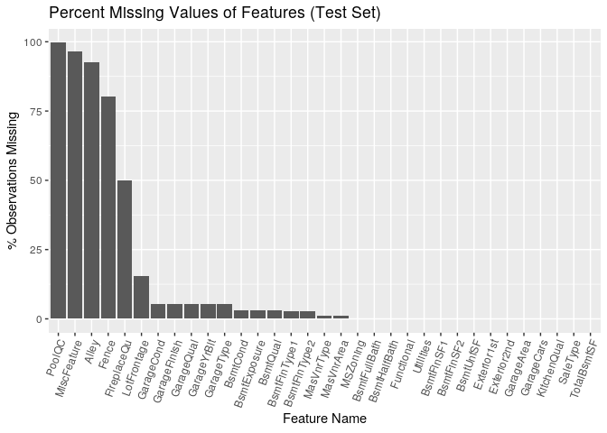

Exploratory Data Analysis
================
Stuart Miller
August 2, 2019

# Setup

``` r
# libraries
library(knitr)
library(tidyverse)
library(naniar)
library(Hmisc)
library(GGally)
require(gplots)
require(corrplot)

# helper files
source('../../helper/data_munging.R')
```

### Load the data into R

``` r
train <- read_csv('../../data/train.csv')
test <- read_csv('../../data/test.csv')

train <- train %>% mutate(logSalePrice = log(SalePrice))

train$MSSubClass <- factor(train$MSSubClass)
test$MSSubClass <- factor(test$MSSubClass)
```

## Missing Data

5 of the features, `PoolQC`, `MiscFeature`, `Alley`, `Fence`, and
`FireplaceQu`, have very high missing rates in both sets of data. It
seems unlikely that these features would provide value as imbuing values
for the missing values would likely bias the training set towards the
imbued value. The feature `LotFrontage` is missing at a rate of ~17% and
~ 15% in the training and testing set respectively. This is also a
fairly high missing rate, but the usefulness of the feature should be
investigated. Fortunately, the rate of missingness for each feature is
approximately the same between the training and testing datasets.

``` r
train.nabular <- train %>% bind_shadow()
train.missing.summary <- train.nabular %>% miss_var_summary()
#train.missing.summary

train.missing.summary %>%
  filter(n_miss > 0) %>%
  ggplot(aes(x = reorder(variable, -n_miss), y = pct_miss)) + geom_bar(stat = 'identity') +
  theme(axis.text.x = element_text(angle = 70, hjust = 1)) +
  labs(title = 'Percent Missing Values of Features (Training Set)',
       y = '% Observations Missing', x = 'Feature Name')
```

<!-- -->

`PoolQC`, `MiscFeature`, `Alley`, `Fence`, `FireplaceQu`, and
`LotFrontage` are the primary missing values in the training dataset.

``` r
test.nabular <- test %>% bind_shadow()
test.missing.summary <- test.nabular %>% miss_var_summary()
#test.missing.summary

test.missing.summary %>%
  filter(n_miss > 0) %>%
  ggplot(aes(x = reorder(variable, -n_miss), y = pct_miss)) + geom_bar(stat = 'identity') +
  theme(axis.text.x = element_text(angle = 70, hjust = 1)) +
  labs(title = 'Percent Missing Values of Features (Test Set)',
       y = '% Observations Missing', x = 'Feature Name')
```

<!-- -->

`PoolQC`, `MiscFeature`, `Alley`, `Fence`,`FireplaceQu`, and
`LotFrontage` are the primary missing values in the testing dataset.

**Summary of the Data Missing per Feature from the
Datasets**

| Variable     | Number Missing (Train) | Percent Missing (Train) | Number Missing (Test) | Percent Missing (Test) |
| ------------ | ---------------------- | ----------------------- | --------------------- | ---------------------- |
| PoolQC       | 1453                   | 99.5%                   | 1456                  | 99.7%                  |
| MiscFeature  | 1406                   | 96.3%                   | 1408                  | 96.5%                  |
| Alley        | 1369                   | 93.7%                   | 1352                  | 92.6%                  |
| Fence        | 1179                   | 80.7%                   | 1169                  | 80.1%                  |
| FireplaceQu  | 690                    | 47.2%                   | 730                   | 50.0%                  |
| LotFrontage  | 259                    | 17.8%                   | 227                   | 15.5%                  |
| GarageType   | 81                     | 5.55%                   | 76                    | 5.21%                  |
| GarageYrBlt  | 81                     | 5.55%                   | 78                    | 5.34%                  |
| GarageFinish | 81                     | 5.55%                   | 78                    | 5.34%                  |
| GarageQual   | 81                     | 5.55%                   | 78                    | 5.34%                  |
| GarageCond   | 81                     | 5.55%                   | 78                    | 5.34%                  |
| BsmtExposure | 38                     | 2.60%                   | 44                    | 3.01%                  |
| BsmtFinType2 | 38                     | 2.60%                   | 42                    | 2.87%                  |
| BsmtQual     | 37                     | 2.53%                   | 44                    | 3.01%                  |
| BsmtCond     | 37                     | 2.53%                   | 45                    | 3.08%                  |
| BsmtFinType1 | 37                     | 2.53%                   | 42                    | 2.87%                  |
| MasVnrType   | 8                      | 0.55%                   | 16                    | 0.27%                  |
| MasVnrArea   | 8                      | 0.55%                   | 15                    | 0.13%                  |
| Electrical   | 1                      | 0.07%                   | N/A                   | N/A                    |
| MSZoning     | N/A                    | N/A                     | 4                     | 0.27%                  |
| Utilities    | N/A                    | N/A                     | 2                     | 0.14%                  |
| BsmtFullBath | N/A                    | N/A                     | 2                     | 0.14%                  |
| BsmtHalfBath | N/A                    | N/A                     | 2                     | 0.14%                  |
| Functional   | N/A                    | N/A                     | 2                     | 0.14%                  |
| Exterior1st  | N/A                    | N/A                     | 1                     | 0.07%                  |
| Exterior2nd  | N/A                    | N/A                     | 1                     | 0.07%                  |
| BsmtFinSF1   | N/A                    | N/A                     | 1                     | 0.07%                  |
| BsmtFinSF2   | N/A                    | N/A                     | 1                     | 0.07%                  |
| BsmtUnfSF    | N/A                    | N/A                     | 1                     | 0.07%                  |
| TotalBsmtSF  | N/A                    | N/A                     | 1                     | 0.07%                  |
| KitchenQual  | N/A                    | N/A                     | 1                     | 0.07%                  |
| GarageCars   | N/A                    | N/A                     | 1                     | 0.07%                  |
| GarageArea   | N/A                    | N/A                     | 1                     | 0.07%                  |
| SaleType     | N/A                    | N/A                     | 1                     | 0.07%                  |
