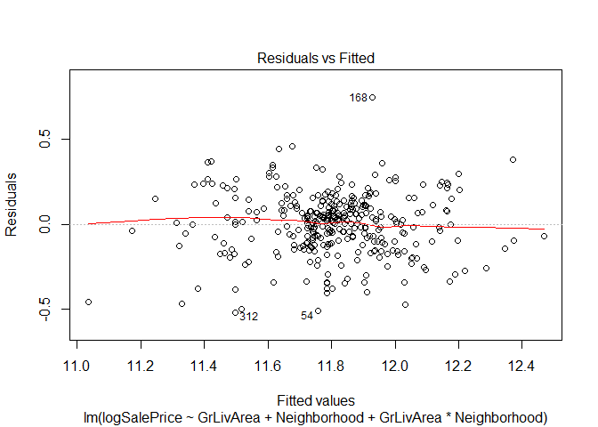
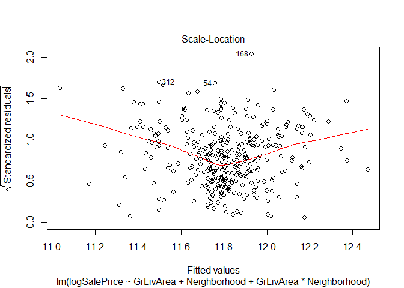

Ames Iowa Housing Prices (Analysis One)
================
Chance Robinson
7/29/2019

# ANALYSIS 1: Requirements

Assume that Century 21 Ames (a real estate company) in Ames Iowa has
commissioned you to answer a very important question with respect to
their business.

Century 21 Ames only sells houses in the NAmes, Edwards and BrkSide
neighborhoods and would like to simply get an estimate of how the
SalePrice of the house is related to the square footage of the living
area of the house (GrLIvArea) and if the SalesPrice (and its
relationship to square footage) depends on which neighborhood the house
is located in.

Build and fit a model that will answer this question, keeping in mind
that realtors prefer to talk about living area in increments of 100 sq.
ft. Provide your client with the estimate (or estimates if it varies by
neighborhood) as well as confidence intervals for any estimate(s) you
provide. It turns out that Century 21’s leadership team has a member
that has some statistical background. Therefore, make sure and provide
evidence that the model assumptions are met and that any suspicious
observations (outliers / influential observations) have been identified
and addressed.

Finally, of course, provide your client with a well written conclusion
that quantifies the relationship between living area and sale price with
respect to these three neighborhoods. Remember that the company is only
concerned with the three neighborhoods they sell in.

``` r
## Multiple Linear Regression

# install.packages("tidyverse")
library(tidyverse)
```

    ## -- Attaching packages -------------------------------------------------------------------- tidyverse 1.2.1 --

    ## v ggplot2 3.2.0     v purrr   0.3.2
    ## v tibble  2.1.3     v dplyr   0.8.3
    ## v tidyr   0.8.3     v stringr 1.4.0
    ## v readr   1.3.1     v forcats 0.4.0

    ## -- Conflicts ----------------------------------------------------------------------- tidyverse_conflicts() --
    ## x dplyr::filter() masks stats::filter()
    ## x dplyr::lag()    masks stats::lag()

``` r
train <- read.csv("train.csv")

train.filtered <- train %>% 
  subset(select = c(Neighborhood, GrLivArea, SalePrice, SaleCondition)) %>%
  filter(Neighborhood %in% c("Edwards", "BrkSide", "NAmes")) %>%
  filter(SaleCondition %in% c("Normal")) %>%
  mutate(logGrLivArea = log(GrLivArea), logSalePrice = log(SalePrice))
```

## Transformation Analysis

We decided to produce a log of the SalePrice with regards to the other
paraemters in the model. (i.e…a log-linear relationship). This had the
desired effect of normalizing the data, but still left some extreme
observations that we felt necessary to handle in order to meet the
assumptions of constant variance. We therefore elected to exclude all
but the homes that were in a “normal condition” as it seemed
inappropriate to build a model when attempting to predict incomplete
observations.

``` r
# Scatterplot of the data
plot(train.filtered$logSalePrice ~ train.filtered$GrLivArea,xlab="GrLivArea", ylab="logSalePrice")
```

<!-- -->

``` r
head(train.filtered)
```

    ##   Neighborhood GrLivArea SalePrice SaleCondition logGrLivArea logSalePrice
    ## 1      BrkSide      1077    118000        Normal     6.981935     11.67844
    ## 2        NAmes      1253    157000        Normal     7.133296     11.96400
    ## 3      BrkSide       854    132000        Normal     6.749931     11.79056
    ## 4        NAmes      1004    149000        Normal     6.911747     11.91170
    ## 5        NAmes       900    134800        Normal     6.802395     11.81155
    ## 6        NAmes      1600    207500        Normal     7.377759     12.24289

``` r
# change the reference category
train.filtered$Neighborhood <- relevel(train.filtered$Neighborhood, ref="Edwards")
# table(train.filtered$Neighborhood)

### assumptions ###
# 1)  Normally Distributed
# 2)  Constant Variance
# 3)  Independent Observations
```

``` r
train.fit <- lm(logSalePrice ~ GrLivArea + Neighborhood + GrLivArea * Neighborhood, data = train.filtered)


summary(train.fit)
```

    ## 
    ## Call:
    ## lm(formula = logSalePrice ~ GrLivArea + Neighborhood + GrLivArea * 
    ##     Neighborhood, data = train.filtered)
    ## 
    ## Residuals:
    ##      Min       1Q   Median       3Q      Max 
    ## -0.52017 -0.11290  0.01637  0.11008  0.74796 
    ## 
    ## Coefficients:
    ##                                 Estimate Std. Error t value Pr(>|t|)    
    ## (Intercept)                    1.105e+01  7.460e-02 148.136  < 2e-16 ***
    ## GrLivArea                      5.170e-04  5.606e-05   9.222  < 2e-16 ***
    ## NeighborhoodBrkSide           -2.643e-01  1.101e-01  -2.401   0.0169 *  
    ## NeighborhoodNAmes              3.691e-01  8.689e-02   4.248 2.82e-05 ***
    ## GrLivArea:NeighborhoodBrkSide  2.267e-04  8.495e-05   2.668   0.0080 ** 
    ## GrLivArea:NeighborhoodNAmes   -1.648e-04  6.484e-05  -2.542   0.0115 *  
    ## ---
    ## Signif. codes:  0 '***' 0.001 '**' 0.01 '*' 0.05 '.' 0.1 ' ' 1
    ## 
    ## Residual standard error: 0.1825 on 328 degrees of freedom
    ## Multiple R-squared:  0.559,  Adjusted R-squared:  0.5523 
    ## F-statistic: 83.16 on 5 and 328 DF,  p-value: < 2.2e-16

``` r
ggplot(data = train.fit) +
  geom_point(mapping = aes(x = GrLivArea, y = logSalePrice)) +
  facet_grid(~ Neighborhood)
```

<!-- -->

### μ{log(Sales Price)| Living Area, Neighborhood} = β0 + β1(Living Area) + β2(BrkSide) + β3(NAmes) + β4(BrkSide)(Living Area)+ β5(NAmes)(Living Area)

``` r
Intercept = 11.4219
GrLivArea = (exp(0.00051699 * 100) - 1) * 100

NeighborhoodBrkSide = -0.6303
NeighborhoodNAmes = 0.0214

GrLivArea_eNeighborhoodBrkSide = (exp((0.00051699 + 0.00022667) * 100) - 1) * 100
GrLivArea_eNeighborhoodNAmes = (exp((0.00051699 - 0.00016483) * 100) - 1) * 100


Intercept
```

    ## [1] 11.4219

``` r
GrLivArea
```

    ## [1] 5.305872

``` r
NeighborhoodBrkSide
```

    ## [1] -0.6303

``` r
NeighborhoodNAmes
```

    ## [1] 0.0214

``` r
GrLivArea_eNeighborhoodBrkSide
```

    ## [1] 7.720099

``` r
GrLivArea_eNeighborhoodNAmes
```

    ## [1] 3.584343

• β0 = the y-intercept is 11.05027136 for the reference neighborhood
(Edwards) with a Living Area of 0. (which does not provide any practical
value as that would be an extrapolation of the data)

• \*\*β1 = each additional 100 sq/ ft of the living area added the
Edwards neighborhood, holding all other variables constant, would result
in a 5.31% multiplicative increase in the median sales price.

• β2 = the adjustment to the y-intercept for the BrkSide neighborhood is
-0.6303.

• β3 = the adjustment to the intercept for the NAmes neighborhood is
0.0214

• \*\*β4 = each additional 100 sq/ ft of the living area added the
BrkSide neighborhood, holding all other variables constant, would result
in a 7.72% increase in the median sales price.

• \*\*β5 = each doubling of the living area for the NAmes neighborhood,
holding all other variables constant, would result in a 3.58% increase
in the median sales
price.

## Prediction for a Single Home in the ‘BrkSide’ neighborhood with a living area of 1500 sq. ft.

``` r
my.pred <- predict(train.fit, data.frame(Neighborhood = 'BrkSide', GrLivArea = 1500))
my.pred.exp <- exp(my.pred)
my.pred.exp
```

    ##        1 
    ## 147481.5

``` r
confint(train.fit)
```

    ##                                       2.5 %        97.5 %
    ## (Intercept)                    1.090353e+01  1.119702e+01
    ## GrLivArea                      4.067084e-04  6.272638e-04
    ## NeighborhoodBrkSide           -4.808197e-01 -4.776775e-02
    ## NeighborhoodNAmes              1.981530e-01  5.400096e-01
    ## GrLivArea:NeighborhoodBrkSide  5.955141e-05  3.937833e-04
    ## GrLivArea:NeighborhoodNAmes   -2.923989e-04 -3.727005e-05

## 95 Percent confidence intervals for the increase Sales Price for every additional 100 sq/ft

### \- 4.15 \~ 6.47% (Edwards)

### \- 4.77 \~ 10.45% (BrkSide)

### \- 1.15 \~ 6.08% (NAmes)

``` r
edwards_low = (exp(4.067084e-04 * 100) - 1) * 100
edwards_low
```

    ## [1] 4.150923

``` r
edwards_high = (exp(6.272638e-04 * 100) - 1) * 100
edwards_high
```

    ## [1] 6.473547

``` r
brkside_low = (exp((4.067084e-04 + 5.955141e-05) * 100) - 1) * 100
brkside_low
```

    ## [1] 4.773006

``` r
brkside_high = (exp((6.272638e-04 + 3.937833e-04) * 100) - 1) * 100
brkside_high
```

    ## [1] 10.74994

``` r
names_low = (exp((4.067084e-04 - 2.923989e-04) * 100) - 1) * 100
names_low
```

    ## [1] 1.149653

``` r
names_high = (exp((6.272638e-04 - 3.727005e-05) * 100) - 1) * 100
names_high
```

    ## [1] 6.077458

## Residual Plots

The regression lines are broken down by a subset of neighborhoods from
the training data
set:

``` r
plot(train.fit)
```

<!-- --><!-- --><!-- --><!-- -->

## Linear Regression Lines for all three neighborhoods (Log Scale of Sale Price)

``` r
ggplot(train.fit,aes(y=logSalePrice,x=GrLivArea,color=factor(Neighborhood)))+geom_point()+stat_smooth(method="lm",se=FALSE)
```

<!-- -->
