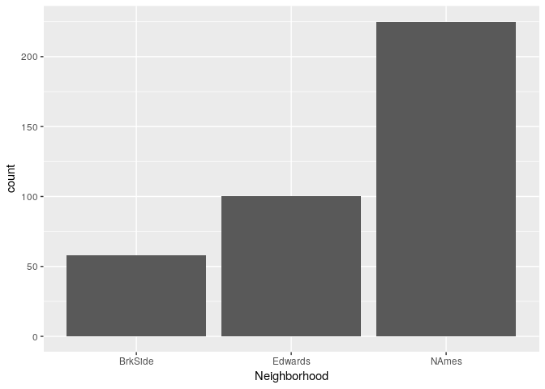
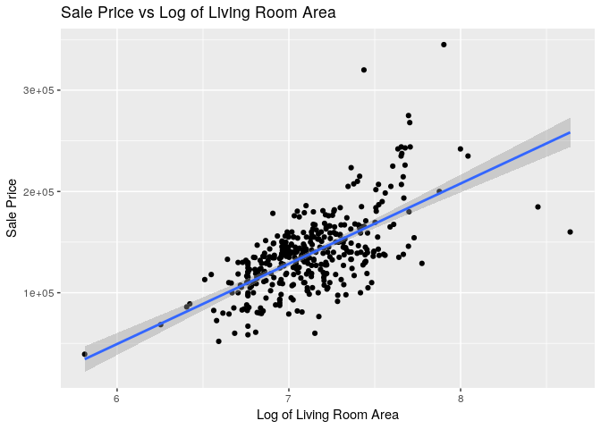
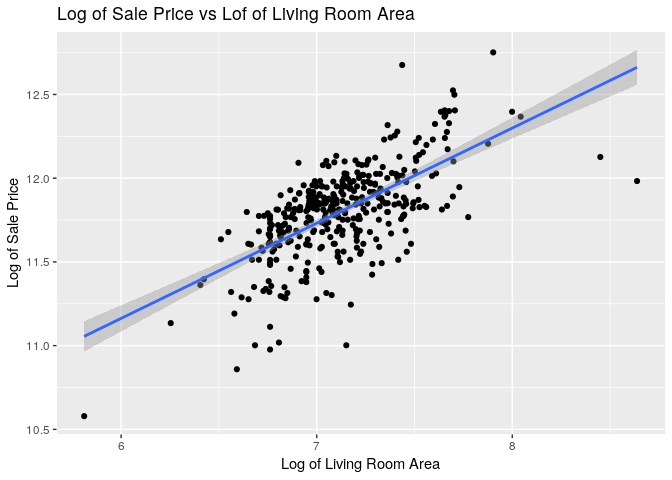
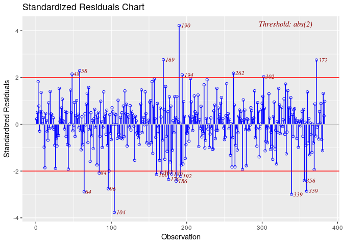
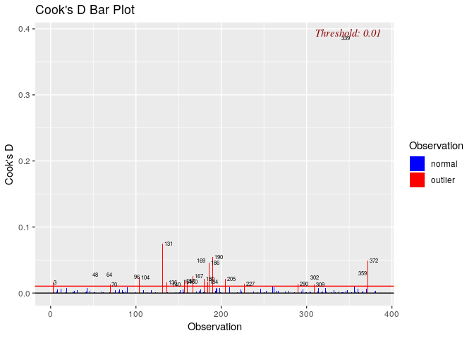

Question 1
================
Stuart Miller
July 28, 2019

# Requested Analysis

Century 21 Ames wawnts to understand if there is a relationship between
the square footage of the living areas of houses (`GrLivArea`) and sale
price in the neighborhood where they operate Northwest Ames, Edwards,
and Brookside (`NAmes`, `Edwards` and `BrkSide`).

# Setup

``` r
# libraries
library(knitr)
library(tidyverse)
library(olsrr)

# load data
train <- read_csv('../data/train.csv')
test <- read_csv('../data/test.csv')
```

# Analysis

## Extract Data of Interest

``` r
# select data of interest
train <- train %>% 
#  select(c('SalePrice','GrLivArea','Neighborhood')) %>%
  filter(Neighborhood == 'NAmes' | Neighborhood == 'Edwards' | Neighborhood == 'BrkSide')
train$Neighborhood <- as.factor(train$Neighborhood)
```

## Plots of Data

Barplot of count houses in `Neighborhood`s of interest.

``` r
train %>% ggplot(aes(x = Neighborhood)) + geom_bar() + 
  labs(title = 'Count of Levels of Neighborhood', 
       y = 'Count')
```

<!-- -->

Histogram of `SalePrice`, which is the sale price of the houses in the
dataset.

``` r
train %>% ggplot(aes(x = SalePrice)) +
  geom_histogram() + 
  labs(title = 'Histogram of Sale Price', 
       y = 'Frequency', x = 'Sale Price')
```

<!-- -->

Histogram of `GrLivArea`, which is the square footage of the living
areas of houses in the dataset.

``` r
train %>% ggplot(aes(x = GrLivArea)) +
  geom_histogram() + 
  labs(title = 'Histogram of Living Room Area', 
       y = 'Frequency', x = 'Living Room Area')
```

<!-- -->

Both variables (`SalePrice` and `GrLivArea`) show evidence of right
skew. This could indicate need for a log transform.

Scatter plot of `SalePrice` vs `GrLivArea` shows that the large values
in `GrLivArea` are pulling the regression line. A log transfrom on
`GrLivArea` may help correct this.

``` r
train %>% ggplot(aes(x = GrLivArea, y = SalePrice)) +
  geom_point() +
  geom_smooth(method = 'lm') + 
  labs(title = 'Sale Price vs Living Room Area', 
       y = 'Log of Sale Price', x = 'Living Room Area')
```

<!-- -->

Scatter plot of `SalePrice` vs log transform of `GrLivArea` shows taking
the log transform of `GrLivArea` does improve the linear relationship.
However, it appears that a larger value of `GrLivArea` is associated
with an increase in varaince of `SalePrice`. A log transform of
`SalePrice` may help control for this change in varaince.

``` r
train %>% ggplot(aes(x = log(GrLivArea), y = SalePrice)) +
  geom_point() +
  geom_smooth(method = 'lm') + 
  labs(title = 'Sale Price vs Log of Living Room Area', 
       y = 'Sale Price', x = 'Log of Living Room Area')
```

<!-- -->

Scatter plot the log transform of `SalePrice` vs the log transform of
`GrLivArea` shows evidece of a linear relationship without sufficient
evidence of changing variance. Two points to the right side of the plot
appear to be pulling the regression line to the right. These points
should be investigated.

``` r
train %>% ggplot(aes(x = log(GrLivArea), y = log(SalePrice))) +
  geom_point() +
  geom_smooth(method = 'lm') + 
  labs(title = 'Log of Sale Price vs Lof of Living Room Area', 
       y = 'Log of Sale Price', x = 'Log of Living Room Area')
```

<!-- -->

Add labels of `SaleCondition` of the two points of interest and some
neighboring points to the scatter plot the log transform of `SalePrice`
vs the log transform of `GrLivArea`. This indicates the influential
points are of type `Partial` `SaleCondition`, which means the houses
were not completed at the time of assessment.

``` r
train %>% ggplot(aes(x = log(GrLivArea), y = log(SalePrice))) +
  geom_point() +
  geom_smooth(method = 'lm') + 
  labs(title = 'Log of Sale Price vs Lof of Living Room Area', 
       y = 'Log of Sale Price', x = 'Log of Living Room Area') +
  geom_text(aes(label = ifelse((log(GrLivArea) > 7.75 & log(SalePrice) > 11) |
                                 (log(SalePrice) > 12.45),
                               SaleCondition, '')),
            hjust=0,
            vjust=0)
```

<!-- -->

``` r
train %>% ggplot(aes(x = SaleCondition)) + 
  geom_bar()
```

<!-- -->

``` r
# create dummy variables with Neighborhood == 'Edwards' as reference
train$Neighborhood_BrkSide <-  as.numeric(train$Neighborhood == 'BrkSide')
train$Neighborhood_NAmes <-  as.numeric(train$Neighborhood == 'NAmes')
```

## Model

Based on the log-log plot above, the response will be modeled as


where Edwards neighborhood is used for reference.

``` r
# model the mean response given equation above
model <- lm(formula = log(SalePrice) ~ log(GrLivArea) + 
     Neighborhood_BrkSide + 
     Neighborhood_NAmes +
     log(GrLivArea) * Neighborhood_BrkSide + 
     log(GrLivArea) * Neighborhood_NAmes, data = train)
summary(model)
```

    ## 
    ## Call:
    ## lm(formula = log(SalePrice) ~ log(GrLivArea) + Neighborhood_BrkSide + 
    ##     Neighborhood_NAmes + log(GrLivArea) * Neighborhood_BrkSide + 
    ##     log(GrLivArea) * Neighborhood_NAmes, data = train)
    ## 
    ## Residuals:
    ##      Min       1Q   Median       3Q      Max 
    ## -0.72080 -0.10353  0.02184  0.10586  0.80470 
    ## 
    ## Coefficients:
    ##                                     Estimate Std. Error t value Pr(>|t|)
    ## (Intercept)                          8.00651    0.40320  19.858   <2e-16
    ## log(GrLivArea)                       0.51967    0.05648   9.202   <2e-16
    ## Neighborhood_BrkSide                -2.09359    0.64589  -3.241   0.0013
    ## Neighborhood_NAmes                   0.48622    0.51751   0.940   0.3481
    ## log(GrLivArea):Neighborhood_BrkSide  0.29998    0.09122   3.289   0.0011
    ## log(GrLivArea):Neighborhood_NAmes   -0.04664    0.07248  -0.644   0.5203
    ##                                        
    ## (Intercept)                         ***
    ## log(GrLivArea)                      ***
    ## Neighborhood_BrkSide                ** 
    ## Neighborhood_NAmes                     
    ## log(GrLivArea):Neighborhood_BrkSide ** 
    ## log(GrLivArea):Neighborhood_NAmes      
    ## ---
    ## Signif. codes:  0 '***' 0.001 '**' 0.01 '*' 0.05 '.' 0.1 ' ' 1
    ## 
    ## Residual standard error: 0.1923 on 377 degrees of freedom
    ## Multiple R-squared:  0.5121, Adjusted R-squared:  0.5056 
    ## F-statistic: 79.14 on 5 and 377 DF,  p-value: < 2.2e-16

## Model Assumption Assessment

``` r
# get predicted values
train$Predicted <- predict(model, train[,c('GrLivArea','Neighborhood_BrkSide','Neighborhood_NAmes')])
train$Resid <- model$residuals
```

### Normality

``` r
qqnorm(model$residuals)
```

<!-- -->

``` r
hist(model$residuals)
```

<!-- -->

### Linear Trend

``` r
train %>% ggplot(aes(x = log(GrLivArea), y = log(SalePrice))) +
  geom_point() +
  geom_smooth(method = 'lm') + 
  labs(title = 'Log of Sale Price vs Lof of Living Room Area', 
       y = 'Log of Sale Price', x = 'Log of Living Room Area')
```

<!-- -->

### Equal Variances

``` r
train %>% ggplot(aes(x = Predicted, y = Resid)) +
  geom_point() +
  geom_abline(slope = 0)
```

<!-- -->

### Other Plots

``` r
# Rstudent vs leverage
ols_plot_resid_lev(model)
```

<!-- -->

``` r
ols_plot_resid_stand(model)
```

<!-- -->

``` r
ols_plot_cooksd_bar(model)
```

<!-- -->

\[ASE = \frac{\sum_{n=1}^{N} (y_i - \hat{y}_i)^2 }{N}\]
