Question 1
================
Stuart Miller
July 28, 2019

# Requested Analysis

Century 21 Ames wants to understand if there is a relationship between
the square footage of the living areas of houses (`GrLivArea`) and sale
price in the neighborhood where they operate Northwest Ames, Edwards,
and Brookside (`NAmes`, `Edwards` and `BrkSide`).

# Analysis

## Extract Data of Interest

``` r
# select data of interest
train <- train %>% 
  filter(Neighborhood %in% c("Edwards", "BrkSide", "NAmes"))
train$Neighborhood <- as.factor(train$Neighborhood)
```

## Plots of Data

Barplot of count houses in `Neighborhood`s of interest.

``` r
train %>% ggplot(aes(x = Neighborhood)) + geom_bar() + 
  labs(title = 'Count of Levels of Neighborhood', 
       y = 'Count')
```

<!-- -->

Histogram of `SalePrice`, which is the sale price of the houses in the
dataset.

``` r
train %>% ggplot(aes(x = SalePrice)) +
  geom_histogram() + 
  labs(title = 'Histogram of Sale Price', 
       y = 'Frequency', x = 'Sale Price')
```

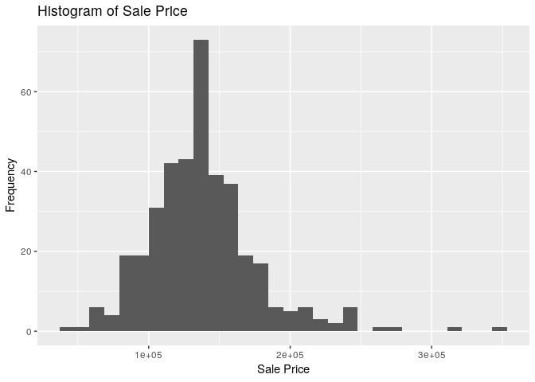<!-- -->

Histogram of `GrLivArea`, which is the square footage of the living
areas of houses in the dataset.

``` r
train %>% ggplot(aes(x = GrLivArea)) +
  geom_histogram() + 
  labs(title = 'Histogram of Living Room Area', 
       y = 'Frequency', x = 'Living Room Area')
```

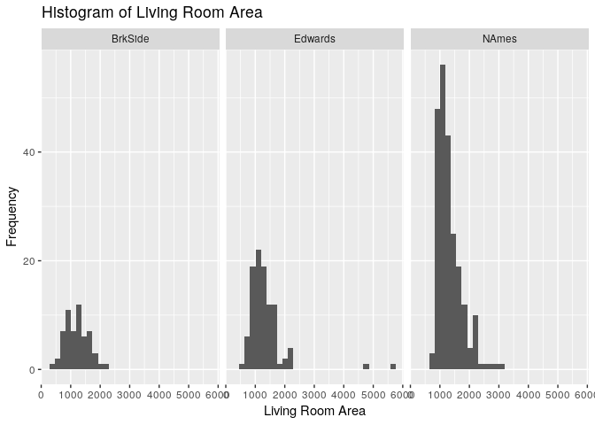<!-- -->

Both variables (`SalePrice` and `GrLivArea`) show evidence of right
skew. This could indicate need for a log transform.

Scatter plot of `SalePrice` vs `GrLivArea` shows that the large values
in `GrLivArea` are pulling the regression line. A log transfrom on
`GrLivArea` may help correct this.

``` r
train %>% ggplot(aes(x = GrLivArea, y = SalePrice)) +
  geom_point(alpha = 0.3) +
  labs(title = 'Sale Price vs Living Room Area', 
       y = 'Log of Sale Price', x = 'Living Room Area')
```

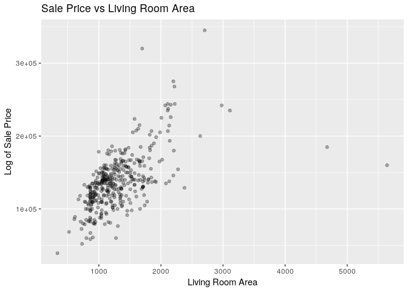<!-- -->

Scatter plot of `SalePrice` vs log transform of `GrLivArea` shows taking
the log transform of `GrLivArea` does improve the linear relationship.
However, it appears that a larger value of `GrLivArea` is associated
with an increase in varaince of `SalePrice`. A log transform of
`SalePrice` may help control for this change in varaince.

``` r
train %>% ggplot(aes(x = log(GrLivArea), y = SalePrice)) +
  geom_point(alpha = 0.3) +
  labs(title = 'Sale Price vs Log of Living Room Area', 
       y = 'Sale Price', x = 'Log of Living Room Area')
```

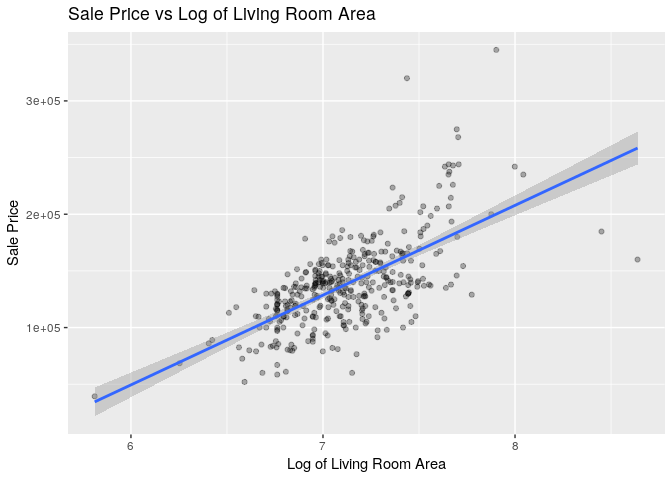<!-- -->

Scatter plot the log transform of `SalePrice` vs the log transform of
`GrLivArea` shows evidece of a linear relationship without sufficient
evidence of changing variance. Two points to the right side of the plot
appear to be pulling the regression line to the right. These points
should be investigated.

``` r
train %>% ggplot(aes(x = log(GrLivArea), y = log(SalePrice))) +
  geom_point(alpha = 0.3) + 
  labs(title = 'Log of Sale Price vs Log of Living Room Area', 
       y = 'Log of Sale Price', x = 'Log of Living Room Area')
```

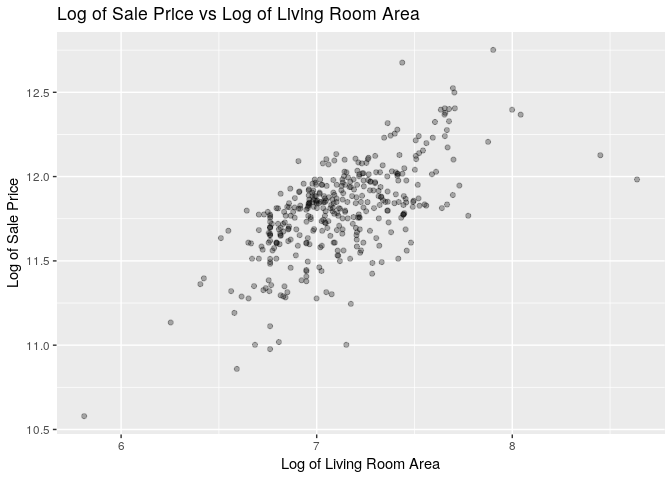<!-- -->

Add labels of `SaleCondition` of the two points of interest and some
neighboring points to the scatter plot the log transform of `SalePrice`
vs the log transform of `GrLivArea`. This indicates the influential
points are of type `Partial` `SaleCondition`, which means the houses
were not completed at the time of assessment.

``` r
train %>% ggplot(aes(x = log(GrLivArea), y = log(SalePrice))) +
  geom_point(alpha = 0.3) +
  labs(title = 'Log of Sale Price vs Log of Living Room Area', 
       y = 'Log of Sale Price', x = 'Log of Living Room Area') +
  geom_text(aes(label = ifelse((log(GrLivArea) > 7.75 & log(SalePrice) > 11) |
                                 (log(SalePrice) > 12.45),
                               SaleCondition, '')), hjust=0, vjust=0)
```

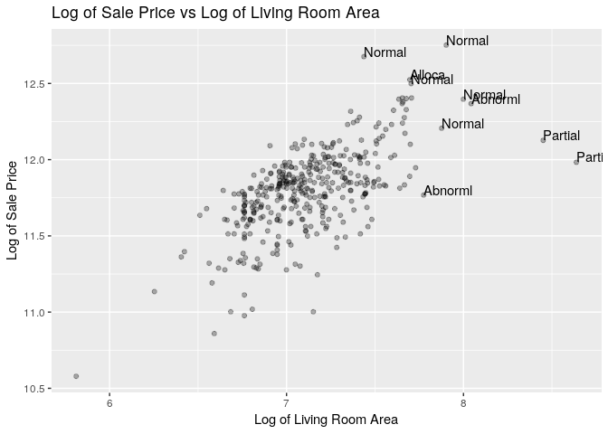<!-- -->

Scatter plot log of sale price vs log of living room area for each
neighborhood. In each case, there is not sigificant evidence against the
assumption of linearity.

``` r
regplot.names <- train %>% filter(Neighborhood == 'NAmes') %>%
  ggplot(aes(x = log(GrLivArea), y = log(SalePrice))) +
  geom_point(alpha = 0.3) +
  ylim(10.5, 13) +
  xlim(5.5, 9) +
  geom_smooth(method = 'lm') +
  labs(subtitle = 'Northwest Ames', 
       y = 'Log of Sale Price', x = 'Log of Living Room Area')

regplot.ed <- train %>% filter(Neighborhood == 'Edwards') %>%
  ggplot(aes(x = log(GrLivArea), y = log(SalePrice))) +
  geom_point(alpha = 0.3) +
  ylim(10.5, 13) +
  xlim(5.5, 9) +
  geom_smooth(method = 'lm') +
  labs(subtitle = 'Edwards', 
       y = 'Log of Sale Price', x = 'Log of Living Room Area')

regplot.brk <- train %>% filter(Neighborhood == 'BrkSide') %>%
  ggplot(aes(x = log(GrLivArea), y = log(SalePrice))) +
  geom_point(alpha = 0.3) +
  ylim(10.5, 13) +
  xlim(5.5, 9) +
  geom_smooth(method = 'lm') +
  labs(subtitle = 'Brook Side', 
       y = 'Log of Sale Price', x = 'Log of Living Room Area')
grid.arrange(regplot.names,regplot.ed,regplot.brk, nrow = 2,
             top = 'Regression Plots for Neighborhoods')
```

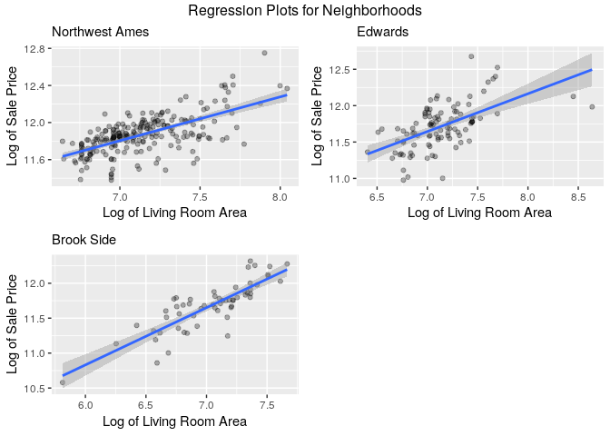<!-- -->

``` r
train %>% ggplot(aes(x = log(GrLivArea), y = log(SalePrice), color = Neighborhood)) +
  geom_point(alpha = 0.3) + 
  labs(subtitle = 'Brook Side', 
       y = 'Log of Sale Price', x = 'Log of Living Room Area')
```

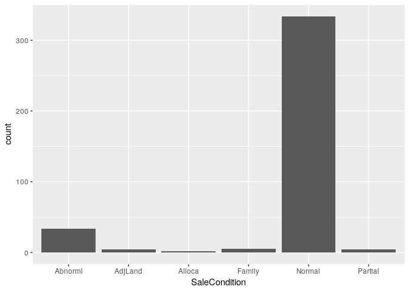<!-- -->

## Model

Based on the log-log plot above, the response will be modeled as

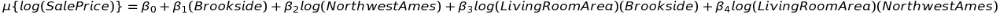

where Edwards neighborhood is used for reference.

### Interaction Terms

We will use an extra sums of square test to verify that the interaction
terms are useful for the model. The ESS test provides strong evidence
that the interaction terms are useful (p-value = 0.0002); thus, we will
continue with the full model.

``` r
# create dummy variables with Neighborhood == 'Edwards' as reference
train <- get.dummies(train, "Neighborhood", reference = 'Edwards')
```

    ## [1] "Neighborhood_BrkSide"
    ## [1] "Neighborhood_NAmes"

``` r
# full model formula
model.formula = log(SalePrice) ~ log(GrLivArea) + 
     Neighborhood_BrkSide + 
     Neighborhood_NAmes +
     log(GrLivArea) * Neighborhood_BrkSide + 
     log(GrLivArea) * Neighborhood_NAmes
# reduced model formula
model.reduced.formula = log(SalePrice) ~ log(GrLivArea) + 
     Neighborhood_BrkSide + 
     Neighborhood_NAmes

# fit models
model <- lm(formula = model.formula, data = train)
model.reduced <- lm(formula = model.reduced.formula, data = train)
# ESS test on models
anova(model.reduced, model)
```

    ## Analysis of Variance Table
    ## 
    ## Model 1: log(SalePrice) ~ log(GrLivArea) + Neighborhood_BrkSide + Neighborhood_NAmes
    ## Model 2: log(SalePrice) ~ log(GrLivArea) + Neighborhood_BrkSide + Neighborhood_NAmes + 
    ##     log(GrLivArea) * Neighborhood_BrkSide + log(GrLivArea) * 
    ##     Neighborhood_NAmes
    ##   Res.Df    RSS Df Sum of Sq     F    Pr(>F)    
    ## 1    379 14.577                                 
    ## 2    377 13.938  2   0.63951 8.649 0.0002125 ***
    ## ---
    ## Signif. codes:  0 '***' 0.001 '**' 0.01 '*' 0.05 '.' 0.1 ' ' 1

### Parameter Estimation

Estimate parameters in the model by fitting to the entire dataset to the
chosen model.

``` r
# formula for model
model.formula = log(SalePrice) ~ log(GrLivArea) + 
     Neighborhood_BrkSide + 
     Neighborhood_NAmes +
     log(GrLivArea) * Neighborhood_BrkSide + 
     log(GrLivArea) * Neighborhood_NAmes

# model the mean response given equation above
model <- lm(formula = model.formula, data = train)
summary(model)
```

    ## 
    ## Call:
    ## lm(formula = model.formula, data = train)
    ## 
    ## Residuals:
    ##      Min       1Q   Median       3Q      Max 
    ## -0.72080 -0.10353  0.02184  0.10586  0.80470 
    ## 
    ## Coefficients:
    ##                                     Estimate Std. Error t value Pr(>|t|)
    ## (Intercept)                          8.00651    0.40320  19.858   <2e-16
    ## log(GrLivArea)                       0.51967    0.05648   9.202   <2e-16
    ## Neighborhood_BrkSide                -2.09359    0.64589  -3.241   0.0013
    ## Neighborhood_NAmes                   0.48622    0.51751   0.940   0.3481
    ## log(GrLivArea):Neighborhood_BrkSide  0.29998    0.09122   3.289   0.0011
    ## log(GrLivArea):Neighborhood_NAmes   -0.04664    0.07248  -0.644   0.5203
    ##                                        
    ## (Intercept)                         ***
    ## log(GrLivArea)                      ***
    ## Neighborhood_BrkSide                ** 
    ## Neighborhood_NAmes                     
    ## log(GrLivArea):Neighborhood_BrkSide ** 
    ## log(GrLivArea):Neighborhood_NAmes      
    ## ---
    ## Signif. codes:  0 '***' 0.001 '**' 0.01 '*' 0.05 '.' 0.1 ' ' 1
    ## 
    ## Residual standard error: 0.1923 on 377 degrees of freedom
    ## Multiple R-squared:  0.5121, Adjusted R-squared:  0.5056 
    ## F-statistic: 79.14 on 5 and 377 DF,  p-value: < 2.2e-16

``` r
confint(model)
```

    ##                                          2.5 %      97.5 %
    ## (Intercept)                          7.2137090  8.79930538
    ## log(GrLivArea)                       0.4086192  0.63071533
    ## Neighborhood_BrkSide                -3.3635933 -0.82357954
    ## Neighborhood_NAmes                  -0.5313439  1.50378486
    ## log(GrLivArea):Neighborhood_BrkSide  0.1206263  0.47933532
    ## log(GrLivArea):Neighborhood_NAmes   -0.1891596  0.09587228

### Model Accuracy Estimation

Use 10-fold cross validation to estimate the accuracy metrics of the
model.

``` r
# Set up repeated k-fold cross-validation
train.control <- trainControl(method = "cv", number = 10)
# Train the model
model.cv <- train(model.formula, 
                    data = train,
                    method = 'lm',
                    trControl = train.control)
# print model summary
model.cv
```

    ## Linear Regression 
    ## 
    ## 383 samples
    ##   3 predictor
    ## 
    ## No pre-processing
    ## Resampling: Cross-Validated (10 fold) 
    ## Summary of sample sizes: 344, 345, 345, 345, 345, 343, ... 
    ## Resampling results:
    ## 
    ##   RMSE       Rsquared   MAE     
    ##   0.1925072  0.5094893  0.146381
    ## 
    ## Tuning parameter 'intercept' was held constant at a value of TRUE

``` r
# get the CV results
res <- model.cv$results

# get cross-validated PRESS statistic
PCV <- PRESS.cv(model.cv)

# print accuracy metrics to md table
kable(data.frame('RMSE'=res$RMSE,
           'CV Press'=PCV,
           'Adjused R Squared'=res$Rsquared))
```

|      RMSE | CV.Press | Adjused.R.Squared |
| --------: | -------: | ----------------: |
| 0.1925072 | 12.77424 |         0.5094893 |

## Model Assumptions Assessment

  - **Linearity**: It appear reasonable that the log of sale price and
    the log of living room area could be linearly related based on a
    scatter plot.
  - **Normality**: The residuals from the model fit appear to be
    normally distributed based on a histogram and qq plot.
  - **Constant Variance**: There is no discernable pattern from a
    scatter plot of residuals and studentized residuals plotted vs
    predicted value.
  - **Independence**: It is not clear how the data was sampled. We will
    assume this is true and continue.

<!-- end list -->

``` r
basic.fit.plots(train, model)
```

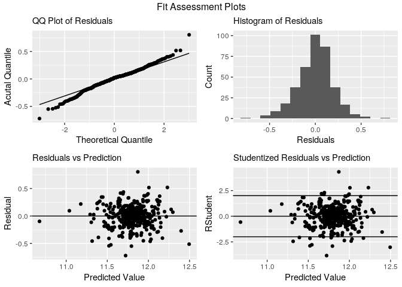<!-- -->

``` r
ols_plot_resid_lev(model)
```

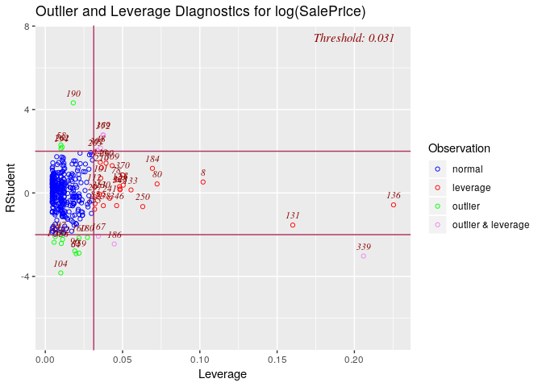<!-- -->

``` r
ols_plot_cooksd_bar(model)
```

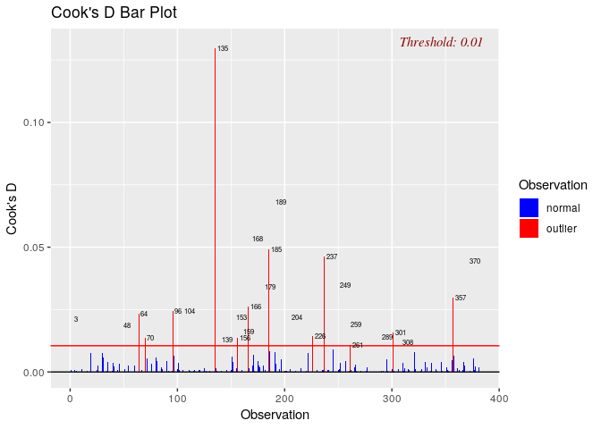<!-- -->

## Conclusion

TODO

  - Provide model
  - Interpretation
      - Statistally significant relationship between edwards
        neighborhood and sale price
      - No statistical difference between Edwards and Northwest Ames
      - Statistical difference between Edwards and Brook Side
  - Scope
      - Unknown sampling method -\> no extension
      - Observational
