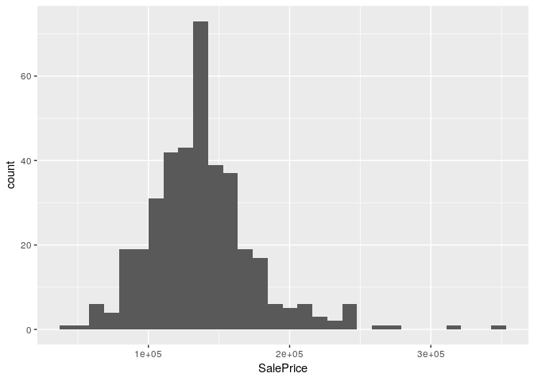

Question 1
================
Stuart Miller
July 24, 2019

# Requested Analysis

Century 21 Ames wawnts to understand if there is a relationship between
the square footage of the living areas of houses and sale price in the
neighborhood where they operate (NAmes, Edwards and BrkSide).

# Setup

``` r
# libraries
library(knitr)
library(tidyverse)
library(recipes)

# load data
train <- read_csv('../data/train.csv')
test <- read_csv('../data/test.csv')
```

# Analysis

## Build the Model

``` r
# select data of interest
train <- train %>% 
  select(c('SalePrice','GrLivArea','Neighborhood')) %>%
  filter(Neighborhood == 'NAmes' | Neighborhood == 'Edwards' | Neighborhood == 'BrkSide')
train$Neighborhood <- as.factor(train$Neighborhood)
```

### Plots of Data

Histogram of `SalePrice`, which is the sale price of the houses in the
dataset.

``` r
train %>% ggplot(aes(x = SalePrice)) +
  geom_histogram()
```

<!-- -->

Histogram of `GrLivArea`, which is the square footage of the living
areas of houses in the dataset.

``` r
train %>% ggplot(aes(x = GrLivArea)) +
  geom_histogram()
```

<!-- -->

Barplot of `Neighborhood`, which is the square footage of the living
areas of houses in the dataset.

``` r
train %>% ggplot(aes(x = Neighborhood)) +
  geom_bar()
```

<!-- -->

### Model

``` r
lm(SalePrice ~  GrLivArea, data = train) %>% summary()
```

    ## 
    ## Call:
    ## lm(formula = SalePrice ~ GrLivArea, data = train)
    ## 
    ## Residuals:
    ##     Min      1Q  Median      3Q     Max 
    ## -177619  -17918     919   15227  163722 
    ## 
    ## Coefficients:
    ##              Estimate Std. Error t value Pr(>|t|)    
    ## (Intercept) 78205.578   4536.054   17.24   <2e-16 ***
    ## GrLivArea      45.979      3.265   14.08   <2e-16 ***
    ## ---
    ## Signif. codes:  0 '***' 0.001 '**' 0.01 '*' 0.05 '.' 0.1 ' ' 1
    ## 
    ## Residual standard error: 30980 on 381 degrees of freedom
    ## Multiple R-squared:  0.3423, Adjusted R-squared:  0.3406 
    ## F-statistic: 198.3 on 1 and 381 DF,  p-value: < 2.2e-16

``` r
dum <- train %>% 
  recipe(~ .) %>% 
  step_dummy(Neighborhood) %>%
  prep(training = train) %>% 
  bake(newdata = train)
dum
```

    ## # A tibble: 383 x 4
    ##    SalePrice GrLivArea Neighborhood_Edwards Neighborhood_NAmes
    ##        <int>     <int>                <dbl>              <dbl>
    ##  1    118000      1077                    0                  0
    ##  2    157000      1253                    0                  1
    ##  3    132000       854                    0                  0
    ##  4    149000      1004                    0                  1
    ##  5    139000      1339                    0                  1
    ##  6    134800       900                    0                  1
    ##  7    207500      1600                    0                  1
    ##  8     68500       520                    0                  0
    ##  9    165500      1700                    0                  1
    ## 10    153000      1297                    0                  1
    ## # ... with 373 more rows

``` r
lm(SalePrice ~  GrLivArea + 
     Neighborhood_Edwards + 
     Neighborhood_NAmes +
     GrLivArea * Neighborhood_Edwards + 
     GrLivArea * Neighborhood_NAmes, data = dum) %>% summary()
```

    ## 
    ## Call:
    ## lm(formula = SalePrice ~ GrLivArea + Neighborhood_Edwards + Neighborhood_NAmes + 
    ##     GrLivArea * Neighborhood_Edwards + GrLivArea * Neighborhood_NAmes, 
    ##     data = dum)
    ## 
    ## Residuals:
    ##    Min     1Q Median     3Q    Max 
    ## -96204 -14568   -310  12601 181131 
    ## 
    ## Coefficients:
    ##                                 Estimate Std. Error t value Pr(>|t|)    
    ## (Intercept)                    19971.514  12351.125   1.617  0.10672    
    ## GrLivArea                         87.163      9.782   8.911  < 2e-16 ***
    ## Neighborhood_Edwards           68381.591  13969.511   4.895 1.46e-06 ***
    ## Neighborhood_NAmes             54704.888  13882.334   3.941 9.69e-05 ***
    ## GrLivArea:Neighborhood_Edwards   -57.412     10.718  -5.357 1.48e-07 ***
    ## GrLivArea:Neighborhood_NAmes     -32.847     10.815  -3.037  0.00256 ** 
    ## ---
    ## Signif. codes:  0 '***' 0.001 '**' 0.01 '*' 0.05 '.' 0.1 ' ' 1
    ## 
    ## Residual standard error: 28550 on 377 degrees of freedom
    ## Multiple R-squared:  0.4474, Adjusted R-squared:   0.44 
    ## F-statistic: 61.04 on 5 and 377 DF,  p-value: < 2.2e-16
