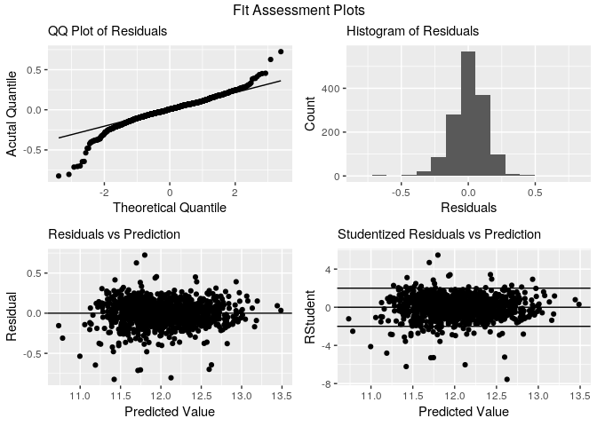

Question 2
================
Stuart Miller
August 5, 2019

``` r
library(tidyverse)
library(MASS)
library(caret)
library(knitr)

source('../../helper/visual.R')

load('../../data/data.RData')
test <- read_csv('../../data/test.csv') 

test$LotFrontage[is.na(test$LotFrontage)] <- 0
test$Alley[is.na(test$Alley)] <- "None"
test$MasVnrType[is.na(test$MasVnrType)] <- "None"
test$MasVnrArea[is.na(test$MasVnrArea)] <- 0
test$BsmtQual[is.na(test$BsmtQual)] <- 0
test$BsmtCond[is.na(test$BsmtCond)] <- 0
test$BsmtExposure[is.na(test$BsmtExposure)] <- 0
test$BsmtFinType1[is.na(test$BsmtFinType1)] <- 0
test$BsmtFinType2[is.na(test$BsmtFinType2)] <- 0
test$Electrical[is.na(test$Electrical)] <- "SBrkr"
test$FireplaceQu[is.na(test$FireplaceQu)] <- "None"
test$GarageType[is.na(test$GarageType)] <- "None"
test$GarageYrBlt[is.na(test$GarageYrBlt)] <- mean(test$GarageYrBlt, na.rm=TRUE)
test$GarageArea[is.na(test$GarageArea)] <- mean(test$GarageArea, na.rm=TRUE)
test$GarageFinish[is.na(test$GarageFinish)] <- "None"
test$GarageQual[is.na(test$GarageQual)] <- "None"
test$GarageCond[is.na(test$GarageCond)] <- "None"
test$PoolQC[is.na(test$PoolQC)] <- "None"
test$Fence[is.na(test$Fence)] <- "None"
test$MiscFeature[is.na(test$MiscFeature)] <- "None"
test$TotalBsmtSF[is.na(test$TotalBsmtSF)] <- mean(test$TotalBsmtSF, na.rm=TRUE)

test$OverallQual[is.na(test$OverallQual)] <- mean(test$OverallQual, na.rm=TRUE)
test$YearRemodAdd[is.na(test$YearRemodAdd)] <- mean(test$YearRemodAdd, na.rm=TRUE)
test$Fireplaces[is.na(test$Fireplaces)] <- mean(test$Fireplaces, na.rm=TRUE)
test$YearBuilt[is.na(test$YearBuilt)] <- mean(test$YearBuilt, na.rm=TRUE)

#GarageArea + OverallQual + GrLivArea:Neighborhood + TotalBsmtSF:BsmtQual + BsmtQual + YearRemodAdd + Fireplaces + YearBuilt:Neighborhood
```

## Model

“By Hand” constuction.

Based on the correlation heatmap the following parameters have a
reasonible correlation with the log of `SalePrice` without high mutual
correlation.

  - `GarageArea`
  - `OverallQual`
  - `GrLivArea`
  - `TotalBsmtSF`
  - `BsmtQual`
  - `YearRemodAdd`
  - `Fireplaces`
  - `YearBuilt`

Based on EDA, `TotalBsmtSF` varies by `BsmtQual`, so it will be included
as an interaction. Living room areas and year built tend to vary by
neighborhood, so neighborhood will be included as an interation on these
variable.

This model produces an adjusted R-squared of 0.882, which is an estimate
of the variability in logSalePrice that is explained by the
model.

``` r
model.formula = log(SalePrice) ~ GarageArea + OverallQual + GrLivArea + TotalBsmtSF:BsmtQual + YearRemodAdd + Fireplaces + YearBuilt:Neighborhood

m <- lm(model.formula, data = train)
summary(m)
```

    ## 
    ## Call:
    ## lm(formula = model.formula, data = train)
    ## 
    ## Residuals:
    ##      Min       1Q   Median       3Q      Max 
    ## -1.91560 -0.07009  0.00824  0.08265  0.53112 
    ## 
    ## Coefficients: (1 not defined because of singularities)
    ##                                Estimate Std. Error t value Pr(>|t|)    
    ## (Intercept)                   3.463e+00  7.376e-01   4.695 2.93e-06 ***
    ## GarageArea                    2.366e-04  2.559e-05   9.244  < 2e-16 ***
    ## OverallQual                   8.056e-02  5.327e-03  15.121  < 2e-16 ***
    ## GrLivArea                     2.020e-04  1.137e-05  17.774  < 2e-16 ***
    ## YearRemodAdd                  2.500e-03  2.677e-04   9.338  < 2e-16 ***
    ## Fireplaces                    5.656e-02  7.685e-03   7.359 3.11e-13 ***
    ## TotalBsmtSF:BsmtQual0                NA         NA      NA       NA    
    ## TotalBsmtSF:BsmtQualEx        7.205e-05  1.460e-05   4.936 8.92e-07 ***
    ## TotalBsmtSF:BsmtQualFa        3.501e-05  3.869e-05   0.905 0.365584    
    ## TotalBsmtSF:BsmtQualGd        8.110e-05  1.355e-05   5.986 2.72e-09 ***
    ## TotalBsmtSF:BsmtQualTA        9.375e-05  1.455e-05   6.441 1.62e-10 ***
    ## YearBuilt:NeighborhoodBlmngtn 1.270e-03  3.178e-04   3.997 6.74e-05 ***
    ## YearBuilt:NeighborhoodBlueste 1.229e-03  3.239e-04   3.793 0.000155 ***
    ## YearBuilt:NeighborhoodBrDale  1.185e-03  3.200e-04   3.704 0.000220 ***
    ## YearBuilt:NeighborhoodBrkSide 1.284e-03  3.257e-04   3.941 8.49e-05 ***
    ## YearBuilt:NeighborhoodClearCr 1.372e-03  3.213e-04   4.270 2.08e-05 ***
    ## YearBuilt:NeighborhoodCollgCr 1.312e-03  3.179e-04   4.129 3.86e-05 ***
    ## YearBuilt:NeighborhoodCrawfor 1.377e-03  3.247e-04   4.242 2.36e-05 ***
    ## YearBuilt:NeighborhoodEdwards 1.257e-03  3.220e-04   3.905 9.87e-05 ***
    ## YearBuilt:NeighborhoodGilbert 1.305e-03  3.171e-04   4.116 4.07e-05 ***
    ## YearBuilt:NeighborhoodIDOTRR  1.195e-03  3.263e-04   3.662 0.000259 ***
    ## YearBuilt:NeighborhoodMeadowV 1.196e-03  3.203e-04   3.734 0.000196 ***
    ## YearBuilt:NeighborhoodMitchel 1.294e-03  3.191e-04   4.055 5.29e-05 ***
    ## YearBuilt:NeighborhoodNAmes   1.303e-03  3.212e-04   4.055 5.28e-05 ***
    ## YearBuilt:NeighborhoodNoRidge 1.367e-03  3.185e-04   4.294 1.87e-05 ***
    ## YearBuilt:NeighborhoodNPkVill 1.265e-03  3.210e-04   3.940 8.53e-05 ***
    ## YearBuilt:NeighborhoodNridgHt 1.363e-03  3.181e-04   4.285 1.95e-05 ***
    ## YearBuilt:NeighborhoodNWAmes  1.304e-03  3.199e-04   4.076 4.84e-05 ***
    ## YearBuilt:NeighborhoodOldTown 1.244e-03  3.270e-04   3.803 0.000149 ***
    ## YearBuilt:NeighborhoodSawyer  1.296e-03  3.209e-04   4.038 5.69e-05 ***
    ## YearBuilt:NeighborhoodSawyerW 1.300e-03  3.186e-04   4.081 4.74e-05 ***
    ## YearBuilt:NeighborhoodSomerst 1.318e-03  3.173e-04   4.153 3.48e-05 ***
    ## YearBuilt:NeighborhoodStoneBr 1.388e-03  3.189e-04   4.353 1.44e-05 ***
    ## YearBuilt:NeighborhoodSWISU   1.283e-03  3.266e-04   3.930 8.91e-05 ***
    ## YearBuilt:NeighborhoodTimber  1.342e-03  3.188e-04   4.209 2.73e-05 ***
    ## YearBuilt:NeighborhoodVeenker 1.387e-03  3.209e-04   4.323 1.64e-05 ***
    ## ---
    ## Signif. codes:  0 '***' 0.001 '**' 0.01 '*' 0.05 '.' 0.1 ' ' 1
    ## 
    ## Residual standard error: 0.1524 on 1425 degrees of freedom
    ## Multiple R-squared:  0.8578, Adjusted R-squared:  0.8544 
    ## F-statistic: 252.8 on 34 and 1425 DF,  p-value: < 2.2e-16

## Model Cross Validation

The RMSE and adjusted R-squared are estimated with 10 fold cross
validation.

  - RMSE: 0.15
  - Adj R-squared: 0.86

Since this data is from Kaggle, it was also tested with Kaggle,
resulting in a score of 0.15575.

``` r
# Set up repeated k-fold cross-validation
train.control <- trainControl(method = "cv", number = 10)
# Train the model
model.cv <- train(model.formula, 
                    data = train,
                    method = 'lm',
                    trControl = train.control)
# print model summary
model.cv
```

    ## Linear Regression 
    ## 
    ## 1460 samples
    ##    9 predictor
    ## 
    ## No pre-processing
    ## Resampling: Cross-Validated (10 fold) 
    ## Summary of sample sizes: 1314, 1315, 1314, 1314, 1314, 1313, ... 
    ## Resampling results:
    ## 
    ##   RMSE       Rsquared   MAE      
    ##   0.1570118  0.8471138  0.1061185
    ## 
    ## Tuning parameter 'intercept' was held constant at a value of TRUE

## Model Fit Plots

``` r
basic.fit.plots(train, m)
```

<!-- -->

## Prediction

``` r
predictions <- as.double(exp(predict(m, test)))
submission <- data.frame(test$Id,predictions)
names(submission) <- c('Id','SalePrice')
write_csv(submission, '../../data/submission_stuart.csv')
```
